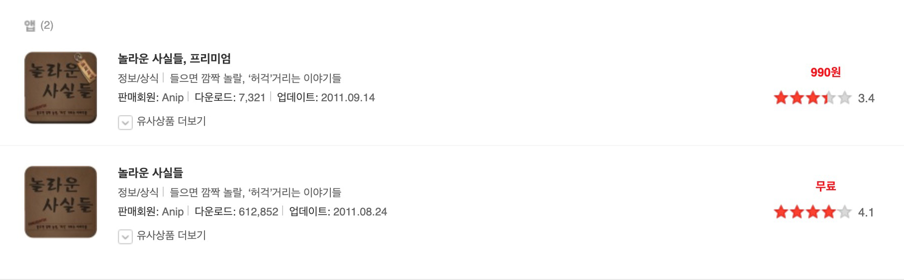
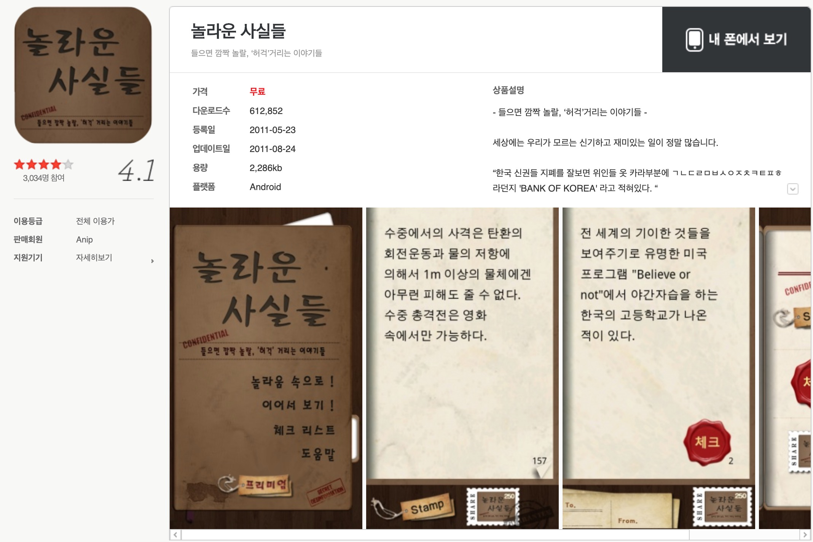
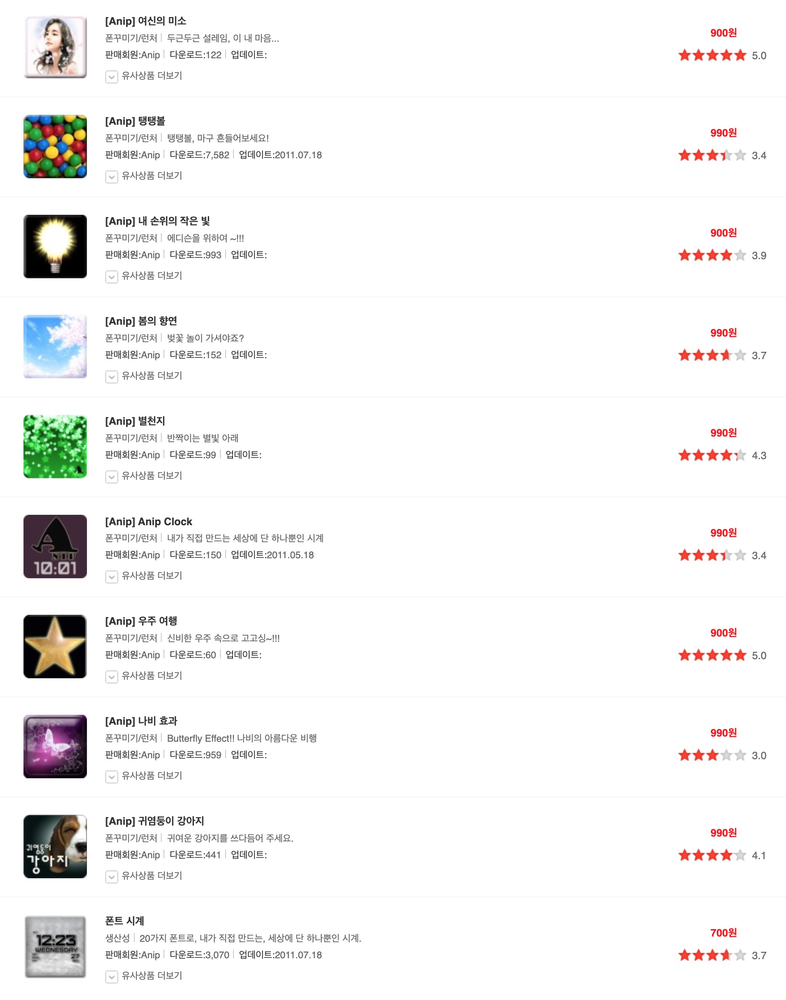
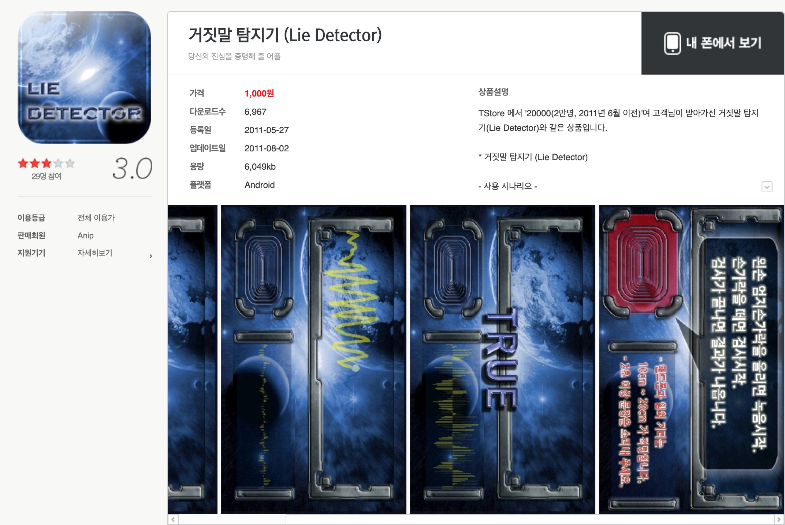

> 이 페이지는 꾸준히 업데이트하는 중이다.

> 예전에 진행했던 프로젝트를 보니, 이것저것 참 많이 시도해보았구나라는 생각이 든다. 하지만 많이 한 것과는 상관없이 성공적인 프로젝트는 거의 없었다. 무엇이 잘못되었던 것일까? 돌이켜보면 이때 저랬어야했는데, 그때는 이랬어야 했는데라는 생각이 많이든다. 아쉽기도 하고 안타깝기도 하지만 그것도 나의 삶의 일부이다.

---

# 대단한친구들 (2016년 말 ~ 현재)

### 마고

- 솔루션 : cafe24 쇼핑몰 솔루션
- Server : cafe24 hosting server + django framework,
  - 자체관리자 : 상품을 빠른 속도로 업로드하고 관리하기 위해 자체 관리자를 개발

동대문 D2C.
동대문의 다양한 상품을 판매하는 쇼핑몰

### 마고진스

청바지 사이즈 문제를 해결하기 위해 청바지를 2개 보내주고

- 솔루션 : cafe24 쇼핑몰 솔루션
- 자체관리자 : 상품을 빠른 속도로 업로드하고 관리하기 위해 자체 관리자를 개발
  - Server : cafe24 hosting server + django framework,

### 룩스라이크 (~2016년 10월)

- 솔루션 : 고도몰 솔루션

인풀루언서에게 상품을 주고, 촬영하게 하여 쇼핑몰에서 팔 수 있도록 하는 서비스
이후에 다른 회사에 매각

고도몰 쇼핑몰 솔루션으로 제작

### 당샤서울 (dangxiaseoul.com), 이때부터 서울팀과 합류, 6명

- Magento -> Wordpress

마젠토 솔루션으로 개발완료하였지만, 관리상의 문제로 워드프레스로 변경하여 다시 제작
한국의 문화를 중국에 소개하고, 한국산 제품을 중국에 판매하도록 하는 서비스

---

# 퍼플이모션, 4인

## 2012년 6월 ~ 2017년 3월

### 신사동TV (sinsading.tv)

- Server : AWS + Play Framework,
- Client : Web

인풀루언서인 안\*\*님을 기반으로 신사동 느낌의 다양한 상품을 동영상으로 소개하고 팔 수 있도록 하는 서비스
실제로 영상을 몇 개 제작하여 운영하였지만, 진행이 안되 문을 닫음

### 대한민국 동창체전, 모디바바 앱 (~ 기억하자)

- Server : AWS + Play Framework
- Client : Web, Android App, iPhone App

자금을 충당하기 위해 진행한 외주와 함께 전국의 체육대회를 주최하고, 참여할 수 있도록 하는 앱을 동시에 개발
아쉽게도 모두 개발 완료하였지만, 해당 회사의 자금난으로 동창체전이 진행되지 못하였다.
모디바바라는 앱을 개발 완료하였고, 출시하였지만, 역시 같이 진행해보기로한 회사의 경영난으로 운영을 못하고 중단하였다.

### BMEA 뉴스레터 (2014년 3월 ~ 2015년 3월)

- Email Service + Design

Offshore Korea 프로젝트와 연계하여 진행한 프로젝트이다. 매달 오프쇼어와 관련된 사람들에게 보내는 뉴스레터를 디자인하였다. 1년 이상 진행했었다.

### 2014 Offshore Korea 2014 (~2014년 12월), 이때부터 2인체제

- Server : cafe24 hosting server + Play Framework
- Client : Web (AngularJs)

자금을 충당하기 위해서 외주를 받아 진행한 홈페이지 개발이었다. 오프쇼어 코리아 컨퍼런스를 개최하면서, 컨퍼런스 참가 신청을 받고 결제를 진행하였다. 스피커들의 컨퍼런스 내용과 주요 연혁들을 소개하고, 업체들의 리스트를 보여주었다.

### 에스키스타 (2014년 3월중순 ~ 4월중순)

- Server : AWS + Play Framework
- Client : Android App, iPhone App

룩스라이크와 같은 SNS 앱을 만들어줬으면 하는 분이 있어서, 외주로 진행했다. 패션 SNS 앱. 이때 외주를 의뢰했던 만났던 사람들과 (주)대단한친구들이라는 회사로 함께 하게 되었다.

### 치순이, 푸들리 (2013년 12월 중순)

- Wordpress
- [치순이](http://chisuny.com) (운영중단)

내가 정말 사랑하는 치킨의 순위를 매키는 사이트다. 3일동안 한국 치킨 정보를 모으는데 사용했었다. 오픈을 했지만, 그냥 쓰-윽- 사라졌던 서비스, 이름을 멋지게 지은 것 같았지만, 운영을 못하고 종료.

- Wordpress
- [푸들리](https://foodly.kr) (운영중단)

전국 곳곳에 숨어있는 배달하지 않는 맛집을 배달해주기 위한 서비스. 왜 숨은 맛집들의 음식은 집에서 못 먹을까? 에서 출발한 서비스. 전국의 유명한 맛집 리스트를 올려두었지만, 실제로 운영하지 못하고 종료.

### 고필드 (2013년 10월초 ~ 2014년 3월중순)

- Server : AWS + Play Framework
- Client : Web

지원사업으로 진행
초중고 선생님을 대상으로, 견학지는 가이드해주는 서비스
세월호 사고가 나서 잠정 중단

### 캠프아웃 (2013년 7월말 ~ 9월초)

- XE

캠핑족들을 위한 캠프장 정보 커뮤니티
좋아하지 않는 PHP 언어로 소스를 뜯어고쳐 사용
전국 캠프장 모으는데 1주일 정도 소요되었던 것 같다.

### 빅딜 (~2013년 4월말 ~ 9월초), 이때부터 3인체제

- Server : AWS + Spring Framework
- Client : Web

중고차 거래, 경매 시스템.
신차의 최대한 할인받아서 살 수 있도록, 고객이 문의하고, 딜러가 가격을 경쟁적으로 제시하여 최저가격으로 살 수 있도록 하는 서비스

### 스타일북 (~2013년 4월말)

- Server : AWS + Spring Framework / Web Crawler
- Client : Android App, iPhone App

현재의 지그재그와 같은 것, 크롤링

### 룩스라이크 (2012년 9월 ~ 2013년 4월)

- Server : AWS + Spring Framework
- Client : Android App, iPhone App

스타일 SNS

### 코코스푼 (~2012년 9월)

- Server : AWS + Spring Framework
- Client : Android App, iPhone App

---

# 나누미안, 3인

## 2012년 4월(?) ~ 5월(?)

### 페이스앤푸드

- Android App

얼굴을 촬영하면 음식을 추천해주는 앱. 무엇을 먹어야할지 고민 중인 사람에게 잠깐의 재미를 주고 싶었던 서비스다. 셀카를 찍으면, 그것을 분석하여 음식을 추천해준다. 음식 사진에 저작권 이슈가 있었기에 구글 검색 이미지 중 첫번째 이미지를 보여주었던 것 같다. 사실 추천은 얼굴 분석이라기 보다는 랜덤이다.

> 내가 이것을 왜 개발했었을까? 그 때 당시에는 기존에 없던 색다른 앱이라는 생각에 재밌게 개발했던 것 같다. 물론 수익은 바라지도 않았던 것 같다. 단지 재미로. - 2019. 08. 26

### 나누미안

- Android App, iPhone App (개발 중간에 중단)

지역별 쿠폰을 발행하고 관리하는 플랫폼. GPS 기반으로 해당 위치에 왔을 때, 근처의 할인 정보를 푸쉬해주는 서비스. 동인이(친구)와 조민(형) 세명이서 진행한 프로젝트. 같이 회의도 많이 하고 진행을 했었지만, 두 사람이 집중하게 되면서 스르륵 중단된 프로젝트.

### 우문현답

- Wordpress
- silly-ask.com, wise-answer.com (운영중단) (바보같은 질문, 현명한 대답)

우문현답. 엉뚱하고 색다른 질문을 던지고, 사람들이 답변을 하는 플랫폼. 여러 질문들을 하루에 하나씩 올렸고 그것에 대해 사람들이 대답을 해주길 원했다. 재밌으면서도, 독특한 대답을 기대했다. 삶에서 한번쯤 고민해봐야하는 질문이나, 전혀 생각지도 못했던 질문을 던져서 새롭게 생각해 볼 기회가 되길 바랬다. 하지만 아무도 참여하지 않고 문을 닫았다. 마케팅을 하고, 사람을 모으는 것에 대해 전혀 몰랐던 시기이었기 때문이다. 오직 개발만 해놓으면 알아서 올 것이라고 생각했던 시절이다. 비즈니스 모델도 없었고, 단지 아이디어 뿐이었던 프로젝트였다.

---

# 파이브씽크, 3인

## 2011년 9월(?) ~ 2012년 3월(?)

정확한 날짜가 기억이 안난다.

### 선생님 찾기

프라이머 인턴쉽

### 파이브씽크

### 데이팅앱

---

# 펄스윙즈 Pulsewings (1인)

## 2011년 5월 ~ 9월

### 드래그패드

- Android App

스와이프 패드를 모티브로 삼아 만든 앱. 스크린의 양옆쪽을 드래그하면 앱을 바로 실행할 수 있도록 하는 앱이다.

스와이프 패드를 참고삼아 만들고, 추가 기능을 넣었다. 드래그를 통해 앱을 실행하고, 사진을 볼 수 있거나, 저장해둔 메모를 바로 볼 수 있도록 했다. 티스토어에 올리고 반응이 꽤 좋았고, 인터넷 기사에도 추천앱으로 실렸었다. 댓글의 반응도 꽤 좋았다. 하지만, 댓글 중에 1~3%의 댓글에 '스와이프 패드'를 베꼈다고 악평이 달렸다. 도덕적으로 문제가 되는 일은 하지 않는 사람이었기에, 그 당시에 이 문제가 나를 혼란스럽게 했다. 기존의 기능에, 업그레이드해서 개발하면 문제가 없다고 생각했기 때문이다. 혹시나 하는 마음에 변호사에게까지 찾아갔었다. 저작권 이슈가 있는지 확인하고 싶었다. 그분 말씀으로는 '디자인'에 대한 저작권을 침해할 여지가 있다고 했다. 물론 원 제작자가 신고를 해야한다. 고소할 일은 없겠지만, 내 마음이 편하지 않았다. 그래서 당장 앱을 내렸다. 당시 수익이 꽤 나고 있었지만 말이다. 법적으로나, 도의적으로나 잘못된 것이 있는 것을 하기는 싫었다.

스마트폰 앱 중에선 가장 아쉬움이 많이 남는 앱이다. 충분히 바이럴도 일어났고 기능적인 면에서도 다른 앱과는 차별이 있는 앱이었다. 저작권 이슈는 '기능적인 면'보다는 '디자인적인 이슈'가 사람들의 저항을 일으키는 것 같다. 같은 기능을 하는 앱을 많고도 많지만 베꼈다는 말을 잘 하지 않는데, 상대적으로 디자인이 비슷하다고 느끼면 표절 이슈가 더 있는 것 같다. 아쉬움이 남지만, 느낀점이 많은 프로젝트다.

8~9년이 지난 시점에서, 이 앱을 계속 운영했었으면 어땠을까를 상상해본다. 이 앱과 같은 기능의 앱은 이후에도 많이 나왔다. 삼성 갤럭시에도 기본 기능으로 탑재되었다. 이전의 그 앱을 계속 업그레이드 시켰으면 어땠었을까? 색다른 것을 더 추가해서 원래의 앱보다 더 뛰어났으면 어땠을까? 그때도 베꼈다는 이야기가 나왔을까? 여러모로 가슴에 맺히는 것이 많은 작품이다.

### 바로가기 폴더

- Android App

드래그 패드의 사례를 참고 삼아 만든 앱.

### 나의 책 이야기

- Android App

### 놀라운 사실들

- Android App

인터넷에 흩어져있는 산뜻하고 신기한 놀라운 사실들을 수집하여 보여주는 어플리케이션. 무료 버전과 유료 버전으로 나누어서 출시했다.

> 지금 보니 원스토어에 꽤 많은 사람들이 다운로드 받았다. 2011년도에 출시했다고 되어 있으니, 8년정도 된 것 같다. 역시 세월의 힘은 무시 못하는 것 같다. 그동안 많은 사람들이 찾아왔었다. 유료 7천건, 무료 61만건 정도이다. 안드로이드 마켓에서도 꽤나 많이 받아갔으니, 내가 개발했던 앱들 중에 가장 많은 사람들이 다운로드 받았던 앱이 아닐까? - 2019-09-06

---

# 안입 Anip (3인)

## 2010년 10월 ~ 2011년 4월

### 라이브 배경화면

- Android App

### 거짓말 탐지기

- Android App

### 펄스윙즈

- Server : Spring Framework

블리자드 업적을 기반으로

---

# 대학교

## 스택

##
