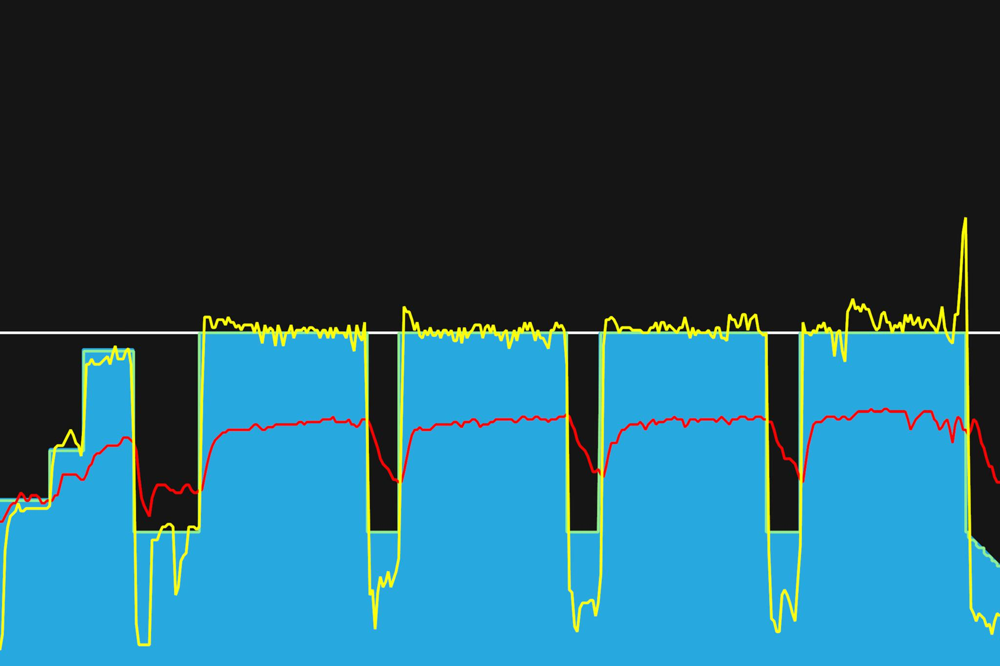

# 10주차 : 8월 19일(월) ~ 25일(일)

## 서른두번째, 8월 19일(월)

VO2 Max 구간에서 인터벌. 주말에 일을 계속해서 그런지, 몸이 풀리지 않았다. 온몸에 뻐근함이 가득. 다행이도 짧은 인터벌이다. 짧게 짧게 인터벌 후, 긴 휴식시간이 가졌다. 그래서 그러나 다행이었다.

토크형과 케이던스형 페달링을 번갈아가면서 했다. 확실히 한쪽 근육을 쓰고, 길게 휴식시간을 가져가니 인터벌이 할만했다. 오늘도 잘했다. 굿

---

8월 30일까지 목표

- FTP 245 (현재 230, 터보무인 기준)
- 몸무게 67kg 대로 진입 (현재 68.5kg)
- 북악업힐 9분 30초대 진입 (현재 9:46)

다음대회까지 목표

- 충원, 상훈 끝까지 피빨고 가기
- 8월 31일(토) 오크밸리 그란폰도 완주
- 9월 7일(토) 춘천 그란폰도 완주

이후 가능한 목표

- 서울팀 vs 부산팀 : 개통로 TTT

달성완료목표

- 북악업힐 10분대 진입 완료 (6월 12:58 -> 7월 6일 10:33)
- 몸무게 68kg 대로 진입 완료 (6월 69.5kg -> 7월 10일 68.5kg)
- FTP 230 (6월 205 -> 7월 22일 230, 터보무인 기준)
- 남산업힐 7분대 진입 (6월 8:22 -> 8월 3일 6:45)
- 북악업힐 9분대 진입 (6월 10:33 -> 8월 3일 9:46)
- 남산업힐 6분 30초대 진입 (8월 3일 6:45 -> 8월 11일 6:36)
- 남산업힐 6분 30초대 진입 (8월 11일 6:36 -> 8월 15일 6:31)

---

## 서른세번째, 8월 21일(수)

눈이 피로하다. 그래서 그런지 머리가 띵하다. 그 반대인가? 새벽에 일찍 깼다. 평소엔 푹자는데, 오늘은 왠지 네시간 남짓 자다가 일어났다. 다시 잠이 안와서 누워있으니, 잡생각이 많이 났다. 그래서 그냥 일어났다. 간단히 스트레칭을 하다보니, 다시 누웠고 다시 잤다. 다시 일어났다.

피곤한 몸을 이끌고 로라에 올랐다. 오늘 트레이닝을 끝낼 수 있을까? 그래도 페달을 굴리니 돌아간다. 시간도 간다. 가이드 해준대로 하진 않았지만, 타겟 파워를 맞추려고 노력했다.

토크형, 케이던스형, 낮은케이던스토크형, 마지막엔 댄싱으로 했다. FTP 파워를 10분정도 유지할 수 있겠다. 하긴 FTP라는게 1시간동안 유지할 수 있는 파워라는 의미일테니, 가능해야한다. 하고나니 개운하다. 잘했다.

대회가 다음주 주말이다? 그때까지 꾸준히 밟아보자.

---

8월 30일까지 목표

- FTP 245 (현재 230, 터보무인 기준)
- 몸무게 67kg 대로 진입 (현재 68.5kg)
- 북악업힐 9분 30초대 진입 (현재 9:46)

다음대회까지 목표

- 충원, 상훈 끝까지 피빨고 가기
- 8월 31일(토) 오크밸리 그란폰도 완주
- 9월 7일(토) 춘천 그란폰도 완주

이후 가능한 목표

- 서울팀 vs 부산팀 : 개통로 TTT

달성완료목표

- 북악업힐 10분대 진입 완료 (6월 12:58 -> 7월 6일 10:33)
- 몸무게 68kg 대로 진입 완료 (6월 69.5kg -> 7월 10일 68.5kg)
- FTP 230 (6월 205 -> 7월 22일 230, 터보무인 기준)
- 남산업힐 7분대 진입 (6월 8:22 -> 8월 3일 6:45)
- 북악업힐 9분대 진입 (6월 10:33 -> 8월 3일 9:46)
- 남산업힐 6분 30초대 진입 (8월 3일 6:45 -> 8월 11일 6:36)
- 남산업힐 6분 30초대 진입 (8월 11일 6:36 -> 8월 15일 6:31)

---
