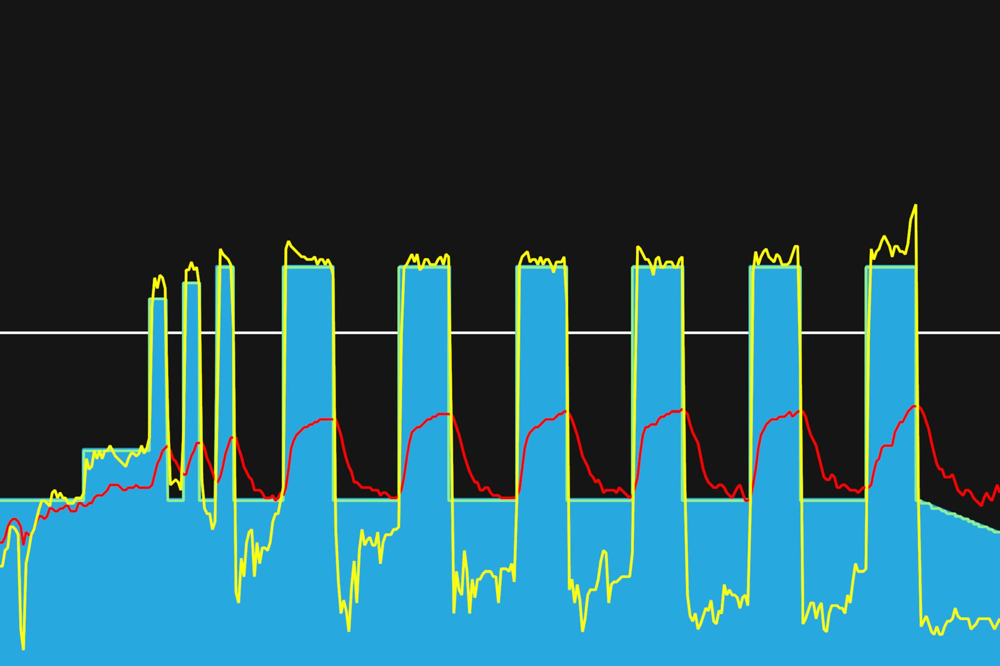

# 10주차 : 8월 19일(월) ~ 25일(일)

## 서른두번째, 8월 19일(월)

VO2 Max 구간에서 인터벌. 주말에 일을 계속해서 그런지, 몸이 풀리지 않았다. 온몸에 뻐근함이 가득. 다행이도 짧은 인터벌이다. 짧게 짧게 인터벌 후, 긴 휴식시간이 가졌다. 그래서 그러나 다행이었다.

토크형과 케이던스형 페달링을 번갈아가면서 했다. 확실히 한쪽 근육을 쓰고, 길게 휴식시간을 가져가니 인터벌이 할만했다. 오늘도 잘했다. 굿

---

8월 30일까지 목표

- FTP 245 (현재 230, 터보무인 기준)
- 몸무게 67kg 대로 진입 (현재 68.5kg)
- 북악업힐 9분 30초대 진입 (현재 9:46)

다음대회까지 목표

- 충원, 상훈 끝까지 피빨고 가기
- 8월 31일(토) 오크밸리 그란폰도 완주
- 9월 7일(토) 춘천 그란폰도 완주

이후 가능한 목표

- 서울팀 vs 부산팀 : 개통로 TTT

달성완료목표

- 북악업힐 10분대 진입 완료 (6월 12:58 -> 7월 6일 10:33)
- 몸무게 68kg 대로 진입 완료 (6월 69.5kg -> 7월 10일 68.5kg)
- FTP 230 (6월 205 -> 7월 22일 230, 터보무인 기준)
- 남산업힐 7분대 진입 (6월 8:22 -> 8월 3일 6:45)
- 북악업힐 9분대 진입 (6월 10:33 -> 8월 3일 9:46)
- 남산업힐 6분 30초대 진입 (8월 3일 6:45 -> 8월 11일 6:36)
- 남산업힐 6분 30초대 진입 (8월 11일 6:36 -> 8월 15일 6:31)

---
