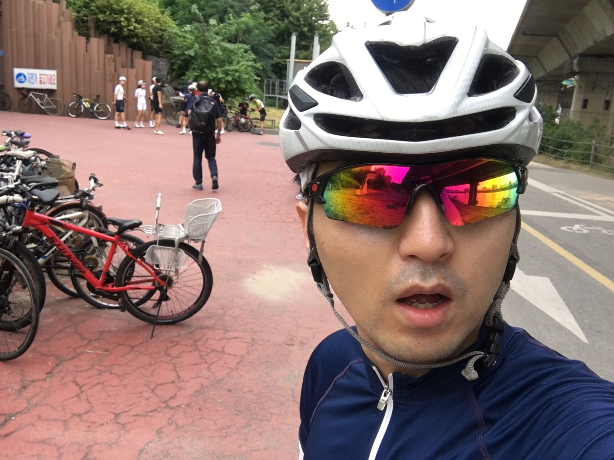
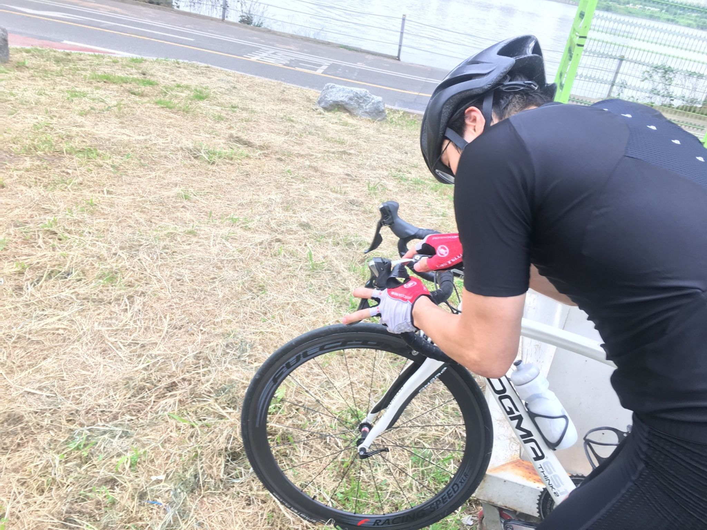
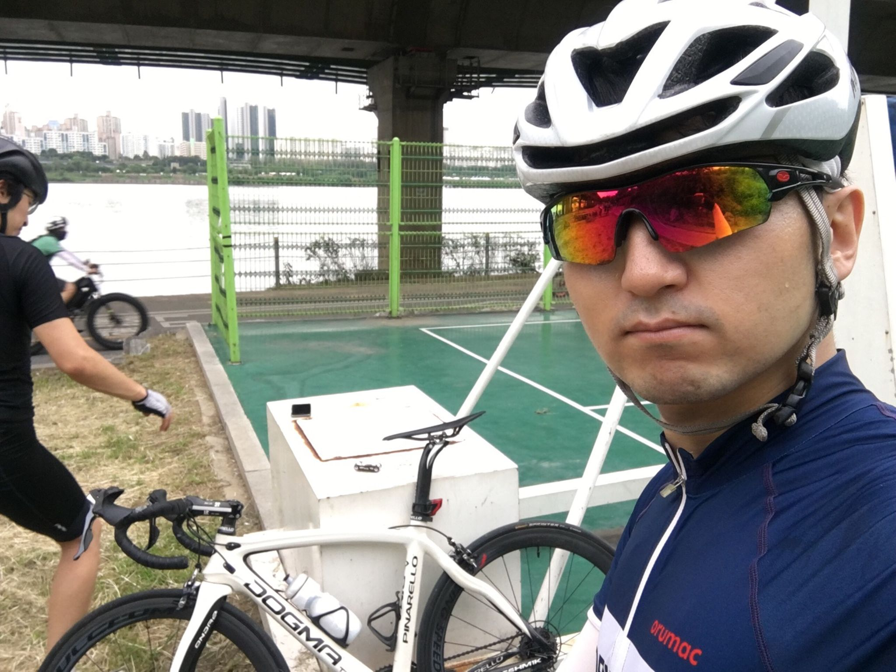
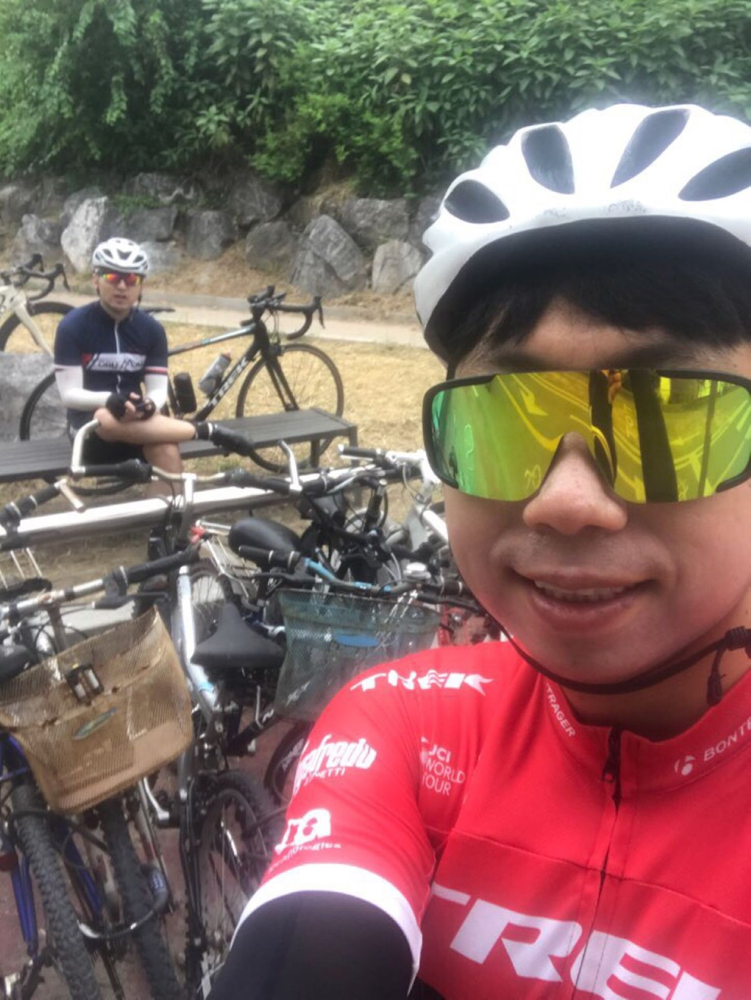
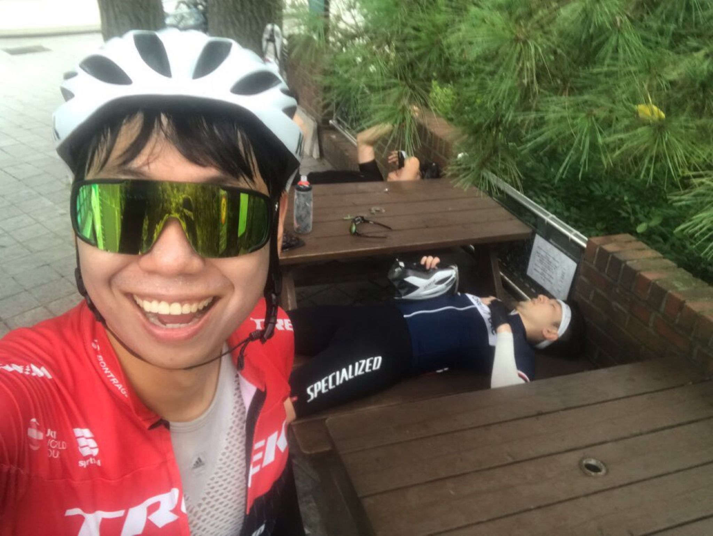
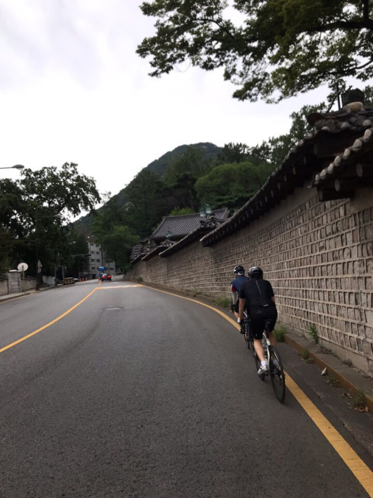
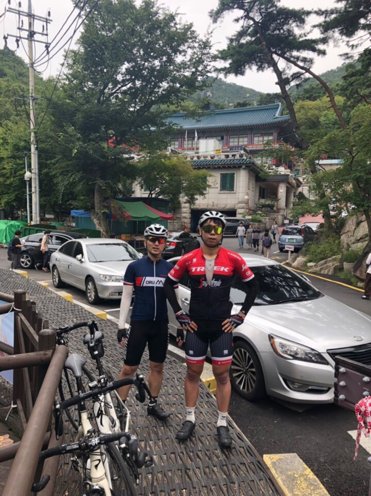
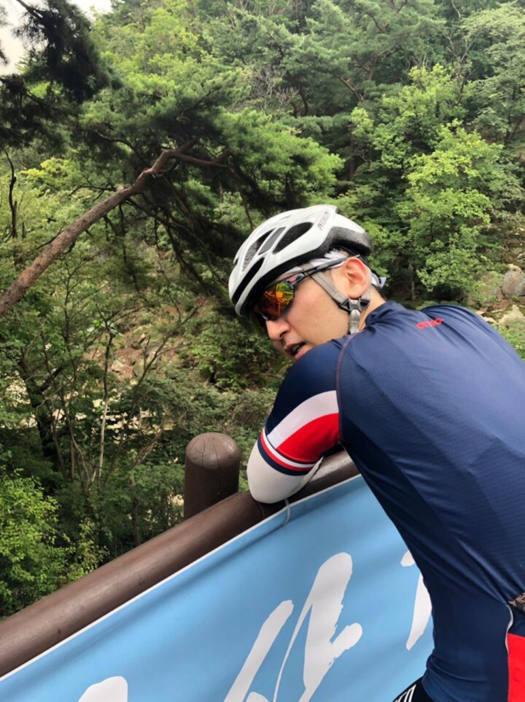

# 남산-북악산-도선사 라이딩

## 서른다섯번째, 8월 25일(일)

이번주도 서울팀과 함께 라이딩을 계획했다. 대회가 이제 한 주 앞으로 다가왔다. 이번이 대회전 함께 하는 마지막 기회이겠지? 폭염 기간도 지나갔고 라이딩하기에 좋은 날씨다.

어제 저녁은 온몸이 뻐근하고, 눈이 피로해 머리가 띵했다. 몸에 약간 몸살 기운이 있어서 갈까말까 잠깐 고민했다. 그리 심하지 않았고, 분위기 전환삼아 바깥 공기 쐐는 것이 더 좋을 것이라 판단했다.

아침 일곱시 반까지 한남대교 밑에서 보기로 했다. 여섯시쯤 일어났는데, 온몸이 찌뿌둥해서 잠깐만 누워있다가 일어나기로 했다. 이런. 다시 눈을 뜨니 7시 5분이었다. 허둥지둥 일어나서 간단히 먹고 씼고 라이딩 준비를 했다. 그러는 동안 상훈이도 일어났다. 나보다 늦는 사람이 있군. 휴, 그나마 다행이다. 만날 때마다 지각하는 사람이 간식을 사곤 했는데, 오늘도 상훈이가 사겠군. 유후

날이 참 좋다. 햇빛이 쨍쨍하게 비치지도 않고, 시원한 바람이 땀을 식혀줘서 좋다. 라이딩하기 딱 좋은 날씨다. 한남대교를 건너, 만나기로한 장소에 가다보니, 동호회에서 단체로 라이딩을 하고 있었다. 비록 따로 라이딩을 하고 있지만, 같은 취미를 즐기고 있다는 것이 반갑다. 뭔가 모르게 힘이 더 난다.

상훈이는 장염인지 화장실에 들렸다 온다고 더 늦었다. 그동안 은호랑 농구장에서 뺑뺑이를 돌며 놀았다. 은호는 이것저것 자전거를 가지고 노는 것을 좋아한다. 오늘도 어김없이 공구를 빌려 브레이크 부분을 손보고 있다. 그런 것 보면 난 자전거 기계에 대한 관심은 별로 없는 것 같다. 그냥 페달을 밟고, 함께 라이딩하는 것이 좋을 뿐. 이 점에 있어서는 상훈이와 비슷하다. 좋은 자전거에 대한 욕심이 없다. 그래도 자전거를 꾸준히 타다보니, 자전거에 대한 지식을 습득하게 된다. 오늘은 브레이크 손잡이와 핸들의 간격을 조절할 수 있다는 것을 알게 되었다.

오늘은 남산-북악산-도선사를 한 번씩 간다.
남산까지 가는내내 몸이 안풀린다는 느낌이었다. 뻐근한 느낌. 그래도 기왕 온 김에 열심히 달려봐야지. 은호가 먼저 출발하고, 내가 출발했다. 저번에 상훈이와 남산을 올랐을 때, 괜히 상훈이 신경쓴다고 오버페이스를 했었다. (그래도 PR은 세웠었지만..) 그래서 오늘은 페달링과 숨내쉬는 것에만 신경을 썼다. 그래서 그런지 남산 도착 100미터 정도 전까지도 상훈이가 내 뒤에 있다는 것을 알지 못했다. 쵯- 나를 쓰윽 지나간다. 그려 잘가. 셋이 비슷한 시점에 도착했다. 바로 북악산으로 고고.

북악산에선 세 명중에 내가 기록이 젤 낮았기 때문에 나, 은호, 상훈 순서대로 출발했다. 이번에도 숨을 잘 내뱉는 것과 근육을 번갈아가면서 쓰는 것에만 신경썼다. 정상에 다 왔을 때, 상훈이가 쑥 지나간다. 쵯- 그려 잘가. 숨좀 돌리고, 바로 도선사로 고고.

도선사 가는 길이 험난 했다. 네이버 지도를 보면서 갔지만, 초행길이다보니 조금 헤맸다. 그래도 무사히 도선사 도착. 업힐을 바로 시작했다. 처음으로 온 것이라 기록보단 완주가 목표였다. 경사도 30% 이라던데.. (지금와서 검색해보니 평균경사도가 13%다.) 뭔가모를 기억의 오류.

끌바만 하지 말고 오르자. 오늘이 도선사에 오는 마지막이다. 다음엔 다시 안와야지. 와리가리를 하자. 무슨 이런 경사가 다있어. 끝이 안난다. 차는 왜 이렇게 많은거야. 오르는 길에 오만가지 생각이 머리속으로 떠오른다. 그래도 산 속의 고요함만큼은 좋다. 그리고 다 올라왔을 때의 쾌감. 힘들었던 것은 이내 다 잊어버린다. 일요일 절 앞이라 그런지 사람이 많다. 자전거 타는 사람은 생각보다 없었다. MTB 라이더 딱 한사람만 봤다. 정상에서 숨 좀 돌리고 집으로 향했다.

돌아가는 길에는 로테이션 한번 돌아보자고 했다. 근데 길도 잘 모르고, 자전거 길도 좋지 않아서 제대로 로테를 돌지도 못했다. 업힐에서 힘을 다썼는지, 난 35km/h 속도 내기도 힘들었다. 상훈이는 그래도 팔팔하네. 상훈이 집앞까지 와서 칼국수를 먹었다. 넘나 더웠기에 난 비빔 냉면을 시켰다. 돌아오는 길 내내 배가 고팠기에 냉면이 더 꿀맛이었다. 칼국수와 만두도 맛있었다.

은호와 잠수교까지 같이 갔다. 둘다 힘들었는지 로테도 제대로 못돌리고, 서로 먼저 가라고 양보했다. 한강길이라 익숙해서 좋다. 그래도 예전보단 확실히 빠르게 달리네.

최근에 남산과 북악만 오르다가 도선사라는 새로운 코스로 가니 신선했다. 가끔씩 새로운 코스를 도전해봐야겠다. 오늘도 좋았다. 굿

---

이번달까지 목표로 했던 9분 30초대로 들어오기도 성공했다.

새로운 기록 북악업힐 9:28

---

8월 30일까지 목표

- FTP 245 (현재 230, 터보무인 기준)
- 몸무게 67kg 대로 진입 (현재 68.5kg)

다음대회까지 목표

- 충원, 상훈 끝까지 피빨고 가기
- 8월 31일(토) 오크밸리 그란폰도 완주
- 9월 7일(토) 춘천 그란폰도 완주

이후 가능한 목표

- 서울팀 vs 부산팀 : 개통로 TTT

달성완료목표

- 북악업힐 10분대 진입 완료 (6월 12:58 -> 7월 6일 10:33)
- 몸무게 68kg 대로 진입 완료 (6월 69.5kg -> 7월 10일 68.5kg)
- FTP 230 (6월 205 -> 7월 22일 230, 터보무인 기준)
- 남산업힐 7분대 진입 (6월 8:22 -> 8월 3일 6:45)
- 북악업힐 9분대 진입 (6월 10:33 -> 8월 3일 9:46)
- 남산업힐 6분 30초대 진입 (8월 3일 6:45 -> 8월 11일 6:36)
- 남산업힐 6분 30초대 진입 (8월 11일 6:36 -> 8월 15일 6:31)
- 북악업힐 9분 30초대 진입 (8월 3일 9:46 -> 8월 25일 9:28)

---
