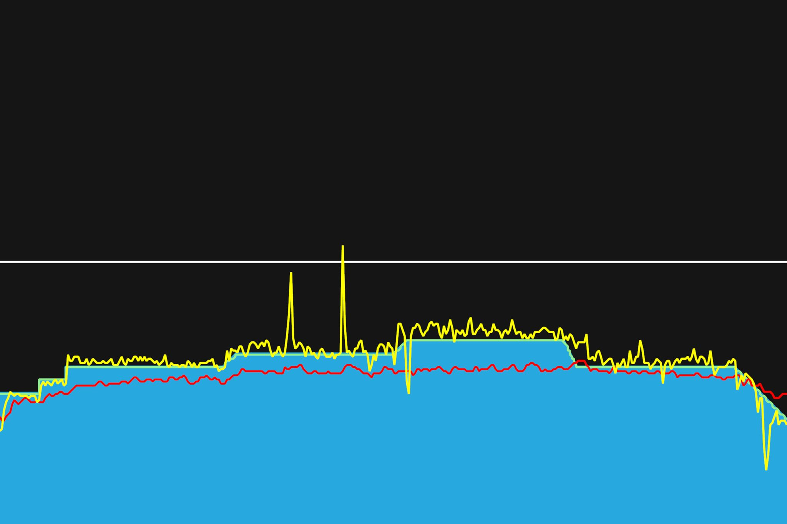
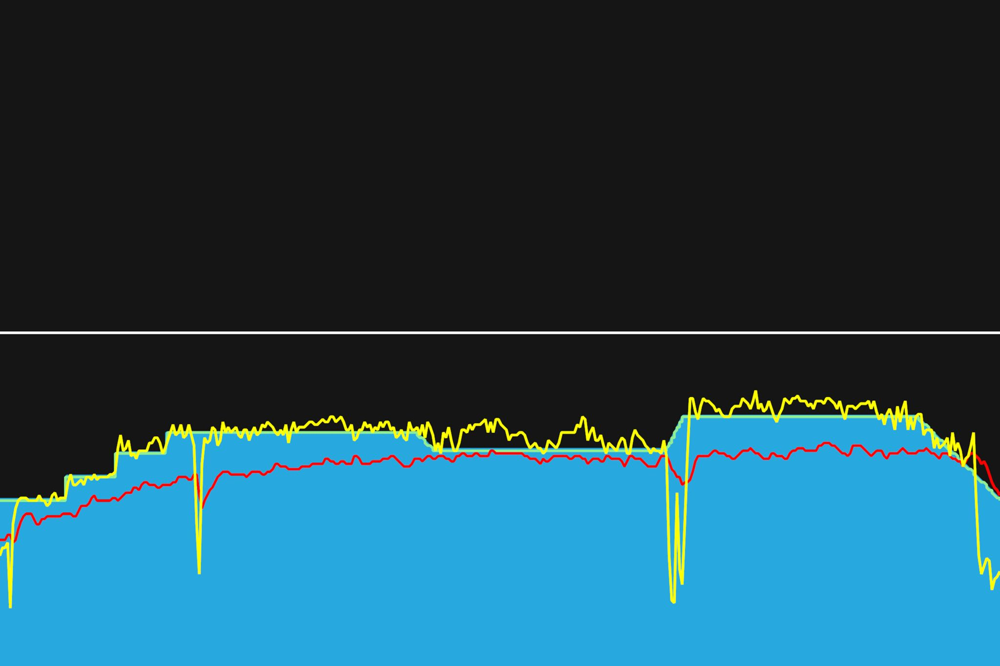
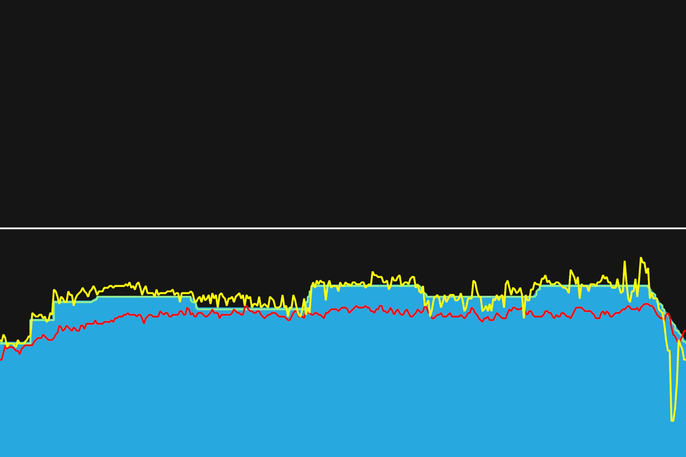

# 10주차 : 8월 26일(월) ~ 9월 1일(일)

## 서른여섯번째, 8월 26일(월)

낮은 파워로 지속 라이딩. 꾸준한 파워 유지. 중간에 쉬어 가는 구간이 없어 엉덩이에 통증이 있었다. 아플 때쯤 일어나서 댄싱을 했다. 헐떡이는 구간 없어서 전반적으로 편했다. 이번주는 트레이닝 마지막주라 그런지 쉬어가는 주이다.

---

8월 30일까지 목표

- FTP 245 (현재 230, 터보무인 기준)
- 몸무게 67kg 대로 진입 (현재 68.5kg)

다음대회까지 목표

- 충원, 상훈 끝까지 피빨고 가기
- 8월 31일(토) 오크밸리 그란폰도 완주
- 9월 7일(토) 춘천 그란폰도 완주

이후 가능한 목표

- 서울팀 vs 부산팀 : 개통로 TTT

달성완료목표

- 북악업힐 10분대 진입 완료 (6월 12:58 -> 7월 6일 10:33)
- 몸무게 68kg 대로 진입 완료 (6월 69.5kg -> 7월 10일 68.5kg)
- FTP 230 (6월 205 -> 7월 22일 230, 터보무인 기준)
- 남산업힐 7분대 진입 (6월 8:22 -> 8월 3일 6:45)
- 북악업힐 9분대 진입 (6월 10:33 -> 8월 3일 9:46)
- 남산업힐 6분 30초대 진입 (8월 3일 6:45 -> 8월 11일 6:36)
- 남산업힐 6분 30초대 진입 (8월 11일 6:36 -> 8월 15일 6:31)
- 북악업힐 9분 30초대 진입 (8월 3일 9:46 -> 8월 25일 9:28)

---

## 서른일곱번째, 8월 28일(수)

리커버리 주간. FTP의 60~70% 정도로 지속 라이딩. 숨을 편안하게 쉴 수 있어 좋다. 케이던스 90을 유지하려고 했다. 투르 드 코리아를 보면서 타기 시간이 잘 간다. 강도 높은 트레이닝에선 집중해야하지만, 이 정도 라이딩에선 무엇이라도 보면서 타는게 좋은 것 같다.

---

8월 30일까지 목표

- FTP 245 (현재 230, 터보무인 기준)
- 몸무게 67kg 대로 진입 (현재 68.5kg)

다음대회까지 목표

- 충원, 상훈 끝까지 피빨고 가기
- 8월 31일(토) 오크밸리 그란폰도 완주
- 9월 7일(토) 춘천 그란폰도 완주

이후 가능한 목표

- 서울팀 vs 부산팀 : 개통로 TTT

달성완료목표

- 북악업힐 10분대 진입 완료 (6월 12:58 -> 7월 6일 10:33)
- 몸무게 68kg 대로 진입 완료 (6월 69.5kg -> 7월 10일 68.5kg)
- FTP 230 (6월 205 -> 7월 22일 230, 터보무인 기준)
- 남산업힐 7분대 진입 (6월 8:22 -> 8월 3일 6:45)
- 북악업힐 9분대 진입 (6월 10:33 -> 8월 3일 9:46)
- 남산업힐 6분 30초대 진입 (8월 3일 6:45 -> 8월 11일 6:36)
- 남산업힐 6분 30초대 진입 (8월 11일 6:36 -> 8월 15일 6:31)
- 북악업힐 9분 30초대 진입 (8월 3일 9:46 -> 8월 25일 9:28)

---

## 서른여덟번째, 8월 30일(금)

리커버리 주간. 꾸준이 1시간 반동안 페달링하니 엉덩이가 아팠다. 그래서 중간중간에 일어서서 했다. 야외 라이딩을 할 때는 꾸준히 자세도 바꿔주고, 엉덩이를 들기도 하고, 중간에 쉬기도 하기 때문에 몰랐지만, 한 자세로 계속 앉아있으면 엉덩이가 불편하고 아픈 건 어쩔 수 없는 것 같다.

트레이너로드의 Base Phase 2가 오늘로 끝이났다. 무사히 완료했다. 짝짝작. 내일 가는 대회 기간에 맞춰서 계획을 짰었다. 빠지지 않고 잘 해낸 것 같아 만족스럽다. 대회 지나고도 계속 해나갈 수 있겠지...? 오크밸리 대회 재밌게 갔다오자.

---

8월 30일까지 목표

- FTP 245 (현재 230, 터보무인 기준)
- 몸무게 67kg 대로 진입 (현재 68.5kg)

다음대회까지 목표

- 충원, 상훈 끝까지 피빨고 가기
- 8월 31일(토) 오크밸리 그란폰도 완주
- 9월 7일(토) 춘천 그란폰도 완주

이후 가능한 목표

- 서울팀 vs 부산팀 : 개통로 TTT

달성완료목표

- 북악업힐 10분대 진입 완료 (6월 12:58 -> 7월 6일 10:33)
- 몸무게 68kg 대로 진입 완료 (6월 69.5kg -> 7월 10일 68.5kg)
- FTP 230 (6월 205 -> 7월 22일 230, 터보무인 기준)
- 남산업힐 7분대 진입 (6월 8:22 -> 8월 3일 6:45)
- 북악업힐 9분대 진입 (6월 10:33 -> 8월 3일 9:46)
- 남산업힐 6분 30초대 진입 (8월 3일 6:45 -> 8월 11일 6:36)
- 남산업힐 6분 30초대 진입 (8월 11일 6:36 -> 8월 15일 6:31)
- 북악업힐 9분 30초대 진입 (8월 3일 9:46 -> 8월 25일 9:28)

---
