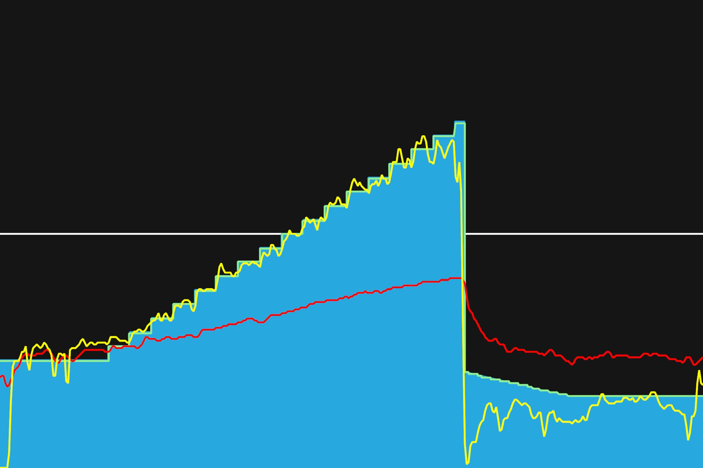
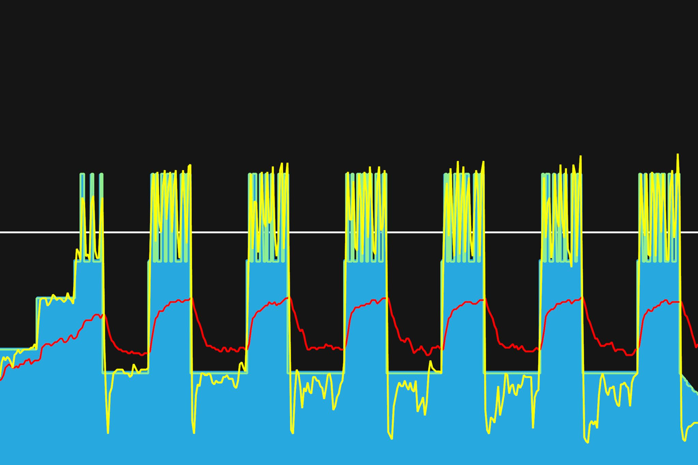

# 12주차 : 9월 2일(월) ~ 9월 8일(일)

## 마흔번째, 9월 2일(월)

오크밸리 그란폰도를 기점으로 트레이닝이 끝났다. 다시 다른 워크아웃을 시작하려고 Ramp Test를 해보았다. 245를 목표로 했으나, 실제로 해보니 230 에서 237로 상승. 목표치보다 낮았다. 트레이닝하면서 성장하는 파워 상승 곡선이 낮아졌다. 마지막 341 파워로 유지하는 것이 있었는데, 그 파워가 나오지 않아서 멈췄다. 타겟 파워가 안나와도 낮게라도 하는 것이 좋은건가? 아니면 그냥 멈춰야 정확한 파워 수치를 얻을 수 있는 것인가? 한번 확인해봐야겠다.
이번 대회에서 오자 다리로 페달링을 한다는 피드백을 받아서, 안장을 0.5mm정도 높여보았다.

FTP 230 -> 237로 상승

---

9월 30일까지 목표

- FTP 245 (현재 237, 터보무인 기준)
- 몸무게 67kg 대로 진입 (현재 68.5kg)

다음대회까지 목표

- 충원, 상훈 끝까지 피빨고 가기 (1차 완료)
- 9월 7일(토) 춘천 그란폰도 완주

이후 가능한 목표

- 서울팀 vs 부산팀 : 개통로 TTT

달성완료목표

- 북악업힐 10분대 진입 완료 (6월 12:58 -> 7월 6일 10:33)
- 몸무게 68kg 대로 진입 완료 (6월 69.5kg -> 7월 10일 68.5kg)
- FTP 230 (6월 205 -> 7월 22일 230, 터보무인 기준)
- 남산업힐 7분대 진입 (6월 8:22 -> 8월 3일 6:45)
- 북악업힐 9분대 진입 (6월 10:33 -> 8월 3일 9:46)
- 남산업힐 6분 30초대 진입 (8월 3일 6:45 -> 8월 11일 6:36)
- 남산업힐 6분 30초대 진입 (8월 11일 6:36 -> 8월 15일 6:31)
- 북악업힐 9분 30초대 진입 (8월 3일 9:46 -> 8월 25일 9:28)
- 8월 31일(토) 오크밸리 그란폰도 완주 (완료)
- 충원, 상훈 끝까지 피빨고 가기 (1차 완료)
- FTP 237 (7월 22일 230 -> 9월 2일 237, 터보무인 기준)

---

## 마흔한번째, 9월 4일(수)

Build Phase의 Short Power Build. 새로운 시작. 인터벌 훈련. 케이던스형과 토크형을 번갈아가면서 했다. 중간중간 휴식 시간이 길기도 하고, 초반이라 그런지 할만했다. 짧게 짧게 높은 파워를 내는 인터벌 연습으로 순간파워를 늘려야겠다.

---

9월 30일까지 목표

- FTP 245 (현재 237, 터보무인 기준)
- 몸무게 67kg 대로 진입 (현재 68.5kg)

다음대회까지 목표

- 충원, 상훈 끝까지 피빨고 가기 (1차 완료)
- 9월 7일(토) 춘천 그란폰도 완주

이후 가능한 목표

- 서울팀 vs 부산팀 : 개통로 TTT

달성완료목표

- 북악업힐 10분대 진입 완료 (6월 12:58 -> 7월 6일 10:33)
- 몸무게 68kg 대로 진입 완료 (6월 69.5kg -> 7월 10일 68.5kg)
- FTP 230 (6월 205 -> 7월 22일 230, 터보무인 기준)
- 남산업힐 7분대 진입 (6월 8:22 -> 8월 3일 6:45)
- 북악업힐 9분대 진입 (6월 10:33 -> 8월 3일 9:46)
- 남산업힐 6분 30초대 진입 (8월 3일 6:45 -> 8월 11일 6:36)
- 남산업힐 6분 30초대 진입 (8월 11일 6:36 -> 8월 15일 6:31)
- 북악업힐 9분 30초대 진입 (8월 3일 9:46 -> 8월 25일 9:28)
- 8월 31일(토) 오크밸리 그란폰도 완주 (완료)
- 충원, 상훈 끝까지 피빨고 가기 (1차 완료)
- FTP 237 (7월 22일 230 -> 9월 2일 237, 터보무인 기준)
