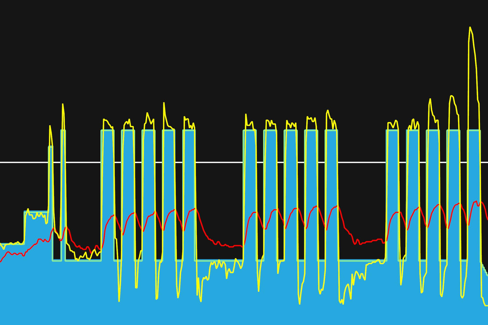
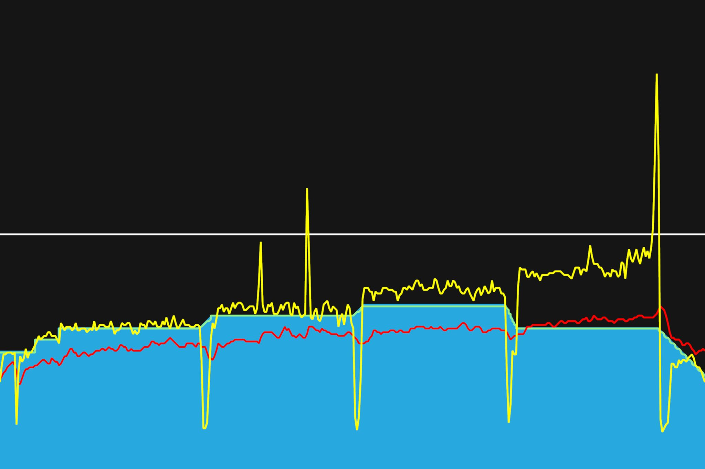
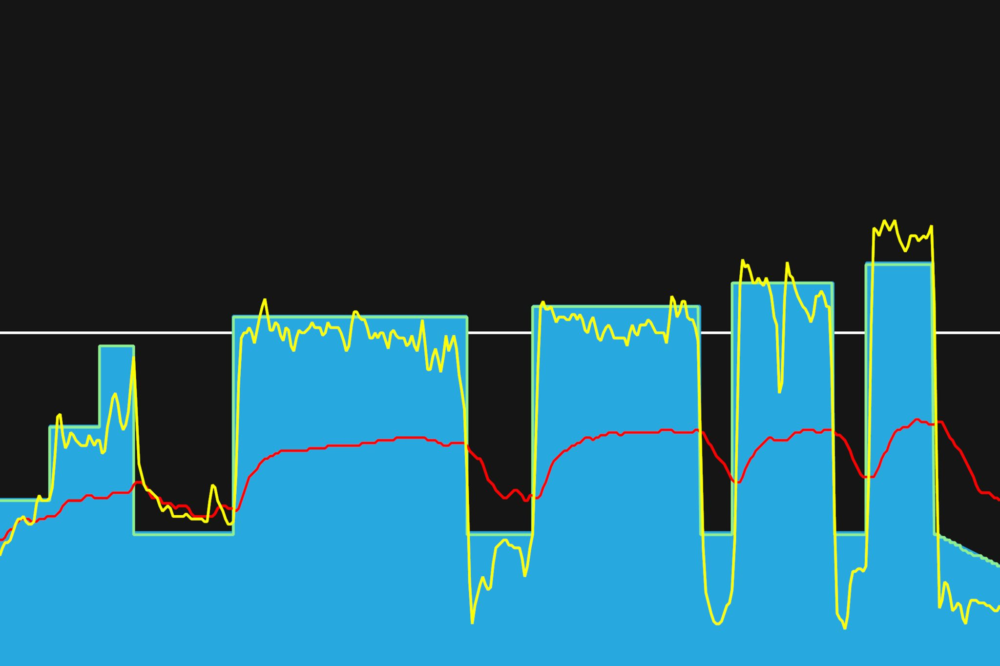

# 13주차 : 9월 9일(월) ~ 9월 15일(일)

## 마흔세번째, 9월 9일(월)

인터벌 훈련. 토,케 번갈아가면서 했다. 휴식시간이 길어서 좋았지만, 높은 파워를 낼 때, 숨이 많이 찼다. 추석 연휴기간이라 못할 것 같으니, 내일, 미리 땡겨서 해야겠다.

이번 추석 때 내려갈 때, 상훈이랑 자전거랑 가지고 가기로 했다. 간 김에 천문대 PR을 세우고 와야겠다. 함께 FTP 테스트도 한다고 한다.

---

9월 30일까지 목표

- FTP 245 (현재 237, 터보무인 기준)
- 몸무게 67kg 대로 진입 (현재 68.5kg)
- 천문대 8분대 진입

다음대회까지 목표

- 충원, 상훈 끝까지 피빨고 가기 (1차 완료)
- 9월 7일(토) 춘천 그란폰도 완주

이후 가능한 목표

- 서울팀 vs 부산팀 : 개통로 TTT

달성완료목표

- 북악업힐 10분대 진입 완료 (6월 12:58 -> 7월 6일 10:33)
- 몸무게 68kg 대로 진입 완료 (6월 69.5kg -> 7월 10일 68.5kg)
- FTP 230 (6월 205 -> 7월 22일 230, 터보무인 기준)
- 남산업힐 7분대 진입 (6월 8:22 -> 8월 3일 6:45)
- 북악업힐 9분대 진입 (6월 10:33 -> 8월 3일 9:46)
- 남산업힐 6분 30초대 진입 (8월 3일 6:45 -> 8월 11일 6:36)
- 남산업힐 6분 30초대 진입 (8월 11일 6:36 -> 8월 15일 6:31)
- 북악업힐 9분 30초대 진입 (8월 3일 9:46 -> 8월 25일 9:28)
- 8월 31일(토) 오크밸리 그란폰도 완주 (완료)
- 충원, 상훈 끝까지 피빨고 가기 (1차 완료)
- FTP 237 (7월 22일 230 -> 9월 2일 237, 터보무인 기준)

---

## 마흔네번째, 9월 10일(화)

낮은 파워에서 리속 라이딩. 리커버리. 부담없이 할 수 있어서 편했다. 엉덩이가 아픈 것 빼곤. 무릎이 양옆으로 기울어지지 않도록, 일직선이 되도록 신경쓰면서 했다. 왼쪽 페달링이 부자연스럽다는 느낌을 받곤 하는데, 자세를 똑바로 하도록 신경쓰면 괜찮아지겠지.

---

9월 30일까지 목표

- FTP 245 (현재 237, 터보무인 기준)
- 몸무게 67kg 대로 진입 (현재 68.5kg)
- 천문대 8분대 진입

다음대회까지 목표

- 충원, 상훈 끝까지 피빨고 가기 (1차 완료)
- 9월 7일(토) 춘천 그란폰도 완주

이후 가능한 목표

- 서울팀 vs 부산팀 : 개통로 TTT

달성완료목표

- 북악업힐 10분대 진입 완료 (6월 12:58 -> 7월 6일 10:33)
- 몸무게 68kg 대로 진입 완료 (6월 69.5kg -> 7월 10일 68.5kg)
- FTP 230 (6월 205 -> 7월 22일 230, 터보무인 기준)
- 남산업힐 7분대 진입 (6월 8:22 -> 8월 3일 6:45)
- 북악업힐 9분대 진입 (6월 10:33 -> 8월 3일 9:46)
- 남산업힐 6분 30초대 진입 (8월 3일 6:45 -> 8월 11일 6:36)
- 남산업힐 6분 30초대 진입 (8월 11일 6:36 -> 8월 15일 6:31)
- 북악업힐 9분 30초대 진입 (8월 3일 9:46 -> 8월 25일 9:28)
- 8월 31일(토) 오크밸리 그란폰도 완주 (완료)
- 충원, 상훈 끝까지 피빨고 가기 (1차 완료)
- FTP 237 (7월 22일 230 -> 9월 2일 237, 터보무인 기준)

---

## 마흔다섯번째, 9월 15일(일)

추석 연휴로 피로가 더 쌓인 것 같다. 리커버리 하려고 30분짜리 짧은 트레이닝을 선택했다. 근데 생각보다 어렵다. 인터벌 훈련이었네? 타겟 파워까지 맞추는 것도 왜이렇게 힘든건지. 체인에서는 삑삑 소리가 났다. 비를 맞아서 그런가? 물티슈로 잘 닦았었는데... 다음에 탈 때는 기름칠을 하고 타봐야겠다.

---

9월 30일까지 목표

- FTP 245 (현재 237, 터보무인 기준)
- 몸무게 67kg 대로 진입 (현재 68.5kg)

다음대회까지 목표

- 충원, 상훈 끝까지 피빨고 가기 (1차 완료)
- 9월 7일(토) 춘천 그란폰도 완주

이후 가능한 목표

- 서울팀 vs 부산팀 : 개통로 TTT

달성완료목표

- 북악업힐 10분대 진입 완료 (6월 12:58 -> 7월 6일 10:33)
- 몸무게 68kg 대로 진입 완료 (6월 69.5kg -> 7월 10일 68.5kg)
- FTP 230 (6월 205 -> 7월 22일 230, 터보무인 기준)
- 남산업힐 7분대 진입 (6월 8:22 -> 8월 3일 6:45)
- 북악업힐 9분대 진입 (6월 10:33 -> 8월 3일 9:46)
- 남산업힐 6분 30초대 진입 (8월 3일 6:45 -> 8월 11일 6:36)
- 남산업힐 6분 30초대 진입 (8월 11일 6:36 -> 8월 15일 6:31)
- 북악업힐 9분 30초대 진입 (8월 3일 9:46 -> 8월 25일 9:28)
- 8월 31일(토) 오크밸리 그란폰도 완주 (완료)
- 충원, 상훈 끝까지 피빨고 가기 (1차 완료)
- FTP 237 (7월 22일 230 -> 9월 2일 237, 터보무인 기준)
- 천문대 8분대 진입 달성 (9월 11일 8:38)

---
