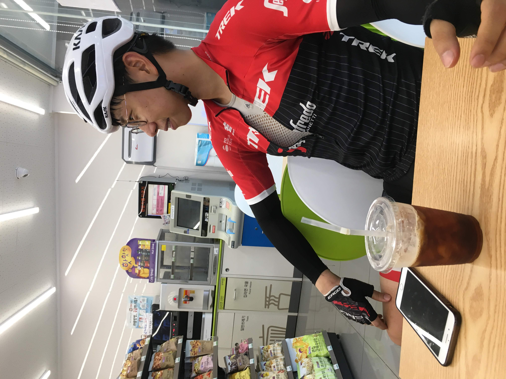
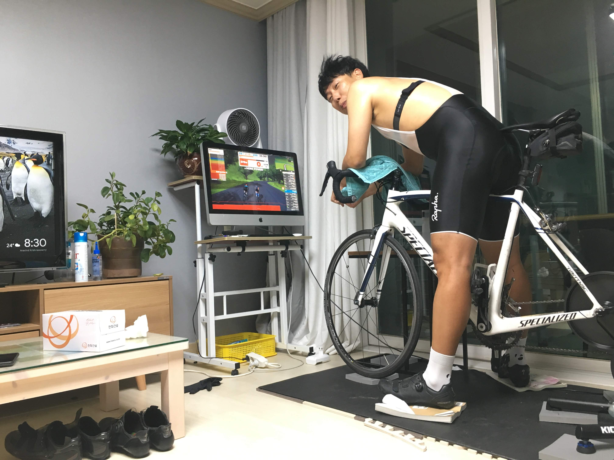

# 천문대 라이딩과 파워테스트

서울에서 밤12시에 출발하여 6시 조금 전에 도착했다. 바로 자긴 했지만, 차에서 앉아서 오랫동안 있었기 때문인지, 몸이 뻐근해서 10시쯤에 깼다. 무거운 몸을 이끌고, 천문대로 향했다. 뒷바퀴를 끼우는 와중에, 체인 부분이 떨어져나갔다. 이런이런. 잠깐 멘붕이 왔다. 마음을 가다듬고 차근차근 보니, 뒷체인 부분(?)에 나사가 빠졌다는 것을 알게 되었다. 2개가 다 떨어져있었는데, 다행이 1개는 간신히 붙어있어 자리를 잡고 돌려끼우니 꼽아졌다. 라이딩을 포기해야하나 싶었는데, 김해까지 자전거 싣고 온게 너무나도 아까웠다. 다른쪽 나사는 아무리 찾아도 없었다. 아마 언제 떨어졌는지도 모른채, 계속 사용해온 것이겠지... 몇 바퀴 굴려보며 별 이상이 없는지 확인했다. 다행이도 큰 이상이 없는듯했고, 천문대로 향했다.

시작전 목표는 8분 초반대 진입과 오루막 3등을 하는 것이었다. 그러기 위해선 최대한 빨리 가야한다. 근데 몸이 어찌나 무겁던지ㅠ 제대로 페달링이 안되었다. 좀 전에 먹고온 비빔 냉면이 다시 쏟아져 나오려하는걸 간신히 붙잡았다. 출발전에는 -먼길을 왔으니, 언제 또오겠는가싶어 - 두바퀴 돌고 가자는 생각이 있었는데, 200m 남짓 올라왔을 때, 그 생각은 버렸다. 어찌나 힘들던지.

다행이 목표는 달성했다. 짝짝짝. 8분 초반대는 달성 못했지만, 만족할 만한 기록이다. 오루막 3등도 달성하였다! 8:38 PR 달성

저녁엔 파워테스트를 했다. 내가 사용하고 있는 터보무인이 뻥파워가 있다고 했기에, 조금 더 정확한 파워를 알고 싶었다. 천문대도 갔다 왔고, 몸도 피곤하여 파워테스트를 할까말까 고민을 좀 했었다. 그래도, 기왕온거 하고 가야겠지? 싶어서 로라에 올랐다. 2분30초씩하며 25w씩 파워를 올려가며 하는 파워 테스트였다. 300w파워 까지는 봤으면 좋겠다 싶었는데, 다리가 말을 안들었다. 275w도 완료 못하고 중간에 포기했다. 파워를 계산해보니 224다. 터보무인과 비교해봤을 때 5~10정도 차이가 난다. 넘나 힘들어서 한동안 뻗어있었다.

나중에 영상을 보니, 내 페달링이 확실히 이상했다. 엉덩이가 왔다갔다한다는 것이 어떤 의미인지 알겠다. 저번주에 안장이 너무 낮은 것 아닐까 생각해서 0.5cm정도 올렸었는데, 다시 내려봐야겠다. 그 때문에 파워가 더 안나온 것은 아닐까? 더 힘들었던 것은 아닐까? 일단 안장을 한번 내려봐야겠다. 아주 재밌고, 아주 힘들었던 하루였다.

- 천문대 8분대 진입 달성 (8:38)
- FTP 224 달성, 3.3w/kg (우준로라)

---

<iframe width="560" height="315" src="https://www.youtube.com/embed/AyKop_2ypCM" frameborder="0" allow="accelerometer; autoplay; encrypted-media; gyroscope; picture-in-picture" allowfullscreen></iframe>

우준이가 만든 영상

---

9월 30일까지 목표

- FTP 245 (현재 237, 터보무인 기준)
- 몸무게 67kg 대로 진입 (현재 68.5kg)

다음대회까지 목표

- 충원, 상훈 끝까지 피빨고 가기 (1차 완료)
- 9월 7일(토) 춘천 그란폰도 완주

이후 가능한 목표

- 서울팀 vs 부산팀 : 개통로 TTT

달성완료목표

- 북악업힐 10분대 진입 완료 (6월 12:58 -> 7월 6일 10:33)
- 몸무게 68kg 대로 진입 완료 (6월 69.5kg -> 7월 10일 68.5kg)
- FTP 230 (6월 205 -> 7월 22일 230, 터보무인 기준)
- 남산업힐 7분대 진입 (6월 8:22 -> 8월 3일 6:45)
- 북악업힐 9분대 진입 (6월 10:33 -> 8월 3일 9:46)
- 남산업힐 6분 30초대 진입 (8월 3일 6:45 -> 8월 11일 6:36)
- 남산업힐 6분 30초대 진입 (8월 11일 6:36 -> 8월 15일 6:31)
- 북악업힐 9분 30초대 진입 (8월 3일 9:46 -> 8월 25일 9:28)
- 8월 31일(토) 오크밸리 그란폰도 완주 (완료)
- 충원, 상훈 끝까지 피빨고 가기 (1차 완료)
- FTP 237 (7월 22일 230 -> 9월 2일 237, 터보무인 기준)
- 천문대 8분대 진입 달성 (9월 11일 8:38)
