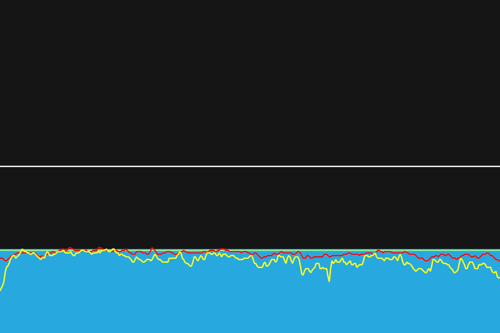

# 14주차 : 9월 16일(월) ~ 9월 22일(일)

## 마흔여섯번째, 9월 16일(화)

인터벌 트레이닝. 안장을 0.5cm 정도 낮췄다. 크게 차이는 없겠지만, 조금 더 안정감이 느껴지는 것 같기도 하다. 잠을 푹자서, 피로가 풀려서 안정감이 느껴지는 것인가?

파워를 최대한 써서 하려고 하고 있는 걸까? 타겟 파워보다 낮게 하는 구간이 늘었다. 타겟 파워에 맞추도록 조금 더 신경써야겠다.

---

9월 30일까지 목표

- FTP 245 (현재 237, 터보무인 기준)
- 몸무게 67kg 대로 진입 (현재 68.5kg)

다음대회까지 목표

- 충원, 상훈 끝까지 피빨고 가기 (1차 완료)
- 9월 7일(토) 춘천 그란폰도 완주

이후 가능한 목표

- 서울팀 vs 부산팀 : 개통로 TTT

달성완료목표

- 북악업힐 10분대 진입 완료 (6월 12:58 -> 7월 6일 10:33)
- 몸무게 68kg 대로 진입 완료 (6월 69.5kg -> 7월 10일 68.5kg)
- FTP 230 (6월 205 -> 7월 22일 230, 터보무인 기준)
- 남산업힐 7분대 진입 (6월 8:22 -> 8월 3일 6:45)
- 북악업힐 9분대 진입 (6월 10:33 -> 8월 3일 9:46)
- 남산업힐 6분 30초대 진입 (8월 3일 6:45 -> 8월 11일 6:36)
- 남산업힐 6분 30초대 진입 (8월 11일 6:36 -> 8월 15일 6:31)
- 북악업힐 9분 30초대 진입 (8월 3일 9:46 -> 8월 25일 9:28)
- 8월 31일(토) 오크밸리 그란폰도 완주 (완료)
- 충원, 상훈 끝까지 피빨고 가기 (1차 완료)
- FTP 237 (7월 22일 230 -> 9월 2일 237, 터보무인 기준)
- 천문대 8분대 진입 달성 (9월 11일 8:38)

---

## 마흔일곱번째, 9월 19일(목)

몸이 힘들어서 1시간짜리 워크아웃을 30분짜리로 줄여서 했다. 몸이 뻐근하고, 눈이 아프다. 어제부터 왼쪽눈에 충혈이 생겼다. 갑자기 왜?

짧게 타는 것이니, 타겟 파워보다 최대한 더 내려고 노력했다. 헥헥. 힘들다.

---

9월 30일까지 목표

- FTP 245 (현재 237, 터보무인 기준)
- 몸무게 67kg 대로 진입 (현재 68.5kg)

다음대회까지 목표

- 충원, 상훈 끝까지 피빨고 가기 (1차 완료)
- 9월 7일(토) 춘천 그란폰도 완주

이후 가능한 목표

- 서울팀 vs 부산팀 : 개통로 TTT

달성완료목표

- 북악업힐 10분대 진입 완료 (6월 12:58 -> 7월 6일 10:33)
- 몸무게 68kg 대로 진입 완료 (6월 69.5kg -> 7월 10일 68.5kg)
- FTP 230 (6월 205 -> 7월 22일 230, 터보무인 기준)
- 남산업힐 7분대 진입 (6월 8:22 -> 8월 3일 6:45)
- 북악업힐 9분대 진입 (6월 10:33 -> 8월 3일 9:46)
- 남산업힐 6분 30초대 진입 (8월 3일 6:45 -> 8월 11일 6:36)
- 남산업힐 6분 30초대 진입 (8월 11일 6:36 -> 8월 15일 6:31)
- 북악업힐 9분 30초대 진입 (8월 3일 9:46 -> 8월 25일 9:28)
- 8월 31일(토) 오크밸리 그란폰도 완주 (완료)
- 충원, 상훈 끝까지 피빨고 가기 (1차 완료)
- FTP 237 (7월 22일 230 -> 9월 2일 237, 터보무인 기준)
- 천문대 8분대 진입 달성 (9월 11일 8:38)

---

## 마흔아홉번째, 9월 22일(일)

리커버리 라이딩. 춘천 그란폰도 이후 피곤한 몸을 이끌고, 간단한 리커버리 라이딩을 하였다. 온몸이 뻐근한데, 살짝살짝 돌리니 할만하다. 몸이 잘 풀려야할텐데.

---

9월 30일까지 목표

- FTP 245 (현재 237, 터보무인 기준)
- 몸무게 67kg 대로 진입 (현재 68.5kg)

이후 가능한 목표

- 서울팀 vs 부산팀 : 개통로 TTT

달성완료목표

- 북악업힐 10분대 진입 완료 (6월 12:58 -> 7월 6일 10:33)
- 몸무게 68kg 대로 진입 완료 (6월 69.5kg -> 7월 10일 68.5kg)
- FTP 230 (6월 205 -> 7월 22일 230, 터보무인 기준)
- 남산업힐 7분대 진입 (6월 8:22 -> 8월 3일 6:45)
- 북악업힐 9분대 진입 (6월 10:33 -> 8월 3일 9:46)
- 남산업힐 6분 30초대 진입 (8월 3일 6:45 -> 8월 11일 6:36)
- 남산업힐 6분 30초대 진입 (8월 11일 6:36 -> 8월 15일 6:31)
- 북악업힐 9분 30초대 진입 (8월 3일 9:46 -> 8월 25일 9:28)
- 8월 31일(토) 오크밸리 그란폰도 완주 (완료)
- 충원, 상훈 끝까지 피빨고 가기 (1차 완료)
- FTP 237 (7월 22일 230 -> 9월 2일 237, 터보무인 기준)
- 천문대 8분대 진입 달성 (9월 11일 8:38)
- 9월 21일(토) 춘천 그란폰도 완주
- 9월 21일(토) 충원, 상훈 끝까지 피빨고 가기

---
