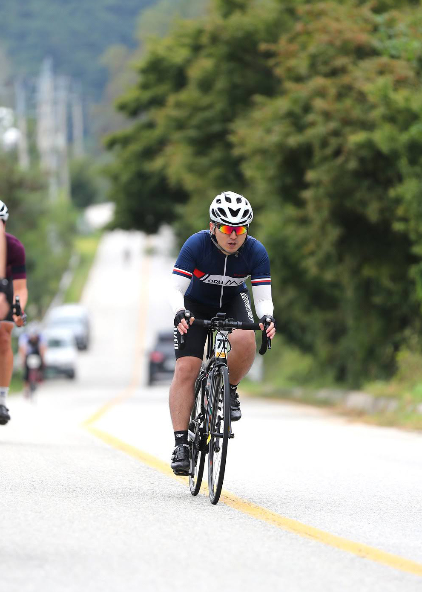

# 마흔여덟번째. 2019 춘천 그란폰도

새벽 3시 반. 아침 일찍부터 일어나, 춘천으로 향할 준비를 했다. 태풍이 올라온다는데, 오늘은 괜찮겠지? 다행이 비소식은 없다. 상훈이집에서 만나서 출발하기로 했기 때문에 자전거를 타고 가야했다. 해가 뜨기 전이라 밖은 어두웠다. 오랫만에 전조등, 후미등을 장착했다. 30분 정도의 짧은 거리였기에 부담이 없다. 내가 자전거를 처음 샀을 때 받았던 깜빡이 후미등이 보였다. 오래 되었는대도 잘 동작하네? 상훈이 집에 도착했을 때 보니, 불이 희미했다. 너도 다되었구나. 네이버 지도로 최단거리로 가니, 생각보다 금방 도착했다. 이른 새벽이라 차도 없어 좋았다.

은호와 동시에 도착했다. 자전거를 실었다. 이제 몇 번 같이 라이딩을 가다보니 자전거를 싣는 방법도 익숙해져 속도도 빨라졌다. 다들 말하지 않아도 자연스럽게 요리조리 맞춰서 세팅한다. 춘천으로 향하는 길에는 은심이 누나가 싸주신 과일 도시락을 먹었다. 평소 과일을 잘 챙겨먹지 않기에, 이럴 때만 먹을 수 있다. 과일은 역시 맛있다. 서울팀은 2시간 남짓 걸려 춘천에 도착했다. 김해팀은 어제 밤에 먼저 와서 자고 있었다. 4~5시간 걸려서 김해에서 춘천까지 올라오다니, 대단하다. 난 아마 부산에 있었다면, 너무 멀어서 대회에 참가 안했을 것 같은데...

어제 점심때 부터 속이 안좋았다. 체한 것 같은 느낌. 그래도 아침에 뭐라도 먹고 가야할 것 같아서, 아침을 간단히 먹었다. 춘천에 도착하면서 한정식 집에 가서 밥도 챙겨 먹었다. 오랫만에 시골 밥상 같은 아침을 먹으니 든든하다.

춘천 그란폰도 시작 지점인 송암 레포츠 타운에 도착했다. 뱃속에서 신호가 왔다. 뭔가 불안한 느낌이다. 서둘러 화장실로 향했다. 근처에 주경기장에 문이 다 닫혀 있어서, 길을 물어물어 X게임파크(?)에 있는 화장실로 향했다. 근데 사람들의 줄이 너무 길다. 5분남짓 기다려보다가, 더이상 여기 있으면 안될 것 같다는 느낌이 들었다. 네이버 지도를 켜서 화장실을 검색해보니 빙상경기장 옆에 화장실이 있었다. 갈까말까 5분정도 더 고민을 했다. 그래, 가자. 여기서 기다리다간 출발시간에 맞추지도 못할 것 같았다. 조깅하듯 뛰어갔다. 크윽. 여기도 주차장이 있어 그런지, 사람들이 주차하고 화장실을 많이 가는 모양새다. 여기도 줄이 화장실 통로 바깥까지 이어져 있었다. 바로 다시 나왔다. 혹시나 다른 경기장에 있지 않을까 해서 족구장까지 갔다. 거긴 아예 문을 안열었다. 저기 멀리 클라이밍하는 곳이 보인다. 근처에 있는 분께 물었더니 저기 가면 있을 것이라 했다. 굿. 멀리있어서 안보였는데, 끝까지 가보니 1인용 화장실이 있었다. 후다닥 달려갔다. 아무도 없어라. 휴우. 다행이 아무도 없다. 이런 행운이. 오랫만에 느껴보는 고통과 행운이었다. 덕분에 뛰어다닌다고 워밍업은 된 것 같다. 출발 시간이 얼마 남지 않았다. 돌아가는 길도 서둘러 뛰어갔다. 얼마만에 뛰어본 건지 원.

차에 도착하자마자, 자전거를 세팅했다. 다행이도 친구들이 배번을 받아다줬서, 출발 시간엔 늦지 않겠다. 상훈이는 느긋하게 근처에 있는 화장실을 찾았고, 여유롭게 갔다왔다며, 얄밉게 말했다. 난 혼자서 쌩고생을 했는데... 화장실은 코앞에 있었다고 한다. 내 마음이 급하니, 바로 근처의 것도 보지 못했던 것 같다.

속을 비우니, 몸이 가벼워졌다. 마음까지 가벼워져 주변 사람들이 보이기 시작한다. 김해팀은 앞쪽에서 먼저 출발했고, 서울팀은 뒤쪽에서 출발했다. 사람들이 많으니 힘이 난다. 역시 라이딩은 함께 할 때 재미가 10배가 된다. 우르르 몰려 가다보니 속도도 꽤나 빠르다. 김해팀과 만나야 하니, 상훈이가 서둘렀다. 첫 업힐 구간에서 김해팀과 만났다. 오루막팀 완성. 다같이 가니 힘이 더욱 난다. 이번 대회에서 상훈이, 충원이를 기필코 따라가겠노라고 목표를 세웠기 때문에 최대한 붙어가려고 했다. 그래서 그런지, 오버페이스를 한 것 같기도 하다. 벌어지지 않으려고 힘을 많이 써서 달렸다. 두번째 업힐 이후, 내리막을 가다보니 오루막팀과 벌어졌다. 충원이는 di2(?)라는 것이 방전되서 기아 변속이 안된단다. 그런데도 겁나게 빨리 페딜링을 굴려서 잘 따라온다. 내리막 이후 먼저 간 친구들을 따라잡지 못하고, 충원이와 나랑 떨어졌다. 나라도 따라 가야겠다 싶어 버스에 탑승하려고 쌔게 달렸다. 버스를 이리저리 갈아타며 가다보니 급행 버스를 탔다. 한참을 달리다보니, 저~~~ 멀리서 상훈, 우준, 은호가 가고 있는 것을 발견했다. 이 속도로 가면 안되겠다 싶어, 로테 타이밍에 맞춰서 내가 앞장을 섰다. 다른 그룹을 끄는 것은 처음이다. 꽤나 긴 시간동안 - 느낌상으론 - 끌면서 오루막팀과 만났다. 덕분에 힘이 많이 빠졌었는데, 만나는 시점부터 업힐 구간이다. 회복할 틈도 없이 가다보니 힘들었다. 어떻게 올라갔는지 기억도 안난다. 아마, 이 시점 이후부터 많이 지쳐있었던 것 같다. 그 당시엔 괜찮다고 생각했는데, 나중엔 힘이 없어서 흘러내렸다.

중간중간 보급은 너무나 만족스러웠었다. 갈증날 구간에 콜라가 있었고, 배고픈 구간에 도넛이 있었다. 바나나도 챙겨갈 수 있었고, 방울 토마토가 넘나 맛있었다. 든든하게 먹으니, 힘이 나서 좋다. 마지막 구간에 한번쯤 보급이 더 있었으면 어땠을까 아쉽긴 하지만, 이전 오크밸리에 비해서는 너무나도 혜자스럽다.

한번 흐르고 난 뒤에는, 혼자서 라이딩을 했다. 그러고 보니, 올해는 이렇게 혼자 라이딩한 적이 없었던 것 같다. 작년까지만 해도 대회 중반 이후에는 혼자 흘러서, 솔로 라이딩을 하곤 했었는데... 나도 실력이 늘긴했나보다. 따라갈 정도는 되었으니. 혼자서 설렁설렁 가고 있으니, 뒤에서 오고 있던 은호 탑승 버스가 왔다. 저 버스는 꼭 타고 가야겠다 싶었다. 또 힘이 어찌어찌 나서 따라가게 된다. 힘들지만 은호를 놓치면 더 힘들어 질 것 같았다. 점점 남은 거리가 줄어들었다. 10km, 5km, 2km, 1km. 도착. 5시간 5분대로 도착했다. 10km 남짓 남았을 때부터 배가 고팠다. 봉크가 살짝 오는 것 같았지만, 심하지 않을 단계에서 마무리가 되어 다행이다. 도착하자마자 아까 챙겼던 바나나와 초코파이를 먹었다. 꿀맛이다.

상훈이는 뒤에는 못 따라갔지만, 충원이와는 함께 들어왔다. 어찌됐든 목표 달성이다. 호호호. 무사히 완주했다. 춘천 닭갈비도 먹었다. 목욕탕에 가서 몸도 씻었다. 무사히 집으로 돌아갔다. 오늘 하루도 재밌었고, 즐거웠다.

---

이로써 목표로 했던 것들을 모두 완료했다. 굿.
