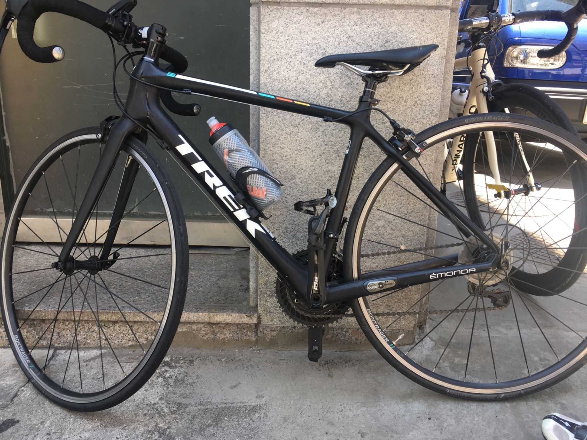
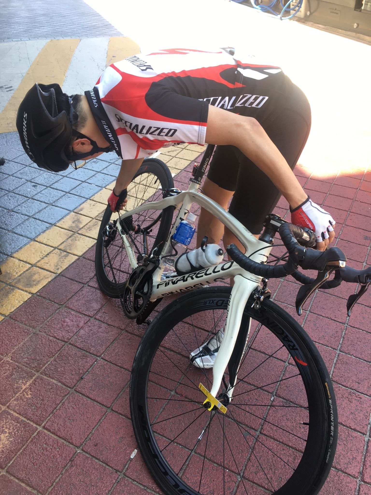

# 1주차 : 6월 22일 (토)

## 두번째, 6월 22일 (토)

현재 남산&북악 업힐 기록 측정을 위해 상훈, 은호랑 만나기전 남산에 들렸다. 생각보다 집에서 멀지 않네? 한남대교 지나가기가 부담스러워서 갈 생각도 안했었는데, 주말 이른 아침에는 간간히 가도 될 것 같다. 남산 업힐을 갔다 가서 그런지 북악에서 넘나 힘들었다. 괜한 짓을 한것 같기도 하고 -ㅇ-
오늘 라이딩 중에 계속 페달링이 많이 어색했었다. 어제 안장을 0.5cm 정도 내렸었는데, 이 정도 수정한 것이 이렇게 큰 차이가 있는가싶어 놀라웠다. 근데 나중에 집에 돌아가는 길에 보니 안장이 완전히 내려가 있었다, 나사를 팍팍 조였어여했는데, 뜨헉. 그 덕분에 넘나 힘들었군... 그래도 현재 남산&북악 기록을 알 수 있어서 좋았다. 한달 뒤에 다시 갱신하러 가야지.
근대 다들 왜케 잘타는거여

오늘 기록
**남산 8:22 / 북악산 12:58**

---

7월 31일까지 목표

- FTP 215
- 남산업힐 7분대 진입 (현재 8:22)
- 북악업힐 10분대 진입 (현재 12:58)

다음대회까지 목표

- 충원, 상훈 끝까지 피빨고 가기

---
