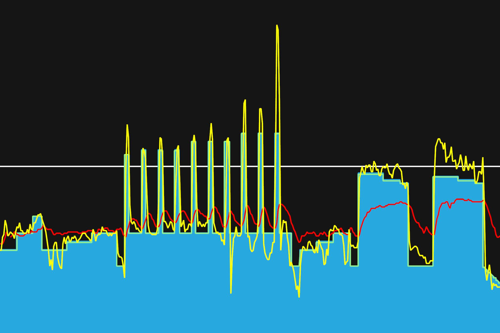
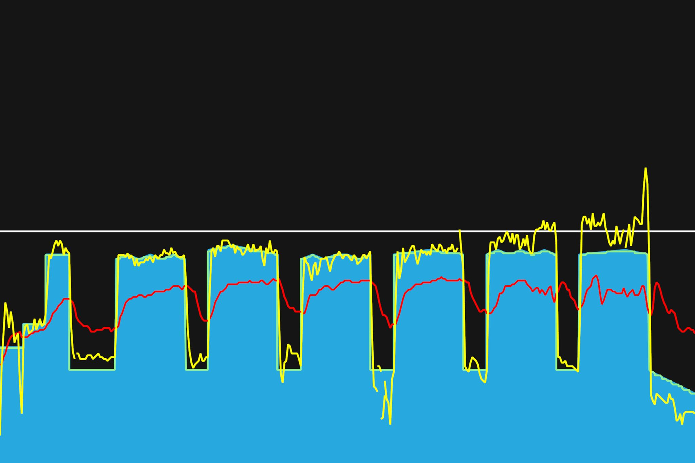
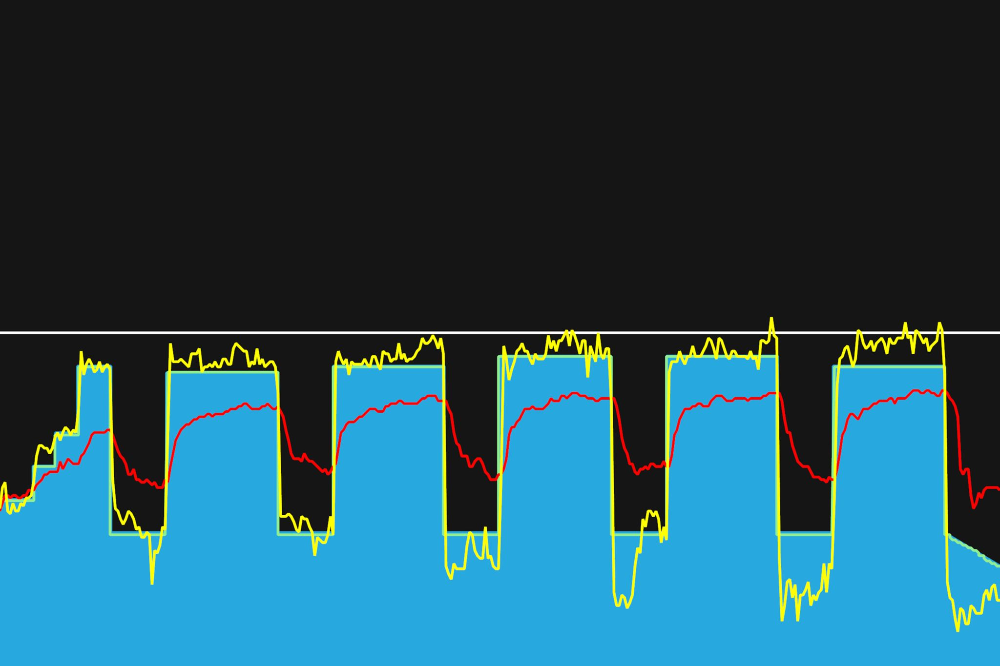

# 2주차 : 6월 24일(월) ~ 30일(일)

## 세번째, 6월 24일(월)

기초 다지기. TrainerRoad의 BASE PHASE를 따라 플랜을 세웠다. 기초 중의 기초. 초반이라 그런지 크게 어렵지 않았다. 너무 어려우면 다음 운동이 하기 싫기 때문에 이 정도 적당한 난이도가 좋다. 점점 힘들어지겠지. 어깨와 팔에 힘 빼는 것에 신경썼다. 안장이 내려간 뒤로 대충 올리고 타서 그런지, 발이 너무 안펴지는 것 같다. 다음에는 안장을 조금 더 올리고 타야겠다.

---

7월 31일까지 목표

- FTP 215 (현재 205, 터보무인 기준)
- 남산업힐 7분대 진입 (현재 8:22)
- 북악업힐 10분대 진입 (현재 12:58)

다음대회까지 목표

- 충원, 상훈 끝까지 피빨고 가기

---

## 네번째, 6월 26일(수)

스위트스팟 구간에서 근지구력 키우기. 힘을 지속적으로 효율적으로 쓰려면 둔근을 이용해야한단다. 이 부분에 신경쓰면서 해보려 했지만, 어떻게 근육을 사용해야할지 감을 못잡겠다. 차차 해봐야지. 상체에 힘을 빼고, 90 케이던스를 유지를 하려고 했다. 지난 주말에 무리해서 그런지 왼쪽 무릎에 미세한 통증이 느껴진다. 이 부분에 무리가 안가도록 더 신경써야겠다.

---

7월 31일까지 목표

- FTP 215 (현재 205, 터보무인 기준)
- 남산업힐 7분대 진입 (현재 8:22)
- 북악업힐 10분대 진입 (현재 12:58)
- 몸무게 68kg 대로 진입 (현재 : 69.5kg)

다음대회까지 목표

- 충원, 상훈 끝까지 피빨고 가기

이후 가능한 목표

- 서울팀 vs 부산팀 : 개통로 TT

---

## 다섯번째, 6월 28일(목)

엉통이 있어서 고생했다. 고정로라인대도 불구하고, 페달링할 때 자전거가 좌우로 많이 흔들리는 것 같다. 뒤에서 보면 엉덩이가 좌우로 왔다갔다한다던데, 이것과 관련있는 건가 싶네. 엉덩이를 흔들리지 않게 고정시키려하니, 엉통이 더 생기는 것인가. 인터벌 중 에어로 자세로 하라해서 했는데, 아직 자연스럽진 않은 것 같다. 숨이 자연스럽게 쉬어지도록 호흡을 깊게 뱉는 것을 생각하며 라이딩을 했다.

---

7월 31일까지 목표

- FTP 215 (현재 205, 터보무인 기준)
- 남산업힐 7분대 진입 (현재 8:22)
- 북악업힐 10분대 진입 (현재 12:58)
- 몸무게 68kg 대로 진입 (현재 : 69.5kg)

다음대회까지 목표

- 충원, 상훈 끝까지 피빨고 가기

이후 가능한 목표

- 서울팀 vs 부산팀 : 개통로 TT

---
