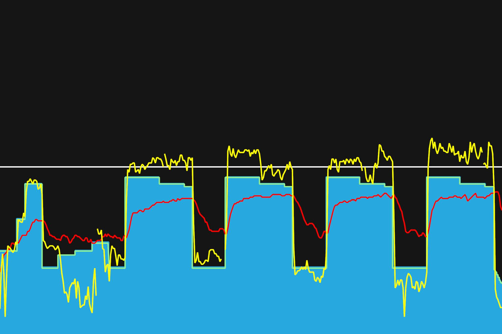
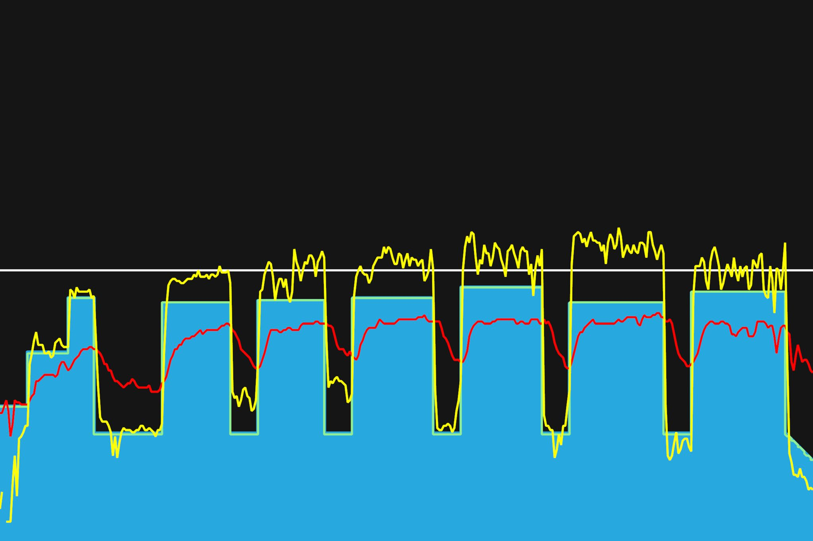
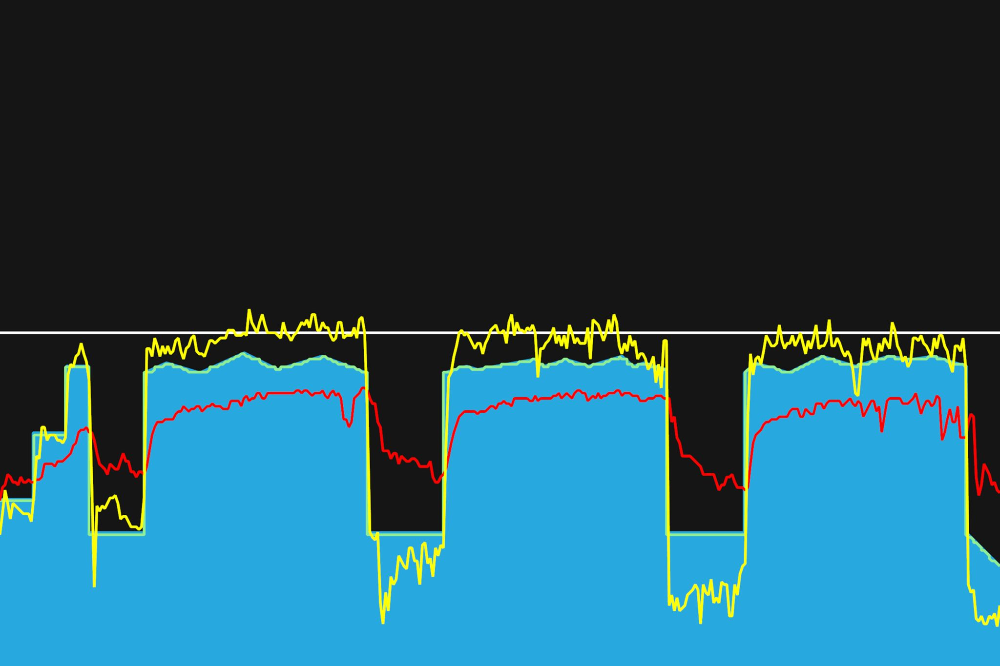

# 3주차 : 7월 1일(월) ~ 7일(일)

## 여섯번째, 7월 1일(월)

이전의 트레이닝과 비슷한 형태다. 스위트 스폿에서 꾸준히 라이딩 하기. 기초 체력을 키우기에 좋다고 하니 꾸준히 해보자. 90-100 케이던스를 유지하면서 효율적인 페달링이 어떤 것일까 생각하며 이것저것 해보았다. 토크형과 케이던스형을 번갈아가면서 했다. 초반에는 한발로 페달링하도록 시키던데, 할 때마다 딱딱 걸리는 소리(knocking)가 났다. 처음에는 다 그렇다고 하던데, 이렇게 걸리는 건 페달링이 비효율적이게 되고 있다는 것을 뜻하기도 한단다. 페달링에 힘도 안 들어가고, 제대로 회전도 안된다. 다음 트레이닝 때 웜업구간에서 한발로 페달링하는 것을 더 해봐야겠다.

---

7월 31일까지 목표

- FTP 215 (현재 205, 터보무인 기준)
- 남산업힐 7분대 진입 (현재 8:22)
- 북악업힐 10분대 진입 (현재 12:58)
- 몸무게 68kg 대로 진입 (현재 : 69.5kg)

다음대회까지 목표

- 충원, 상훈 끝까지 피빨고 가기

이후 가능한 목표

- 서울팀 vs 부산팀 : 개통로 TT

---

## 일곱번째, 7월 3일(수)

터보 무인의 파워, 케이던스가 자꾸 끊겼다가 연결되었다가 했다. misuro 센서의 건전지의 위치를 조금 조정하고 연결했더니, 괜찮은 것 같다. 다행이다. 낮은 케이던스 75-85로 조금 무게감 있게 라이딩하는 것을 연습하였다. 막바지쯤엔 왼쪽 무릎에 약간 통증이 느껴졌다. 다른 근육으로 페달링을 하려고 신경썼다. 68kg대로 진입, 몸무게가 왔다갔다하니 조금 더 지켜봐야겠다.

---

7월 31일까지 목표

- FTP 215 (현재 205, 터보무인 기준)
- 남산업힐 7분대 진입 (현재 8:22)
- 북악업힐 10분대 진입 (현재 12:58)
- 몸무게 68kg 대로 진입 (현재 : 69.5kg)

다음대회까지 목표

- 충원, 상훈 끝까지 피빨고 가기

이후 가능한 목표

- 서울팀 vs 부산팀 : 개통로 TT

---

## 여덟번째, 7월 5일(금)

안하던 운동을 2주동안 꾸준히 해서인지, 몸무게가 조금씩 줄고 있다. 운동을 끝내고 나서는 67kg대까지 봤는데, 밥먹으면 바로 68kg가 되겠지. 이대로 하면 이번달까지 평균몸무게 68kg대 달성은 무난히 될 것 같다.
스위트 스폿에서 일정한 파워유지하는 트레이닝을 했는데, 아무래도 시간이 길어지니 힘들었다. 세번째 인터벌할 때는 왼쪽 무릎에 통증이 조금씩 느껴졌다. 오른쪽 무릎은 대부분 괜찮았는데, 왼쪽을 쉬어주기 위해 오른쪽으로 하려고 했더니, 오른쪽 무릎도 통증이 살짝살짝 느껴지는 것 같았다. 무릎이 아픈 것은 현재 파워를 무릎이 감당 못해서겠지. 다른 근육들을 써서 힘을 분산시켜야겠다.

---

7월 31일까지 목표

- FTP 215 (현재 205, 터보무인 기준)
- 남산업힐 7분대 진입 (현재 8:22)
- 북악업힐 10분대 진입 (현재 12:58)
- 몸무게 68kg 대로 진입 (현재 : 69.5kg)

다음대회까지 목표

- 충원, 상훈 끝까지 피빨고 가기

이후 가능한 목표

- 서울팀 vs 부산팀 : 개통로 TTT

---
