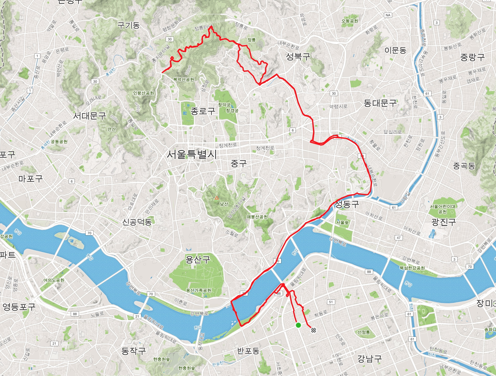

# 북악북악 덥다덥다

## 아홉번째, 7월 6일(토)

어제도 라이딩을 했겠다 오늘은 쉬고 내일 라이딩을 가려했다. 아침에 상훈이가 전화가 와서 라이딩 하잔다. 고고. 찢어진 타이어를 교체하고 한번 나가본다. 처음으로 타이어를 교체해보았는데 생각보다 간단하네. 굿잡.

이제 여름이다. 온도가 사뭇 다르다. 덥다더워. 기생출 업힐에 클릿이 벗겨져 클빠링했다. 다행이 완전 넘어지지는 않아서, 데굴데굴 굴러내려가진 않았다. 다행이다. 다시 허겁지겁 올라갔는데, 이 때 오버페이스를 했던 것 같다. 이때부터 계속 기침이 나기 시작했다. 북악역방향업힐을 할 때는 정말 오바이트할 뻔...

북악정방향업힐에선 이전 기록보다 단축하면 좋겠다 싶었다. 저번엔 남산을 갔다오고 북악을 간 것이라 기록이 12분대 후반이었다. 그것보다야 잘타야지 않겠는가. 이번에 할 때는 케이던스형보단 토크형으로 타려고 해보았다. 내가 잘 쓰지 않았던 근육을 보완하면 좋으니까. 그 덕분인가? 다행이 기록이 많이 단축되었다. 1kg 남짓 경량화한 몸무게 덕도 있었던 것 같다. 굿굿.

업힐댄싱이 부자연스러워서 상훈이와 같이 연습해보았다. 한 높은 경사에서 자리를 잡고 했다. 왠걸.. 댄싱을 하다 오른쪽 클릿이 또 빠져서 고꾸라졌다. 오늘만 두번째... 클릿이 자꾸 빠진다고 하니 상훈이가 고쳐주겠단다. 페달 부분에 나사를 돌리니 클릿을 쌔게 잡아주었다. 이런 기능이 있었다니!!! 감사감사.

아직까지 기침이 간간히 나는 것 보면 오버페이스를 하긴 했나보다. 오늘내일은 푹 쉬어야지. 북악업힐 10분대 진입 완료. 다음은 9분대로 가자.

---

7월 31일까지 목표

- FTP 215 (현재 205, 터보무인 기준)
- 남산업힐 7분대 진입 (현재 8:22)
- 북악업힐 9분대 진입 (현재 10:33)
- 몸무게 68kg 대로 진입 (현재 : 69.5kg)

다음대회까지 목표

- 충원, 상훈 끝까지 피빨고 가기

이후 가능한 목표

- 서울팀 vs 부산팀 : 개통로 TTT

달성완료목표

- 북악업힐 10분대 진입 (6월 12:58 (남산후북악) -> 10:33 달성 (7월 6일)

---
