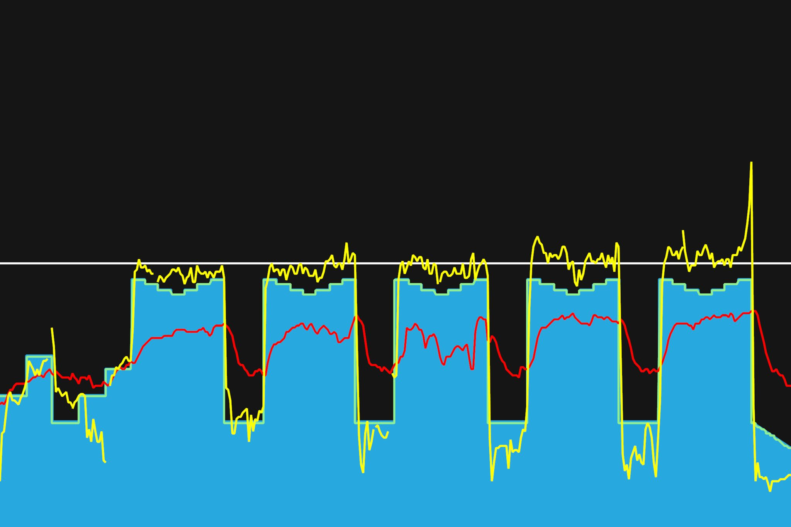
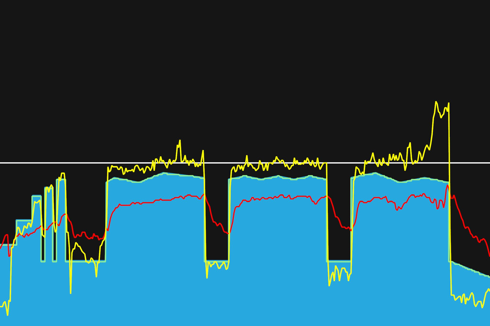
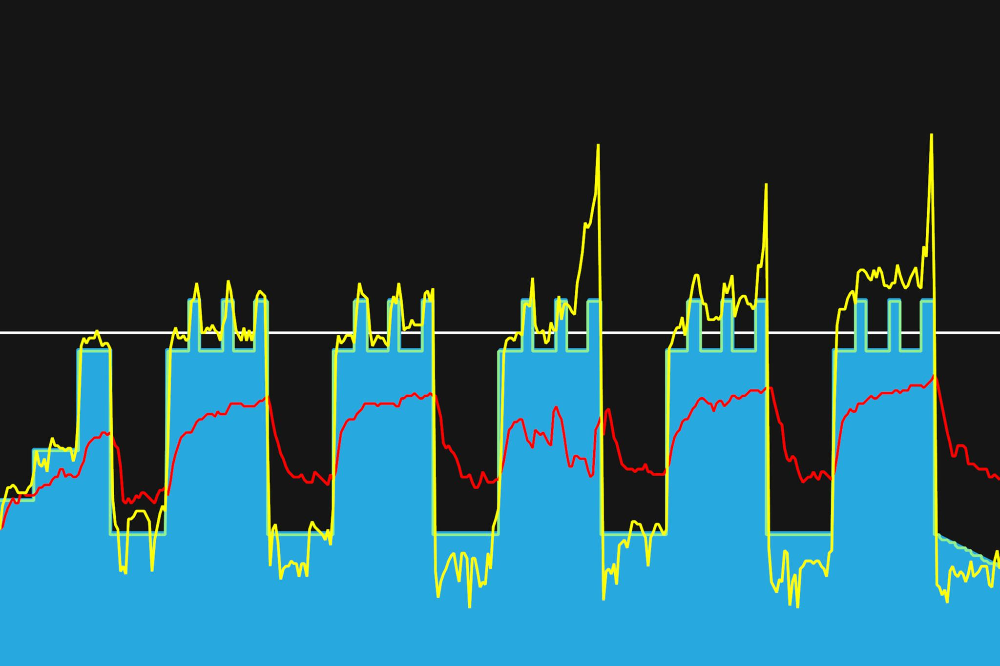

# 4주차 : 7월 8일(월) ~ 14일(일)

## 열번째, 7월 8일(월)

스위트스팟에서 지속적으로 파워 유지하기. 토크형 페달링을 연습. 어느 한 지점에서 힘이 잘 들어가고 자연스럽게 페달링되는 자세가 있다. 조금 힘들어지면 이런 자세가 무너진다. 오래 유지할 수 있도록 해보자. 근지구력이 조금 늘었는가? 같은 파워를 내는대의 평균 심박이 조금 내려간 것 같은 느낌이다.

---

7월 31일까지 목표

- FTP 215 (현재 205, 터보무인 기준)
- 남산업힐 7분대 진입 (현재 8:22)
- 북악업힐 9분대 진입 (현재 10:33)
- 몸무게 68kg 대로 진입 (현재 : 69.5kg)

다음대회까지 목표

- 충원, 상훈 끝까지 피빨고 가기

이후 가능한 목표

- 서울팀 vs 부산팀 : 개통로 TTT

달성완료목표

- 북악업힐 10분대 진입 (6월 12:58 (남산후북악) -> 10:33 달성 (7월 6일)

---

## 열한번째, 7월 10일(수)

스위트스팟에서 근지구력 키우기, 토크형 자세로 쭉- 했다. 이전 트레이닝에서는 마지막 인터벌에서 왼쪽 무릎의 통증이 약간 느껴졌었다. 이번에는 통증이 없었다. 뒤쪽 허벅지와 엉덩이근육(아직 잘 모르겠지만)을 사용하려고 했기 때문인가. 약간 걱정되는 것은 왼쪽과 오른쪽의 파워가 다를 수 있을 것 같다는 느낌이다.

---

7월 31일까지 목표

- FTP 215 (현재 205, 터보무인 기준)
- 남산업힐 7분대 진입 (현재 8:22)
- 북악업힐 9분대 진입 (현재 10:33)

8월 30일까지 목표

- 몸무게 67kg 대로 진입 (현재 68.5kg)

다음대회까지 목표

- 충원, 상훈 끝까지 피빨고 가기

이후 가능한 목표

- 서울팀 vs 부산팀 : 개통로 TTT

달성완료목표

- 북악업힐 10분대 진입 완료 (6월 12:58 -> 7월 6일 10:33)
- 몸무게 68kg 대로 진입 완료 (6월 69.5kg -> 7월 10일 68.5kg)

---

## 열두번째, 7월 12일(금)

Sweet Spot 구간과 VO2 Max 구간 연습. 이제 FTP보다 높은 구간을 연습하게 하는군.
자전거 타다 배가 아파서 고생했다. 중간에 설사를 세번 연속 좔좔좔... 끄아아악. 뭘 잘못 먹은거지? 2/3 정도만 하고, 그만하려고 했다. 근대 또 하다보니 끝까지 해야할 것 같은 느낌이 들어, 끝까지 마무리를 했다. 잘했다. 조금씩 페달링 효율이 생기는 것인가? 조금씩 페달링이 자연스러워지는 것 같다. 다음주까지 하고, 다시 FTP 테스트를 해봐야겠다.

---

7월 31일까지 목표

- FTP 215 (현재 205, 터보무인 기준)
- 남산업힐 7분대 진입 (현재 8:22)
- 북악업힐 9분대 진입 (현재 10:33)

8월 30일까지 목표

- 몸무게 67kg 대로 진입 (현재 68.5kg)

다음대회까지 목표

- 충원, 상훈 끝까지 피빨고 가기

이후 가능한 목표

- 서울팀 vs 부산팀 : 개통로 TTT

달성완료목표

- 북악업힐 10분대 진입 완료 (6월 12:58 -> 7월 6일 10:33)
- 몸무게 68kg 대로 진입 완료 (6월 69.5kg -> 7월 10일 68.5kg)

---
