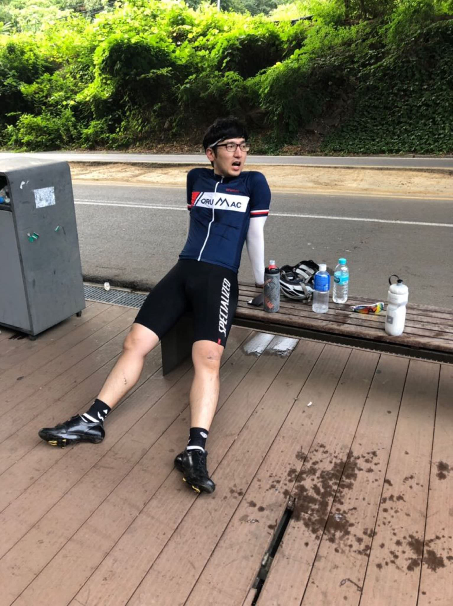

# 쭉쭉 달리는 한강 라이딩

## 열세번째, 7월 13일(토)

뜻밖의 라이딩. 비도 온다고 하고, 상훈이는 일정이 있다하여 이번 주말은 푹 쉬자고 생각했었다.
점심때쯤 라면 먹고 잠이 들었었는데, 은호의 전화에 잠이 깼다. 라이딩 가자! 살짝 고민했었는데, 이제 여름이라 밖에서 자주 못 탈 것 같아서 가자고 했다. 저번주에 더워서 너무 고생했던 것이 생각났다. 오늘은 그래도 하루 종일 '흐림' 날씨이니 좀 괜찮겠지.

은호는 힘이 넘쳤다. 은호와 만난 뒤로 쭉 35-40 속도로 갔다. 1/3 지점 이후부터는 30-35로 달렸다. 그래도 꾸준히 30 이상은 달렸던 것 같다. 2/3 지점까지는 대부분 은호가 끌었다. 은호가 힘이 빠졌는지 남은 1/3 정도는 내가 주로 끌었던 것 같다.

앞장서서 끈다는 것이 익숙하지 않다. 뒤에서 속도 맞춰서 따라가기도 힘들었었는데, 바람을 맞아가며 힘을 더 쓴다는 것이 부담도 되고, 힘도 없다. 상훈이가 매번 주로 앞에 있었는데, 오늘은 없으니 은호가 앞장선다. 은호가 힘이 빠지니 나도 끌게 된다. 로테이션 돌면서 조금씩 힘을 나눠쓰는 것을 조금은 익힌 것 같다. 조금 더 연습하면 서로서로 체력을 아끼면서 빠르게 갈 수 있을 것 같다.

체력이 좀 오른 것 같다. 요새 꾸준히 타려고 하다보니 힘이 조금 더 붙었다. 예전보다 평속도 조금 올랐다. 평지에서 꾸준한 속도로 달리는 것이 예전보다 덜 힘들다. 서울을 조금 벗어나서 사람이 뜸한 자전거길을 달리는 것이 무척이나 재밌었다. 앞장서서 달리던 사람들을 한 사람씩 한사람씩 따라잡는 것이 재밌었다. 바람을 가르며 달리고 있을 때의 시원한 바람이 너무 좋았다. 탈 수 있을 때 타자.

---

7월 31일까지 목표

- FTP 215 (현재 205, 터보무인 기준)
- 남산업힐 7분대 진입 (현재 8:22)
- 북악업힐 9분대 진입 (현재 10:33)

8월 30일까지 목표

- 몸무게 67kg 대로 진입 (현재 68.5kg)

다음대회까지 목표

- 충원, 상훈 끝까지 피빨고 가기

이후 가능한 목표

- 서울팀 vs 부산팀 : 개통로 TTT

달성완료목표

- 북악업힐 10분대 진입 완료 (6월 12:58 -> 7월 6일 10:33)
- 몸무게 68kg 대로 진입 완료 (6월 69.5kg -> 7월 10일 68.5kg)

---
