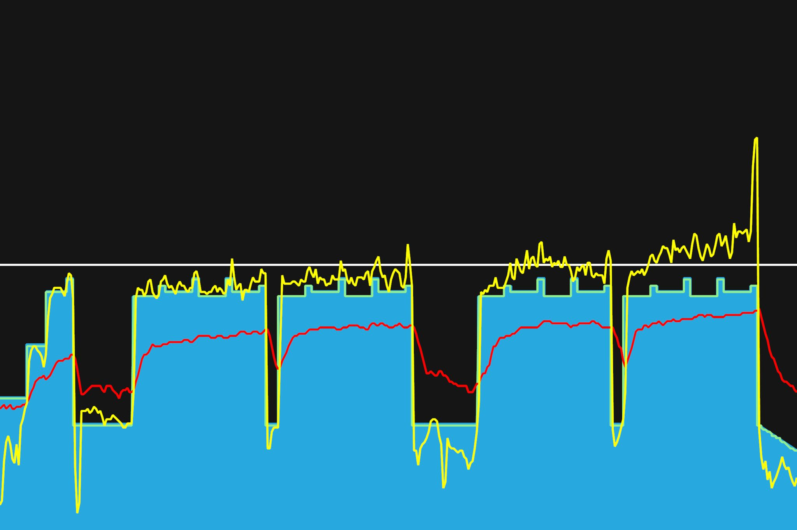
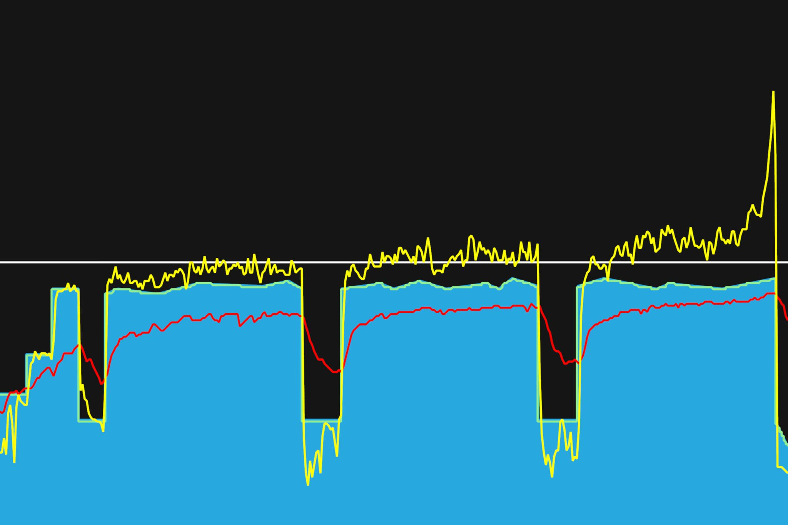
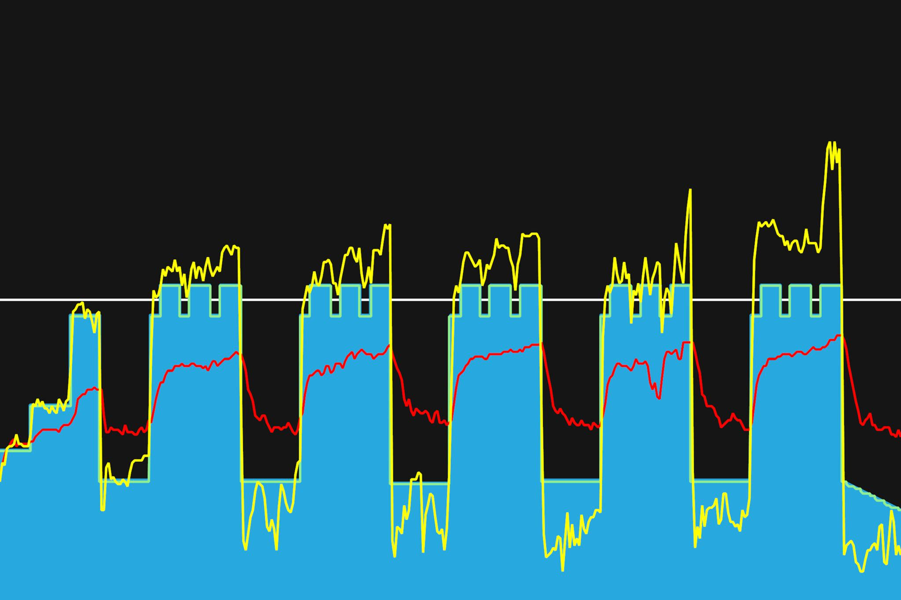

# 5주차 : 7월 15일(월) ~ 21일(일)

## 열네번째, 7월 15일(월)

주말 라이딩의 피로가 다 안풀린 것 같다. 이전에 비해 파워 유지가 힘들었다. 중반 이후에는 몸이 좀 풀렸는지, 이전과 비슷한 파워가 나왔다. 핸들보다 안장이 너무 낮은 것 같아 0.5cm 정도 올려보았다. 조금 더 해봐야겠지만 무릎 통증이 없었다. 다행. 엉덩이 근육이 약간 땡기는 것으로 봐서 둔근을 조금씩 사용하고 있는 것 같다. 굿. 주말 저녁에 배가 고파서 이틀 연속 야식을 먹었더니 이전 몸무게로 다시 돌아갔다. 다시 68kg로 대로 가자. 고고.

---

7월 31일까지 목표

- FTP 215 (현재 205, 터보무인 기준)
- 남산업힐 7분대 진입 (현재 8:22)
- 북악업힐 9분대 진입 (현재 10:33)

8월 30일까지 목표

- 몸무게 67kg 대로 진입 (현재 68.5kg)

다음대회까지 목표

- 충원, 상훈 끝까지 피빨고 가기

이후 가능한 목표

- 서울팀 vs 부산팀 : 개통로 TTT

달성완료목표

- 북악업힐 10분대 진입 완료 (6월 12:58 -> 7월 6일 10:33)
- 몸무게 68kg 대로 진입 완료 (6월 69.5kg -> 7월 10일 68.5kg)

---

## 열다섯번째, 7월 17일(수)

페달링을 네 부분으로 나누어서, 내리고 들어올리는 것에 신경쓰며 연습했다. 각 구간별로 토크형, 케이던스형, 토크형으로 나누어 했다. 웜업이 중요한 것 같다. 처음 구간에는 힘이 들었는데, 이후에 지날수록 몸이 풀리는지 페달링이 더 잘 된다. 상체에 힘을 빼는 것에도 신경썼다. 이번주까지 마저 트레이닝하고, 다음 트레이닝 세션을 위해 다시 FTP 테스트를 해봐야겠다.

---

7월 31일까지 목표

- FTP 215 (현재 205, 터보무인 기준)
- 남산업힐 7분대 진입 (현재 8:22)
- 북악업힐 9분대 진입 (현재 10:33)

8월 30일까지 목표

- 몸무게 67kg 대로 진입 (현재 68.5kg)

다음대회까지 목표

- 충원, 상훈 끝까지 피빨고 가기

이후 가능한 목표

- 서울팀 vs 부산팀 : 개통로 TTT

달성완료목표

- 북악업힐 10분대 진입 완료 (6월 12:58 -> 7월 6일 10:33)
- 몸무게 68kg 대로 진입 완료 (6월 69.5kg -> 7월 10일 68.5kg)

---

## 열여섯번째, 7월 19일(금)

중간 인터벌에 댄싱을 연습. 어색어색. 댄싱 영상을 좀 봐야겠다.
왼쪽 무릎통증은 안느껴진다. 다행이다. 통증이 느껴지는 왼쪽 다리를 주로 신경써서 그런지, 오른쪽 페달링이 자연스럽지 않은 느낌이다. 이 부분도 다시 바로잡아야겠다.

첫번재 트레이닝는 전체적으로 스위트스팟에서 시간을 늘려가며 꾸준히 라이딩하는 것을 연습했다. 전체적인 체력이 증가했다. 일정한 속도를 유지하는 시간도 좀 더 늘었다. 라이딩하는 절대적인 시간이 느니, 전반적인 기초체력 상승했고, 라이딩 능력이 상승했다. 다음주부터는 리커버리를 좀 하면서 새로운 두번째 트레이닝으로 넘어가자.

---

7월 31일까지 목표

- FTP 215 (현재 205, 터보무인 기준)
- 남산업힐 7분대 진입 (현재 8:22)
- 북악업힐 9분대 진입 (현재 10:33)

8월 30일까지 목표

- 몸무게 67kg 대로 진입 (현재 68.5kg)

다음대회까지 목표

- 충원, 상훈 끝까지 피빨고 가기

이후 가능한 목표

- 서울팀 vs 부산팀 : 개통로 TTT

달성완료목표

- 북악업힐 10분대 진입 완료 (6월 12:58 -> 7월 6일 10:33)
- 몸무게 68kg 대로 진입 완료 (6월 69.5kg -> 7월 10일 68.5kg)

---
