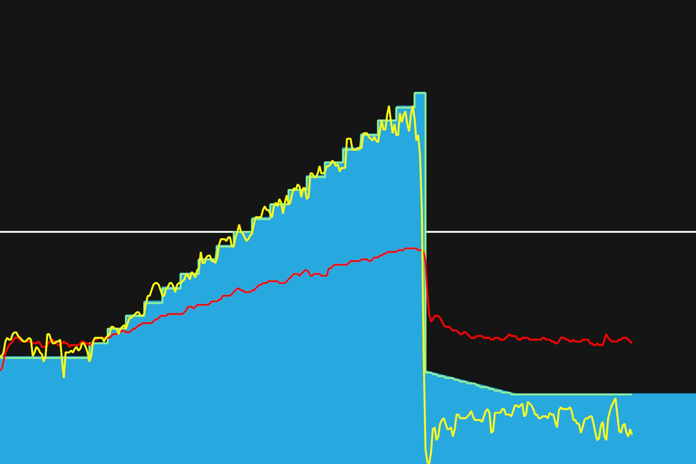
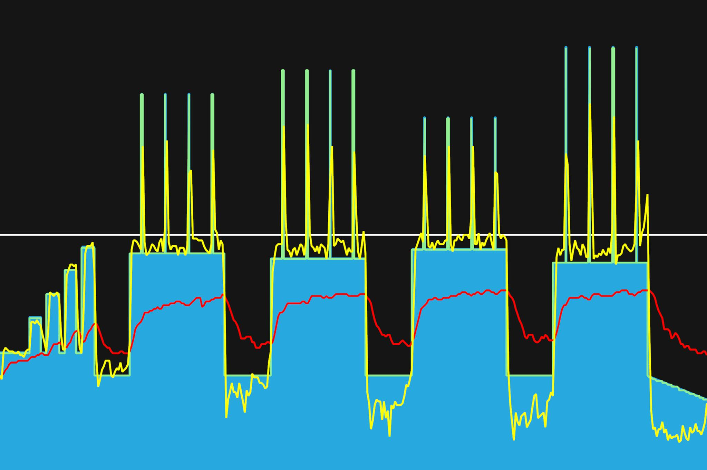
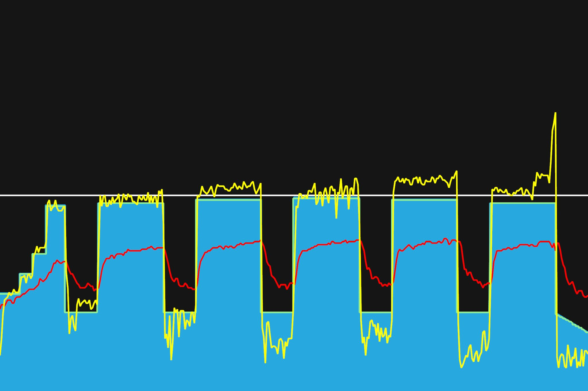

# 6주차 : 7월 22일(월) ~ 28일(일)

## 열입곱번째, 7월 22일(월)

파워테스트 결과 FTP 230 나왔다. 한달 전에 비해 25 정도가 상승했다. 꾸준한 보람이 있다. 굿. 심박수도 190이 한계인지 알았는데, 193까지 나온거보니, 최대심박수를 195~200정도라 봐야겠다. 터보무인이 10% 뻥파워가 있다하니, 실제로는 209~215 정도일 것으로 예상한다. 비교 수치가 있어야 하기 때문에 난 터보무인 기준으로.

대회까지 한달 남짓 남았는데, 그때까지 파워 10~20 정도는 더 높일 수 있지 않을까 싶다. 꾸준히 해보자. 대회전까지 FTP 240-245 까지 올려보자.

---

7월 31일까지 목표

- 남산업힐 7분대 진입 (현재 8:22)
- 북악업힐 9분대 진입 (현재 10:33)

8월 30일까지 목표

- FTP 245 (현재 230, 터보무인 기준)
- 몸무게 67kg 대로 진입 (현재 68.5kg)

다음대회까지 목표

- 충원, 상훈 끝까지 피빨고 가기

이후 가능한 목표

- 서울팀 vs 부산팀 : 개통로 TTT

달성완료목표

- 북악업힐 10분대 진입 완료 (6월 12:58 -> 7월 6일 10:33)
- 몸무게 68kg 대로 진입 완료 (6월 69.5kg -> 7월 10일 68.5kg)
- FTP 230 (6월 205 -> 7월 22일 230, 터보무인 기준)

---

## 열여덟번째, 7월 24일(수)

두 번째 베이스 페이즈. 스위트스팟에서 연습. 간간히 높은 파워의 인터벌도 생겼다. 순간적으로 높은 파워를 내는 것을 잘못했는데, 이런 연습을 통해 실력이 향상되지 않을까싶다. 다시 시작된 한달간의 워크아웃. 잘해보자.
왼쪽 다리 전체적으로 저린 느낌이 있었는데, 허벅지와 엉덩이 근육으로 쓰려고 하다보니 괜찮아지는 것 같다. 무릎에 무리가 가지 않도록 하자.

---

7월 31일까지 목표

- 남산업힐 7분대 진입 (현재 8:22)
- 북악업힐 9분대 진입 (현재 10:33)

8월 30일까지 목표

- FTP 245 (현재 230, 터보무인 기준)
- 몸무게 67kg 대로 진입 (현재 68.5kg)

다음대회까지 목표

- 충원, 상훈 끝까지 피빨고 가기

이후 가능한 목표

- 서울팀 vs 부산팀 : 개통로 TTT

달성완료목표

- 북악업힐 10분대 진입 완료 (6월 12:58 -> 7월 6일 10:33)
- 몸무게 68kg 대로 진입 완료 (6월 69.5kg -> 7월 10일 68.5kg)
- FTP 230 (6월 205 -> 7월 22일 230, 터보무인 기준)

---

## 열아홉번째, 7월 26일(금)

첫번째주 트레이닝 완료. 토크형, 케이던스형, 댄싱, 토크형, 에어로 자세 순으로 한번씩 탔다. 스위트스팟에서 연습하니 할만하다. 각 자세에서 근육을 사용하는 곳이 어디인지 어느정도 알 것 같다. 번갈아가면서 사용하면 효율적이니, 나누어서 연습을 해보자.

이번주 주말에 남산과 북악산을 가서, 업힐을 연습하면 좋을 것 같은데, 비가 많이 내려 힘들지 않을까싶다. 아쉽다.

---

7월 31일까지 목표

- 남산업힐 7분대 진입 (현재 8:22)
- 북악업힐 9분대 진입 (현재 10:33)

8월 30일까지 목표

- FTP 245 (현재 230, 터보무인 기준)
- 몸무게 67kg 대로 진입 (현재 68.5kg)

다음대회까지 목표

- 충원, 상훈 끝까지 피빨고 가기
- 8월 31일(토) 오크밸리 그란폰도 완주
- 9월 7일(토) 춘천 그란폰도 완주

이후 가능한 목표

- 서울팀 vs 부산팀 : 개통로 TTT

달성완료목표

- 북악업힐 10분대 진입 완료 (6월 12:58 -> 7월 6일 10:33)
- 몸무게 68kg 대로 진입 완료 (6월 69.5kg -> 7월 10일 68.5kg)
- FTP 230 (6월 205 -> 7월 22일 230, 터보무인 기준)

---
