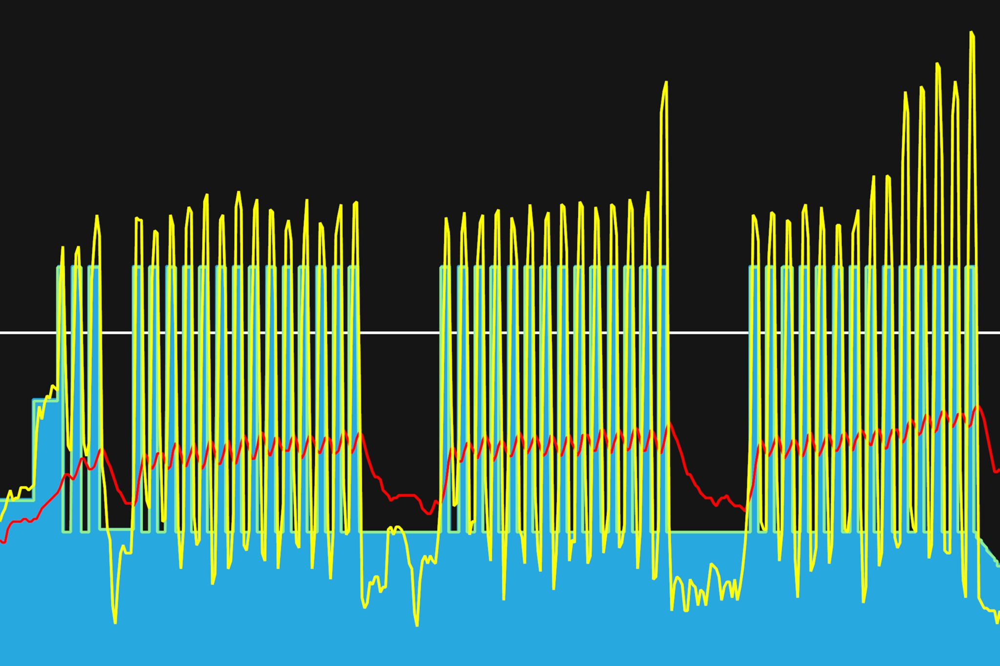
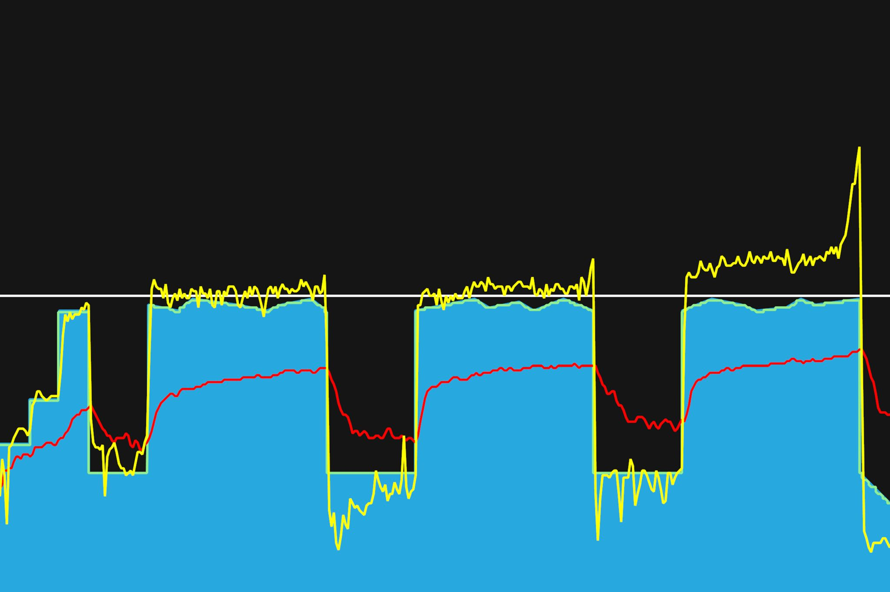
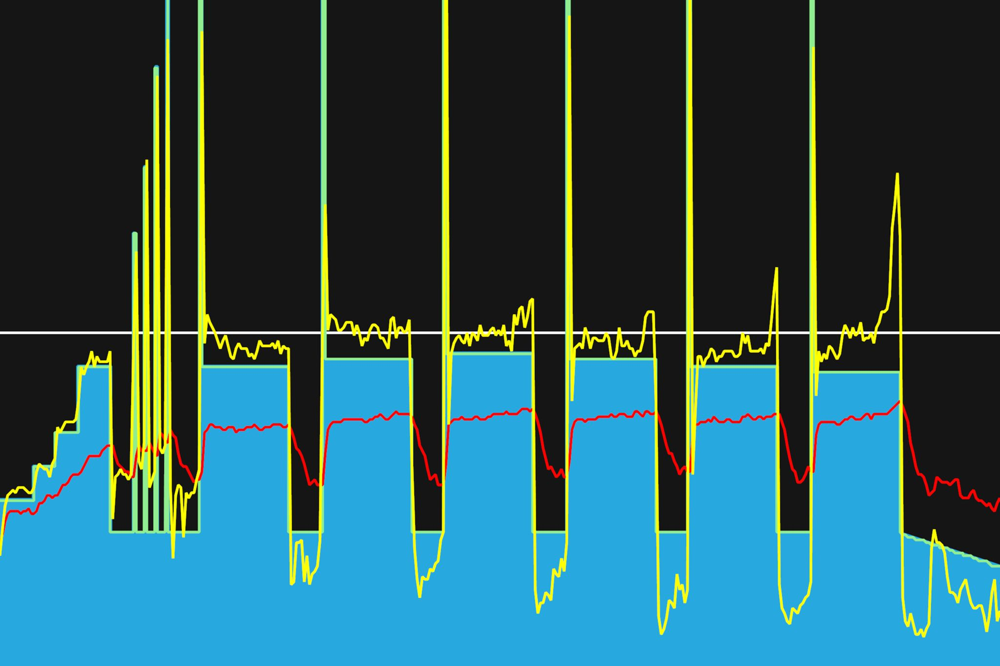

# 7주차 : 7월 29일(월) ~ 8월 4일(일)

## 스무번째, 7월 29일(월)

짧은 인터벌을 반복하는 워크아웃. 타겟파워보다 조금씩 더 높은 파워를 내려고 했다. 터보무인에서 높은 파워일 때 조금 더 뻥파워가 있는 것 같기 때문이다. 100정도의 케이던스로 페달링을 유지하려고 신경썼다. 새로운 한주가 시작되었다. 이번주도 잘해보자. 화이팅.

---

7월 31일까지 목표

- 남산업힐 7분대 진입 (현재 8:22)
- 북악업힐 9분대 진입 (현재 10:33)

8월 30일까지 목표

- FTP 245 (현재 230, 터보무인 기준)
- 몸무게 67kg 대로 진입 (현재 68.5kg)

다음대회까지 목표

- 충원, 상훈 끝까지 피빨고 가기
- 8월 31일(토) 오크밸리 그란폰도 완주
- 9월 7일(토) 춘천 그란폰도 완주

이후 가능한 목표

- 서울팀 vs 부산팀 : 개통로 TTT

달성완료목표

- 북악업힐 10분대 진입 완료 (6월 12:58 -> 7월 6일 10:33)
- 몸무게 68kg 대로 진입 완료 (6월 69.5kg -> 7월 10일 68.5kg)
- FTP 230 (6월 205 -> 7월 22일 230, 터보무인 기준)

---

## 스물한번째, 7월 31일(수)

Threshold 구간에서 지속적인 라이딩하기. 근지구력 강화. 두 번째 인터벌부터는 에어로 자세로 연습했다. 낮은 케이던스에 묵직한 페달링이 파워가 더 높게 나왔다. 빠른 케이던스로 하니 확실히 호흡이 딸린다. 상대적으로 낮은 케이던스가 호흡은 덜 부족하지만, 높은 파워를 낸다. 다리에 데미지는 더 간다.
이전에 비해, 같은 심박수에 낼 수 있는 파워가 늘었다. 높은 심박수에서 유지할 수 있는 지속 시간이 늘었다.

---

7월 31일까지 목표

- 남산업힐 7분대 진입 (현재 8:22)
- 북악업힐 9분대 진입 (현재 10:33)

8월 30일까지 목표

- FTP 245 (현재 230, 터보무인 기준)
- 몸무게 67kg 대로 진입 (현재 68.5kg)

다음대회까지 목표

- 충원, 상훈 끝까지 피빨고 가기
- 8월 31일(토) 오크밸리 그란폰도 완주
- 9월 7일(토) 춘천 그란폰도 완주

이후 가능한 목표

- 서울팀 vs 부산팀 : 개통로 TTT

달성완료목표

- 북악업힐 10분대 진입 완료 (6월 12:58 -> 7월 6일 10:33)
- 몸무게 68kg 대로 진입 완료 (6월 69.5kg -> 7월 10일 68.5kg)
- FTP 230 (6월 205 -> 7월 22일 230, 터보무인 기준)

---

## 스물두번째, 8월 2일(금)

정말 오랜만에 내보는 높은 파워. 짧은 스프린트를 몇 번해보았는데, 최대 파워가 700대가 나았다. 최대로 내본다고 했는데도, 생각보다 많이 안나온다. 연습하다보면 조금씩 늘겠지.
8월이 되었다. 7월말에는 비가 계속 오기도하고, 덥기도해서 라이딩하러 못나갔었는데, 이번 주말에는 남산에 한번 가야겠다. 저번달 목표였던 남산 7분대 진입을 시도 해봐야지.

---

7월 31일까지 목표

- 남산업힐 7분대 진입 (현재 8:22)
- 북악업힐 9분대 진입 (현재 10:33)

8월 30일까지 목표

- FTP 245 (현재 230, 터보무인 기준)
- 몸무게 67kg 대로 진입 (현재 68.5kg)

다음대회까지 목표

- 충원, 상훈 끝까지 피빨고 가기
- 8월 31일(토) 오크밸리 그란폰도 완주
- 9월 7일(토) 춘천 그란폰도 완주

이후 가능한 목표

- 서울팀 vs 부산팀 : 개통로 TTT

달성완료목표

- 북악업힐 10분대 진입 완료 (6월 12:58 -> 7월 6일 10:33)
- 몸무게 68kg 대로 진입 완료 (6월 69.5kg -> 7월 10일 68.5kg)
- FTP 230 (6월 205 -> 7월 22일 230, 터보무인 기준)

---
