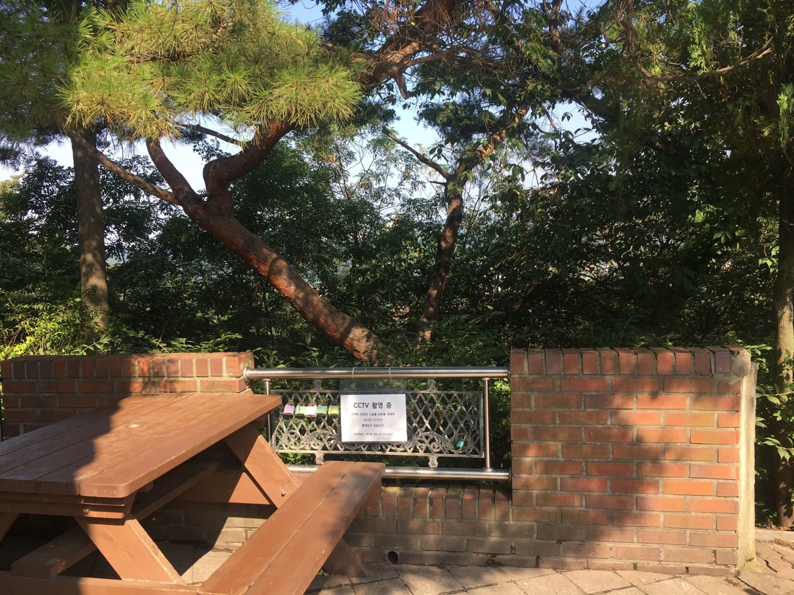
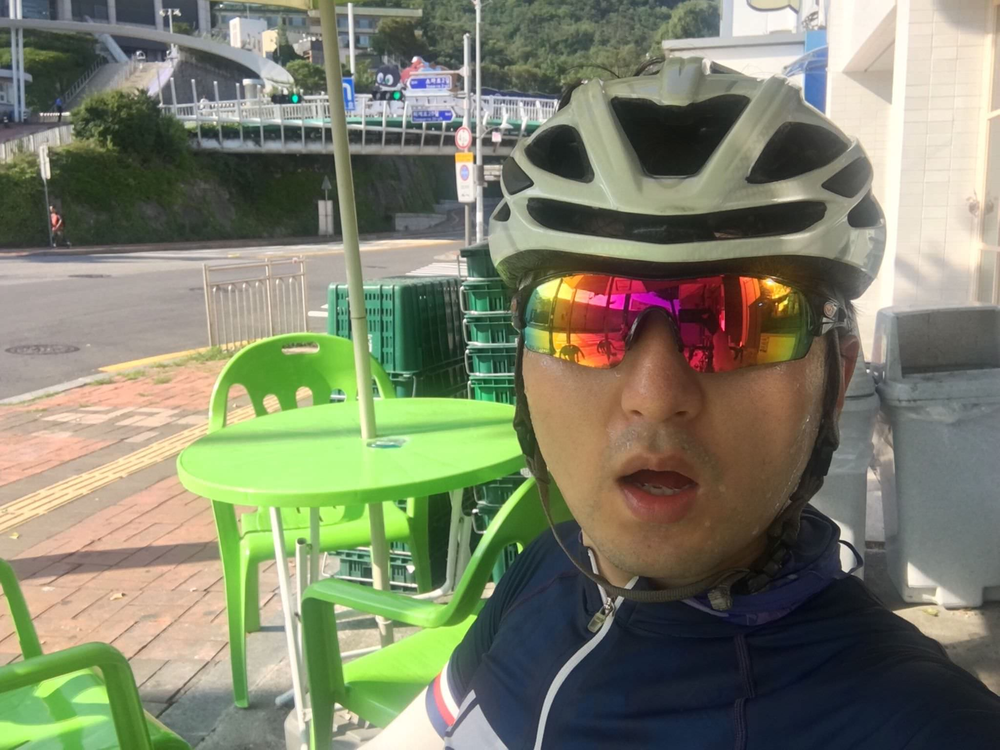

# 자전거도 타고, 나도 탄다. 남산북악 라이딩

## 스물세번째, 8월 3일(토)

오전에도 날이 덥다. 새벽같이 나가면 좀 낫겠다 싶어 일찍 출발했다. 남산입구에 7시까지 도착하려고 했으나, 7시 조금 넘어서야 출발했다. 그래도 출발했으니 다행. 이전에 햇빛 쨍쨍한 오후에 갔었는데, 그 때보다 훨 낫다. 다행이다.

최근 한달간 주말마다 비소식이 있어 못탔다. 7월까지 남산북악 기록 갱신을 목표로 두고 있었기에 이번에는 덥더라도 꼭 가야겠다 싶었다. 체력이 얼마나 향상되었을까 궁금. 남산 3바퀴 돌고, 9시까지 집에 돌아오자고 계획을 세웠다.

역시 남산답게, 이른 시간인데도 사람들이 많다. 덕분에 외롭지 않은 라이딩이다. 졸졸 따라가며 남산 입구까지 도착. 호흡을 가다듬고, 페달링을 시작했다. 이전에 왔을 때보다 확실히 수월하다. 굿굳. 근육을 이리썼다, 저리썼다 해봤다. 마지막엔 댄싱으로 마무리했다. 쉬지 않고, 다운힐을 하고 나서, 한바퀴 더 돌았다. 시간이 지날 수록 체력도 떨어지고, 점점 더 더워진다. 편의점에서 시원한 콜라를 먹어야겠다 생각했다. 어라? 남산 정상에 도착했는데, 편의점 문이 안열려있있다. 주말엔 안하는 것인가...?

남산을 내려와서 편의점을 찾아보았다. 북악산 방향으로 조금 가다보면 나오겠지. 한참 가다보니 편의점이 있었다. 오우야. 콜라 1+1의 노림수에 넘어가 그 자리에서 한병을 다 비웠고, 하나는 져지 뒷주머니에 넣었다.

남산 한바퀴 더 돌고 가려고 했었다. 근데 여기서 남산까지 가는 거리나, 북악까지 가는 거리가 비슷했다. 북악고고. 오랜만에 공도로 가는 길이라 좀 해맸다. 설렁설렁 밟으며 북악 입구에 도착. 저번 기록보단 좋게 나오도록 해야지. 역시 북악도 사람이 많다. 넘나 좋은것. 다들 더운데 고생이 많네. 나도 포함해서... 덥고 힘들다. 땀이 주르륵. 힘들게 정상 도착. 쉬었다 가려고 했는데, 가만히 앉아 있는게 더 덥다. 바람도 안불어주는 구나. 다시 챙겨서 부랴부랴 북악을 내려왔다.

돌아오는 길은 더위와의 싸움이다. 시간이 지날수록 햇빛이 강렬하다. 그나마 그늘 밑이나, 라이딩 중에는 괜찮은데, 직사광선을 직통으로 맞는 신호등에 멈춰있을 때는 정말 죽을 맛이다. 진짜 몸이 타는 듯한 느낌. 그렇게 30분정도 서있으면 쓰러질 것 같다. 그래도 밟으니, 집까진 와지네. 고생했다.

기록이 궁금하여 브라이튼앱으로 바로 올렸다. 근대 스트라바에 기록이 안올라간다. 된장. 브라이튼을 USB로 연결도 안되고, 브라이튼 앱에는 기록도 안남아있다. 홈페이지도 들어가보고 30-40분 정도 씨름하고 있었다. 이런이런. 혹시나 해서 스트라바에 들어와봤는데, 기록이 올라가 있네. 너도 시간이 필요했던 거구나. 좀 일찍 알려주지 그랬니.

오-예- 오랜만에 PR 달성. 남산도, 북악도 새로운 기록이다. 다음에는 10초 더 줄여야지. 간만에 바깥 라이딩을 하니 이야기가 길어졌네. 대회까지 한달. 그 전에 남산과 북악을 한번더 갈 수 있을까? 이 찜통 더위에...? 나중에 생각하자. 끝.

---

8월 30일까지 목표

- FTP 245 (현재 230, 터보무인 기준)
- 몸무게 67kg 대로 진입 (현재 68.5kg)
- 남산업힐 6분 30초대 진입 (현재 6:45)
- 북악업힐 9분 30초대 진입 (현재 9:46)

다음대회까지 목표

- 충원, 상훈 끝까지 피빨고 가기
- 8월 31일(토) 오크밸리 그란폰도 완주
- 9월 7일(토) 춘천 그란폰도 완주

이후 가능한 목표

- 서울팀 vs 부산팀 : 개통로 TTT

달성완료목표

- 북악업힐 10분대 진입 완료 (6월 12:58 -> 7월 6일 10:33)
- 몸무게 68kg 대로 진입 완료 (6월 69.5kg -> 7월 10일 68.5kg)
- FTP 230 (6월 205 -> 7월 22일 230, 터보무인 기준)
- 남산업힐 7분대 진입 (6월 8:22 -> 8월 3일 6:45)
- 북악업힐 9분대 진입 (6월 10:33 -> 8월 3일 9:46)

---
