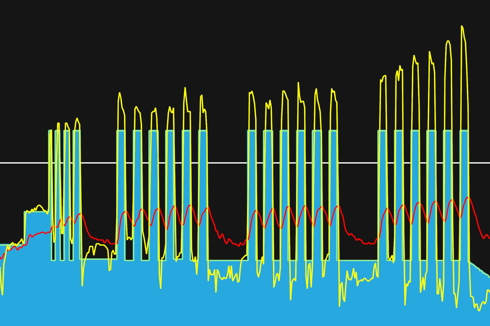
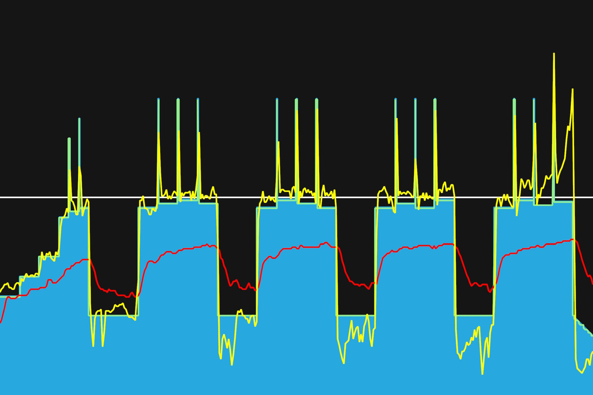

# 8주차 : 8월 5일(월) ~ 11일(일)

## 스물네번째, 8월 5일(월)

VO2 Max 구간에서의 훈련. 인터벌 훈련이다. 토크형, 케이던스형 번갈아가면서 해보았다. 체력을 계속 나눠쓰는 것을 연습해보고 있다. 마지막 구간의 인터벌에는 낼 수 있는 만큼 내보려고 했다. 힘들군. 조금씩 높은 파워를 내는 연습을 하고 있다.

---

8월 30일까지 목표

- FTP 245 (현재 230, 터보무인 기준)
- 몸무게 67kg 대로 진입 (현재 68.5kg)
- 남산업힐 6분 30초대 진입 (현재 6:45)
- 북악업힐 9분 30초대 진입 (현재 9:46)

다음대회까지 목표

- 충원, 상훈 끝까지 피빨고 가기
- 8월 31일(토) 오크밸리 그란폰도 완주
- 9월 7일(토) 춘천 그란폰도 완주

이후 가능한 목표

- 서울팀 vs 부산팀 : 개통로 TTT

달성완료목표

- 북악업힐 10분대 진입 완료 (6월 12:58 -> 7월 6일 10:33)
- 몸무게 68kg 대로 진입 완료 (6월 69.5kg -> 7월 10일 68.5kg)
- FTP 230 (6월 205 -> 7월 22일 230, 터보무인 기준)
- 남산업힐 7분대 진입 (6월 8:22 -> 8월 3일 6:45)
- 북악업힐 9분대 진입 (6월 10:33 -> 8월 3일 9:46)

---

## 스물다섯번째, 8월 7일(수)

Threshold 구간에서의 근지구력 트레이닝. 근지구력 인터벌 훈련. 중간중간에 스프린팅을 하였다. 파워가 500정도밖에 안나온다. 순간파워가 많이 약한 것 같다. 토크형 세번 케이던스형 한번으로 했다. 토크형으로 꾸준히 가는 것이 점점 편해주고 있다.
태풍이 오면서 이번주도 계속 비소식이다. 주말에 비가 안오면, 새벽 라이딩을 해야겠다.

muscle endurance 근지구력, Anaerobic 무산소의, aerobic 유산소의

---

8월 30일까지 목표

- FTP 245 (현재 230, 터보무인 기준)
- 몸무게 67kg 대로 진입 (현재 68.5kg)
- 남산업힐 6분 30초대 진입 (현재 6:45)
- 북악업힐 9분 30초대 진입 (현재 9:46)

다음대회까지 목표

- 충원, 상훈 끝까지 피빨고 가기
- 8월 31일(토) 오크밸리 그란폰도 완주
- 9월 7일(토) 춘천 그란폰도 완주

이후 가능한 목표

- 서울팀 vs 부산팀 : 개통로 TTT

달성완료목표

- 북악업힐 10분대 진입 완료 (6월 12:58 -> 7월 6일 10:33)
- 몸무게 68kg 대로 진입 완료 (6월 69.5kg -> 7월 10일 68.5kg)
- FTP 230 (6월 205 -> 7월 22일 230, 터보무인 기준)
- 남산업힐 7분대 진입 (6월 8:22 -> 8월 3일 6:45)
- 북악업힐 9분대 진입 (6월 10:33 -> 8월 3일 9:46)

---

## 스물여섯번째, 8월 9일(금)

토크형, 케이던스형, 스탠딩형을 번갈아가면서 했다. Threshold 구간에서 인터벌. 힘들긴 하지만, 끝내고 나니 뿌듯하다. 마지막 인터벌에 왼쪽에 무릎통증이 약간 있었다. 로라와 모니터 방향이 삐딱하게 되어 있어서 그런가?
심박계가 안되서 고장났나 싶었는데, 체중계에 있던 건전지로 바꾸니 되었다. 심박계를 구입한지 2년 정도 된 것 같은데, 오래 버텼다.

---

8월 30일까지 목표

- FTP 245 (현재 230, 터보무인 기준)
- 몸무게 67kg 대로 진입 (현재 68.5kg)
- 남산업힐 6분 30초대 진입 (현재 6:45)
- 북악업힐 9분 30초대 진입 (현재 9:46)

다음대회까지 목표

- 충원, 상훈 끝까지 피빨고 가기
- 8월 31일(토) 오크밸리 그란폰도 완주
- 9월 7일(토) 춘천 그란폰도 완주

이후 가능한 목표

- 서울팀 vs 부산팀 : 개통로 TTT

달성완료목표

- 북악업힐 10분대 진입 완료 (6월 12:58 -> 7월 6일 10:33)
- 몸무게 68kg 대로 진입 완료 (6월 69.5kg -> 7월 10일 68.5kg)
- FTP 230 (6월 205 -> 7월 22일 230, 터보무인 기준)
- 남산업힐 7분대 진입 (6월 8:22 -> 8월 3일 6:45)
- 북악업힐 9분대 진입 (6월 10:33 -> 8월 3일 9:46)

---
