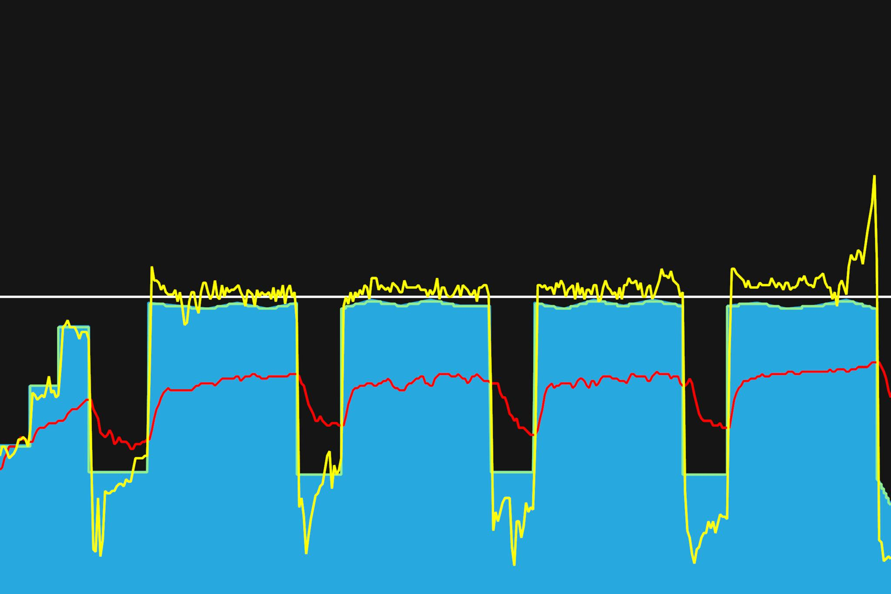

# 9주차 : 8월 12일(월) ~ 18일(일)

## 스물여덟번째, 8월 12일(월)

VO2 Max 구간에서 빠른 케이던스로 인터벌. 100rpm으로 유지하도록 했다. 짧게 짧게 끝낼 수 있어 수월할 것이라 예상했는데, 높은 파워를 내야하다보니 쉽지 않았다. 오랜만에 빠른 케이던스로 트레이닝했다. 인터벌이 운동효과가 좋다고 하니, 파워 증진에도 도움이 되겠지.

---

8월 30일까지 목표

- FTP 245 (현재 230, 터보무인 기준)
- 몸무게 67kg 대로 진입 (현재 68.5kg)
- 북악업힐 9분 30초대 진입 (현재 9:46)

다음대회까지 목표

- 충원, 상훈 끝까지 피빨고 가기
- 8월 31일(토) 오크밸리 그란폰도 완주
- 9월 7일(토) 춘천 그란폰도 완주

이후 가능한 목표

- 서울팀 vs 부산팀 : 개통로 TTT

달성완료목표

- 북악업힐 10분대 진입 완료 (6월 12:58 -> 7월 6일 10:33)
- 몸무게 68kg 대로 진입 완료 (6월 69.5kg -> 7월 10일 68.5kg)
- FTP 230 (6월 205 -> 7월 22일 230, 터보무인 기준)
- 남산업힐 7분대 진입 (6월 8:22 -> 8월 3일 6:45)
- 북악업힐 9분대 진입 (6월 10:33 -> 8월 3일 9:46)
- 남산업힐 6분 30초대 진입 (8월 3일 6:45 -> 8월 11일 6:36)

---

## 스물아홉번째, 8월 14일(수)

Threshold 구간에서 지속 라이딩. 근지구력 운동과 에어로 자세를 연습했다. 거의 FTP 파워로 8~10분 정도 유지했다. 머리 속에 이것저것 생각이 나서, 가이드해주는 것을 잘 읽지 못했다. 목표파워보다 10 정도를 더 내도록 했다. 오늘도 해냈다. 굿.

---

8월 30일까지 목표

- FTP 245 (현재 230, 터보무인 기준)
- 몸무게 67kg 대로 진입 (현재 68.5kg)
- 북악업힐 9분 30초대 진입 (현재 9:46)

다음대회까지 목표

- 충원, 상훈 끝까지 피빨고 가기
- 8월 31일(토) 오크밸리 그란폰도 완주
- 9월 7일(토) 춘천 그란폰도 완주

이후 가능한 목표

- 서울팀 vs 부산팀 : 개통로 TTT

달성완료목표

- 북악업힐 10분대 진입 완료 (6월 12:58 -> 7월 6일 10:33)
- 몸무게 68kg 대로 진입 완료 (6월 69.5kg -> 7월 10일 68.5kg)
- FTP 230 (6월 205 -> 7월 22일 230, 터보무인 기준)
- 남산업힐 7분대 진입 (6월 8:22 -> 8월 3일 6:45)
- 북악업힐 9분대 진입 (6월 10:33 -> 8월 3일 9:46)
- 남산업힐 6분 30초대 진입 (8월 3일 6:45 -> 8월 11일 6:36)

---

## 서른한번째, 8월 16일(금)

어제 남산 라이딩을 해서인지 오늘은 힘이 많이 안났다. 엊그제 했던 트레이닝보다 훨씬 힘들었다. 10분정도씩 파워유지를 해야했었는데, 쉽지 않았다. 평소엔 타겟파워보다 5-10정도 더 내려고 했으나, 오늘은 목표파워를 맞추기도 어려웠다.

토크형과 케이던스형 번갈아가면서 했다. 근육을 다르게 쓰면서 힘을 분배를 잘해야 완료할 수 있는 워크아웃같다. 마지막 인터벌에는 댄싱으로 해보려했는데, 타겟파워를 맞추기가 쉽지 않았다. 파워가 더 안난다고 해야하나?

어제 체인 청소를 간단히 하고 기름을 바르지 않아서인지, 체인소리가 많이 났다.

---

8월 30일까지 목표

- FTP 245 (현재 230, 터보무인 기준)
- 몸무게 67kg 대로 진입 (현재 68.5kg)
- 북악업힐 9분 30초대 진입 (현재 9:46)

다음대회까지 목표

- 충원, 상훈 끝까지 피빨고 가기
- 8월 31일(토) 오크밸리 그란폰도 완주
- 9월 7일(토) 춘천 그란폰도 완주

이후 가능한 목표

- 서울팀 vs 부산팀 : 개통로 TTT

달성완료목표

- 북악업힐 10분대 진입 완료 (6월 12:58 -> 7월 6일 10:33)
- 몸무게 68kg 대로 진입 완료 (6월 69.5kg -> 7월 10일 68.5kg)
- FTP 230 (6월 205 -> 7월 22일 230, 터보무인 기준)
- 남산업힐 7분대 진입 (6월 8:22 -> 8월 3일 6:45)
- 북악업힐 9분대 진입 (6월 10:33 -> 8월 3일 9:46)
- 남산업힐 6분 30초대 진입 (8월 3일 6:45 -> 8월 11일 6:36)
- 남산업힐 6분 30초대 진입 (8월 11일 6:36 -> 8월 15일 6:31)

---
