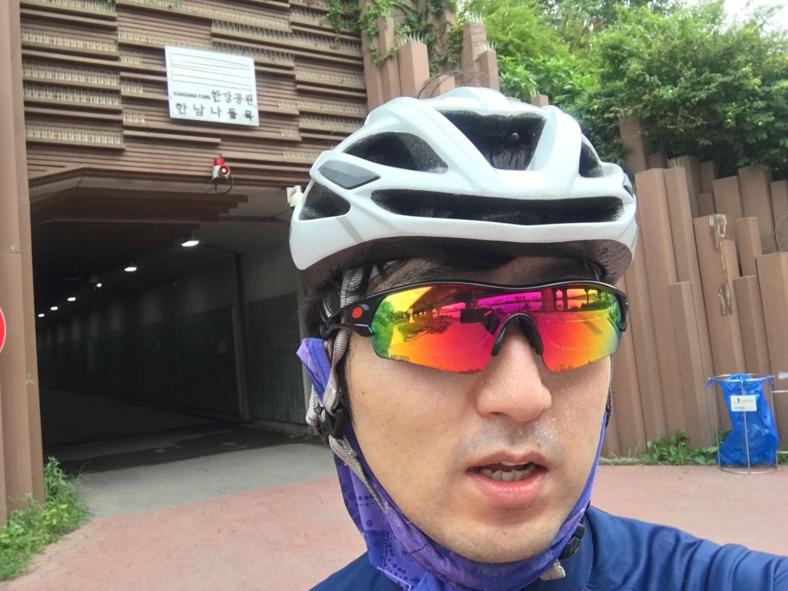
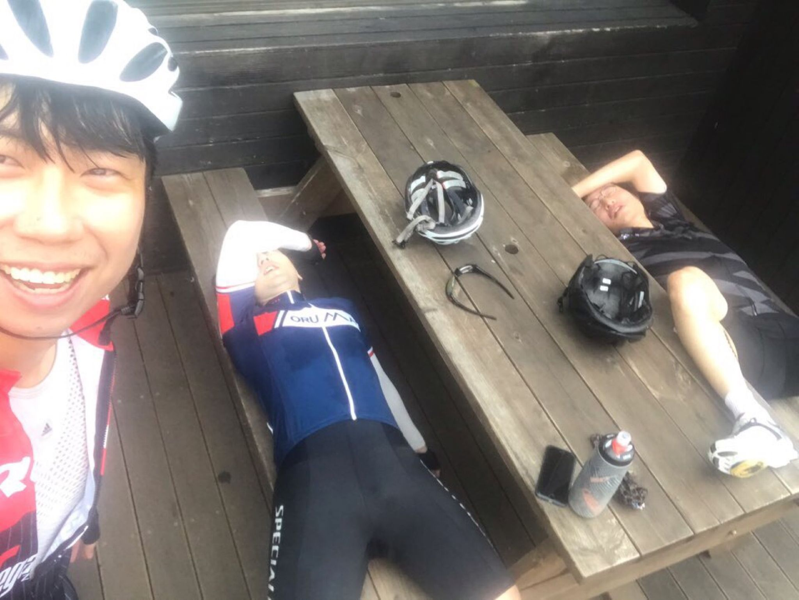
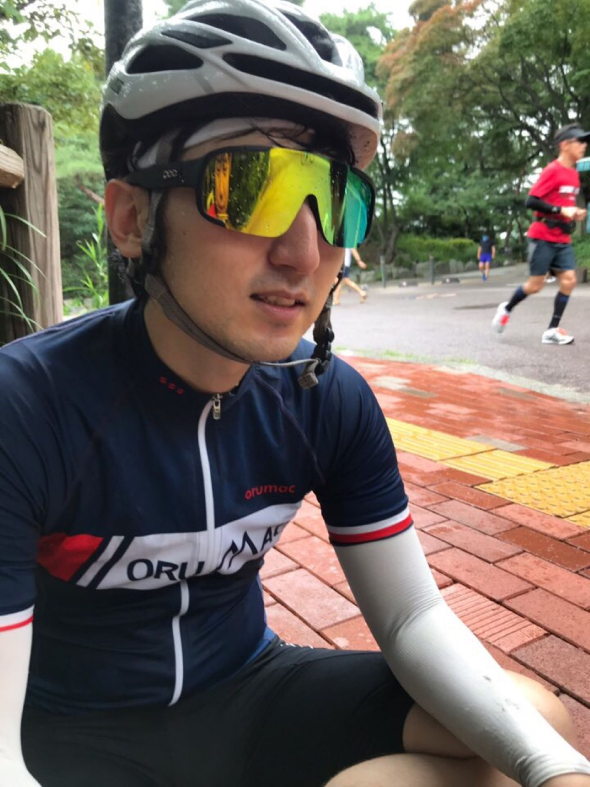
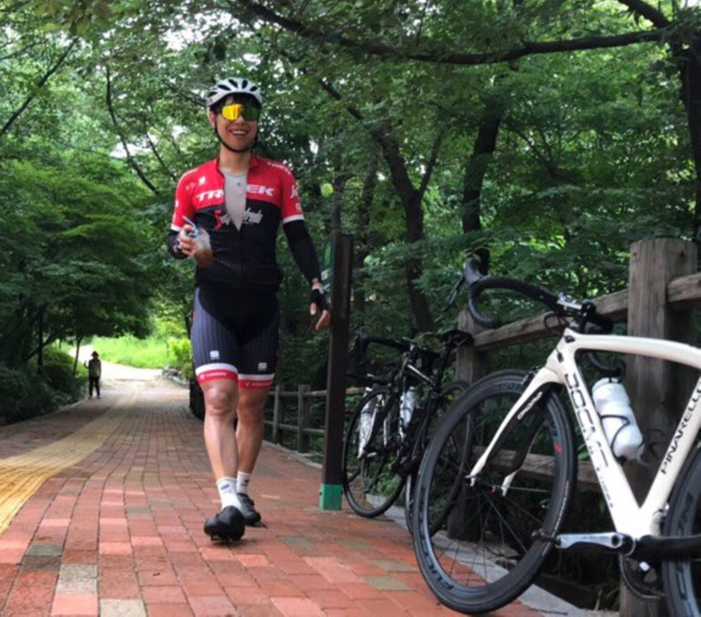
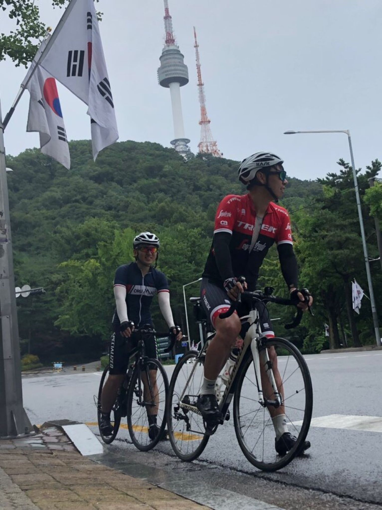
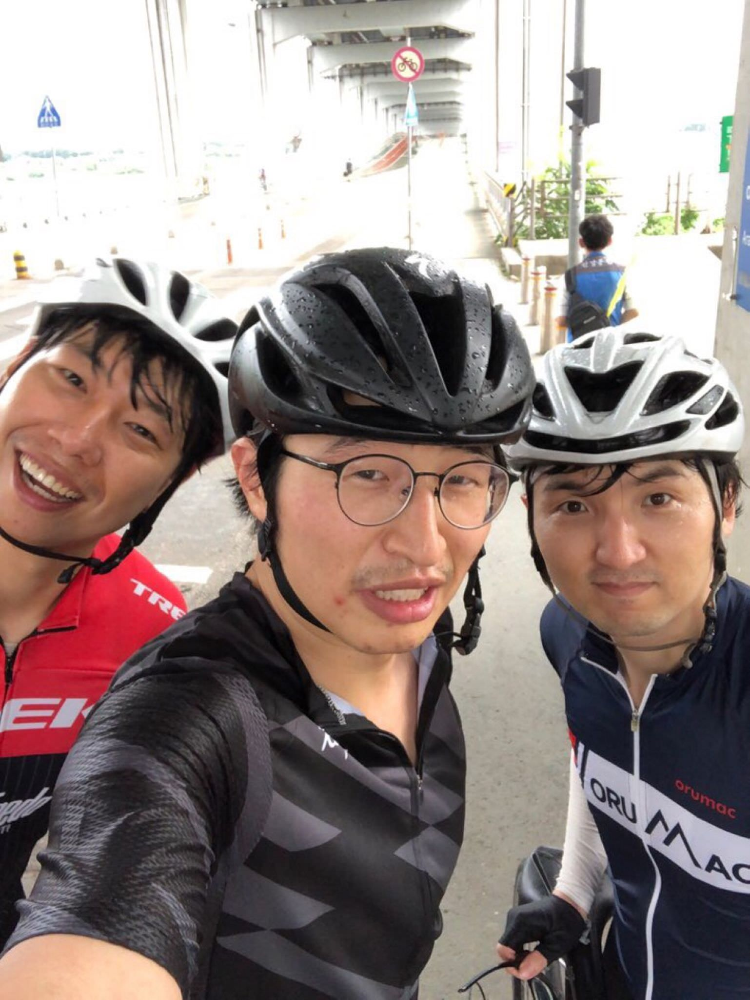

# 남산 삼바리, 비가와도 좋다

## 서른번째, 8월 15일(월)

광복절. 어제 상훈이가 광복절 휴일을 맞이하여 남산 라이딩을 하자고 했다. 부산 내려가기 전에 남산 기록을 세우고 싶어하는 듯 해보였다. 일기 예보에는 비가 내린다 했다. 몇 초 고민을 했지만, 비가 많이 오면 취소하는 것으로 하고, 라이딩 일정을 잡았다.

아침에 일어나 날씨앱을 켜서 보니, 비는 내리겠지만 많이 쏟아질 것 같진 않았다. 새벽에 1시경에 '몇시에 볼꼬?'라는 문자를 남기고 잔 상훈이를 보니, 안갈 수도 있을 것 같은 느낌들었다. 난 기왕 가기로 했으니, 준비도 거의 해놓은 상태였다. 비가 오더라도 나서보자고 결심했다. 씻고 나오니, 은호가 같이 가자고 연락왔다. 참여하겠는 이야기가 없어서 안갈 줄 알았는데, 뜻밖이었다. 상훈이 보다 은호가 먼저 연락이 왔다. 서울팀 단톡방에서 대화가 오가다보니 상훈이도 알림소리에 일어났다. 갈까말까 내적 갈등을 하는 것 같이 보였다. '자네들, 함께하는 것이 어떻겠나?' 약속시간을 다시 정하고, 바로 출발했다.

날이 흐리다. 딱 좋다. 이전에는 새벽인데도 불구하고 더웠다. 오늘은 선선하니 좋다. 시원한 바람이 불어서 더더욱 좋다. 약속시간보다 조금 늦긴했지만, 모두 모였다. 비가 온다고 투정부리는 상훈. 늦은 것 같다고 급하게 온 것 같은 은호. 셋이서 라이딩하는 것은 오랜만이다.

바로 남산으로 향했다. 남산까지 가는 길에 상훈이는 온갖 밑밥을 다 깐다. 잠을 별로 못잤다. 힘이 하나도 없다. 힘이 안들어간다. 물이 조금밖에 없다. 밥도 안먹고 왔다. 그러면서도 잘 탈꺼면 호들갑은. 그러려니 한다.

최근 라이딩에서 상훈이 북악 기록을 깨보려고 했었지만, 계속 실패했었다. 상훈이는 북악 기록을 세운 뒤에도 출퇴근 라이딩으로 단련이 되었을터였다. 그래서 나의 남산 기록도 가볍게 제껴질 것이라 예상했다. 그래도 혹시나 하는 마음에 열심히 페달을 굴렸다. 상훈이가 뒤에서 따라온다고 하니 오버페이스한 것 같다. 후반에 힘이 딸렸다. 중반 이후에 상훈이는 날 가볍게 제치고 쓩슝 달려간다. 아이고, 힘들어라. 역시나. 상훈이는 이쪽 동네 굇수다. 한달만에 탄다고 하는 은호. 몸이 가벼워서 그런지 공백기간이 있는 데도 불구하고, 잘 탄다. 다들 남산 6분대에 들어왔다.

남산 정상에서 쉬고. 남산 업힐 시작하기 전에 쉬고. 그런 여유로움이 좋았다.
이전에 혼자 탈 때는 정상에서 쉬지도 않았었고, 시작 지점에선 숨만 돌리고 갈 뿐이었다. 너무 더웠던 나머지, 쉬고 있는 것 자체가 고통이었다.
오늘은 살살살 내리는 빗방울, 선선한 바람과 산속에서 느껴지는 개운함이 너무 좋았다. 그리고 이 공간을 함께 할 수 있는 사람들이 있다는 것이 제일 좋았다.

남산 세바퀴를 돌고, 각자 집들로 향했다. 잠수교 밑에서 헤어졌다. 은호는 서쪽으로, 상훈이는 동쪽으로, 나는 남쪽으로 향했다. 돌아가는 길에도 비가 조금씩 내렸다. 시원해서 좋다.
집에서 씻고 누웠는데, 밖을 보니 비가 쏟아졌다. 산뜻한 타이밍에 집에 도착한 것 같아, 괜히 더 뿌듯했다.

남산 새로운 기록 6:31

---

8월 30일까지 목표

- FTP 245 (현재 230, 터보무인 기준)
- 몸무게 67kg 대로 진입 (현재 68.5kg)
- 북악업힐 9분 30초대 진입 (현재 9:46)

다음대회까지 목표

- 충원, 상훈 끝까지 피빨고 가기
- 8월 31일(토) 오크밸리 그란폰도 완주
- 9월 7일(토) 춘천 그란폰도 완주

이후 가능한 목표

- 서울팀 vs 부산팀 : 개통로 TTT

달성완료목표

- 북악업힐 10분대 진입 완료 (6월 12:58 -> 7월 6일 10:33)
- 몸무게 68kg 대로 진입 완료 (6월 69.5kg -> 7월 10일 68.5kg)
- FTP 230 (6월 205 -> 7월 22일 230, 터보무인 기준)
- 남산업힐 7분대 진입 (6월 8:22 -> 8월 3일 6:45)
- 북악업힐 9분대 진입 (6월 10:33 -> 8월 3일 9:46)
- 남산업힐 6분 30초대 진입 (8월 3일 6:45 -> 8월 11일 6:36)
- 남산업힐 6분 30초대 진입 (8월 11일 6:36 -> 8월 15일 6:31)

---
