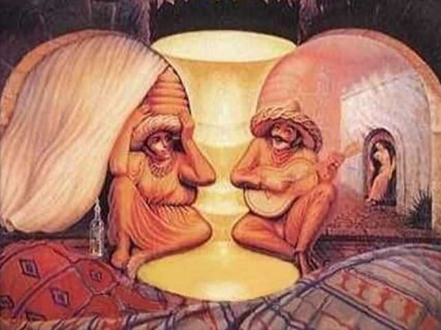

삶은 선택의 연속이라고 했던가.

사람들은 인생을 살면서 끊임없는 선택과 결정에 맞닥뜨리게 된다. 인간은 어떠한 문제에 대해서 일정한 사고패턴으로 매 순간을 결정하고 실행에 옮긴다. 하지만, 이러한 행동을 옮기게 만드는 "생각"에 문제가 있다면 우리는 올바른 결정을 하지 못한 것이 되고 그에 따른 결과는 당연히 잘못된 것이 된다. 그렇기에 나는 인간이 자주 일으키는 생각의 오류에 대해 미리 예상해보고, 그에 따른 나의 선택이 좀 더 현명할 수 있도록 해보고자 한다. 토머스키다의 생각의 오류라는 책을 집어 들어, 사람들이 일으킬 수 있는 잘못을 미리 알아보는 것이 분명 도움이 된다.

"세상은 자신이 믿는 데로 간다." 인생의 진리로써, 나의 삶을 결정짓게 하는 나의 좌우명이다. 그 말은 진리이기도 하면서, 아주 큰 효력이 있다는 것을 알고 있다. 하지만, 이것은 우리를 진리에서 멀어지게 할 수도 있다. 참으로 아이러니컬하다. 우리의 눈은 마음이 이해할 준비가 되어있는 것만 본다는 것이다. 우리는 자신의 뇌가 기억하고 있는 것으로만 생각하게끔 되어있기에 당연한 말이기도 하지만, 우리 자신의 믿음을 확인시켜주는 증거들에만 집중하는 경향이 있다는 말로 생각할 수 있겠다. 이렇게 해서 운과 우연의 일치가 하는 역할을 잘 이해하지 못하고, 전혀 상관이 없는 곳에서 연관성을 찾기도 하며, 자신의 생각을 뒷받침 하는 증거만 찾는 오류를 범하기도 한다. 그리고 우리는 통계수치보다 이야기를 자체를 더 좋아하기 때문에, 주변 환경에서 들려오는 이야기만으로 믿게 되어 선택을 하게 될 수도 있고, 터무니없는 믿음을 가지게 될 수도 있다.

모든 사람은 타인의, 또는 환경의 영향을 받고 사는 사회적인 동물이기에 많은 삶의 선택들을 다른 사람들의 생각을 통해 결정하게 된다. 나는 수없이 많은 정보의 홍수 속에서 살고 있고, 어떤 것이 진실인지 거짓인지 모르는 삶 속에서 살고 있다. 그 속에서 어떤 것이 정말로 진실이고 올바른 것인지 구별할 줄 알아야 하지 않을까. 그렇기에 모든 인간이 피할 수 없는 보편적인 생각의 오류들을 아는 것이 나의 믿음과 결정을 향상시키는 첫걸음이라 생각한다. 나는 회의적인 사고가 더욱더 필요하다. 모든 것에 의문을 품고 생각을 하며, 그것이 정말로 맞는 결정이고 올바른 이론인지 나 자신에 의해 확인되어야 한다. 개방적인 마음으로 다른 사람의 생각을 열린 마음으로 받아들여야 한다. 그렇게 함으로써 나는 내 인생에서 최상의 결정을 하고, 올바른 인생을 선택하는 것에 가까워 질 수 있다.

생각하고 또 생각하자.

- 2008. 08. 05 -

