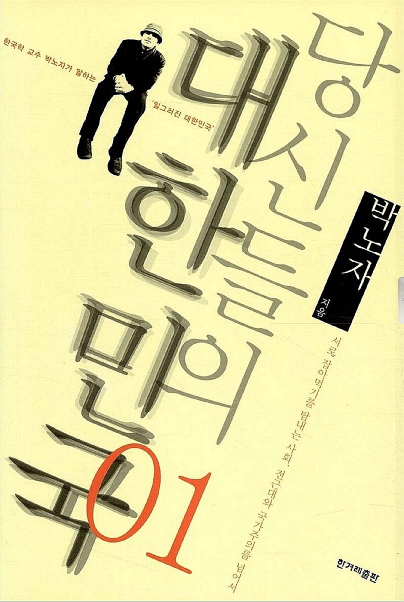
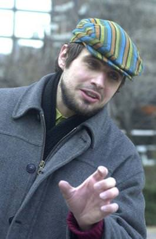

세월의 흐름이 묻어나오는 듯한 누르스름한 겉표지는 고리타분한 인문학 서적을 연상시켰다. 평소에 특별히 관심을 가지지 않았던 분야인 만큼, 딱딱하고 어려운 문체일 것이라는 생각에, 지레 겁을 먹은 것은 사실이다. 하지만 자신에 대한 비평은. 어김없이 귀를 쫑긋 세우고 듣기 마련인 것 같다. '당신들의 대한민국'이라는 비꼬는 투의 제목은 상당히 나의 주의를 집중시켰고. 한국으로 귀화한 러시아인 한국학 교수라는 타이틀을 가진 것에 걸맞게 문체에서 학문적 소양이 묻어났다.

'일그러진 대한민국'을 질서정연한 논리로 자신의 생각을 피력하는 것이 이 책의 전반적인 내용이다. 우리가 너무 가까이 있어서, 혹은 너무나 익숙해져 있어서 보지 못했던 사회 현상들에 대한 이해를, 다른 나라 사람의 입장에서 바라보고 있다. 우리가 아무렇지도 않게 인식하고 있었던 일들을, 다른 나라에 가거나, 혹은 외국 사람들과의 만남을 통해서 알게 되면, 같은 일에 다른 생각도 존재한다는 뜻밖의 깨달음을 느끼게 마련이다. 다른 사상과 사회 체제 속에서 성장했던 그이기 때문에 '한국'이라는 나라를 조금 더 객관적이게 바라볼 수 있는 배경을 가지고 있었던 것 같다.

책은 전체적으로 "한국 사회의 초상", "대학한국 사회의 축소판", "민족주의인가 국가주의인가", "인종주의와 대한민국"이라는 주제로, 나누어 설명하고 있다. 나는 군대가 낳은 권위주의, 폭력문화, 학교의 전근대성, 민족주의와 인종주의에 대해 이야기 해보고자 한다.

현 사회에서 정치, 언론 등이 대중매체에 힘을 빌려 자신의 이념과 사상들을 전파하는 것은 흔한 일이 되어버렸다. 대중들은 아무런 거리낌 없이 광고나 뉴스거리를 통해 은연중에 숨겨져 들어온 이념들을 받아들이고 있다. 자신들이 그런 매체들에 의해 영향을 받은 것 자체도 인식하지 못한 체 말이다. 이러한 현상은 오래 전부터 사용되어 온 국가 지휘자들의 전략이다. 이 책에서도 독재자가 그가 추구하는 체제 유지를 위해, 다른 매개체를 통하여 은근히 스며들어 사람들의 사회 인식을 장악해왔다. 이 책에서 간단한 예로 동상을 통한 방법을 설명하고 있다. 기존에는 없었던 이순신과 김유신의 동상과 같이 역사적 연상 작용을 함축적으로 표현하면서 국방사관이나 의로운 싸움으로의 전쟁 참가 고무와 같은 국가적 문제에 대해 참여의 당연시함을 강조했다. 이러한 정치적 세뇌 현상은 군대의 의무적 이행에서 뚜렷하게 나타난다. 우리 나라의 성인 남성들이 아무런 저항과 생각 없이 '남자의 의무'이기 때문에 군대에 가는 것이라고 생각한다. 의무 집행으로 군대 생활을 하게 되면, 뚜렷하게 자신의 사상 및 신념을 확립하지 않은 이들에게는 군사․폭력문화와 권위주의에 물들게 된다. 구타와 무조건적인 복종에 대해 아무런 저항을 하지 못하고, 이후에 사회에서는 하급자의 자유로운 의견 개진, 상급자에 대한 건설적인 비판, 거침없는 자기 권리 주장과 같은 자유 민주 사회의 문화가 정착되지 못하게 한다는 것이 작가의 생각이다. 하지만 내가 겪은 군대 생활에 대한 이야기와는 사뭇 다르다는 생각을 떨칠 수 없다. 민주적이지 못한 군대를 사뭇 교도소나 식민지에서의 노예 사회와 같은 것으로 표현하고 있는데, 이는 작가가 2001년도라는 오래전의 이야기를 글로 작성하면서 생긴 시대의 틈에서 생긴 것이라 생각한다. 내가 겪은 군대에서는 구타와 무조건적인 순종을 요구하지 않았다. 계급사회라서 생기는 업무의 조직적 관리를 위한 지시 및 요청을 제외하고는, 개인의 자유와 의견을 존중해주는 생각 이상의 민주성을 보여주는 곳이었다. 이것이 내가 군 입대를 전에, 어렵고 힘든 군생활을 예상했던 것에 대한 상대적으로 느끼는 수월함에서 생기는 기분일지도 모르겠지만, 작가가 말하는 군 생활의 모습은 마음 깊이 와 닿지 않는 것이 사실이었다. 그만큼 세월이 흐르면서 예전의 악 폐습을 점진적으로 줄이고, 민주적이고 체계성을 갖춘 군대를 만들려고 노력하고 있다는 것이 될 것이다. 그만큼 국민들이 군대에 대한 의무적 이행은 인정하면서, 그에 상응하는 민주적인 체제를 꾸준히 군대에 요구하고 있다고 봐야할 것이다. 하지만 예전부터 양심적 병역 거부자들이 종교상의 이유로 군대에 가지 않고 교도소에서 지내는 것에 대해 언론에서 말이 끊이질 않고 있다. 자신이 가지고 있는 신념을 버리면서 까지 국가에 대한 충성의 마음만으로 강제적으로 살인을 위한 무기로 양성되는 것은 올바르지 않다고 생각한다. 이러한 종교적, 세속적 평화주의자들의 양심적 병역 거부자에 대한 기본권은 생각해봐야할 문제이다. 작가는 그 대책의 일환으로 보조 간호사나 호스피스 봉사자 등의 사명감 없이는 하기 힘들을 통해 사회․봉사와 같은 역할을 줌으로써 어느 정도 민주적이고 자유로운 선택의 기회를 주는 것이 방책이 될 것이라고 말한다. 대체 방안과 같은 일차원적인 해결방법에서 더 나아가 선진국에서 채택하고 있는 모병제를 도입하는 것이 최선의 방책이라고 말한다. 물론 분단국가라는 현실적인 상황을 고려해야 하기 때문에 항시 전시 상황을 생각하고 전쟁에 대한 대비는 마땅히 해야 한다. 하지만 국가는 인간의 기본 권리를 존중해 주어야 하고, 강제적인 의무에 대한 대안방안을 마련해주어야 한다는 것이 나의 생각이다. 대한민국의 젊은 20대는 국가와 국민 전체가 동의하는 의무 불이행이 야기하는 불합리함과 불이익을 알기 때문에 군대에 가고 있다. 그리고 현 체제는 군대의 현실을 생각하면, 쉽게 바꿀 수 있는 시스템이 아니다. 점차적으로, 철저한 계획아래 선진적인 군대 조직을 만듦으로써 맹목적인 복종, 아첨과 같은 상하관계에 대한 폐단을 없애고, 평등적인 인권 의식을 위해서, 민주적으로 이행할 수 있는 군대가 되어야 한다.

너무나도 아무렇지도 않게 행하는 일들은 가끔은 그 주변에 서서 바라볼 필요가 있다. 작가가 제시한 대학의 전근대성에 관한 내용을 보면 나 자신이 작가가 비평하고 있는 대상이 되기 때문에 당황스런 기분이 든다. 군대 문화에 대한 권위주의에 대한 작가의 주장이 나에게 현실적으로 받아들이지 않았다면, 진보라는 이름 속에 숨은 대학의 충성과 경쟁에 대한 작가의 말은 일리 있는 말이 아닐 수 없다. '충성 경쟁'이라는 인맥과 생존을 위한 투쟁을 위해, 상명하달의 원칙을 대부분의 사람들이 자연스레 받아들이고 있다. '윗사람을 받아들이고, 아랫사람을 다스리는 것'이 교수와 학생들 간의 암묵적인 관계라고 작가는 말한다. 자유와 열정으로 뭉쳐야 할 대학이 군대만큼이나 권위주의적이라는 것에 놀랍다. 상아탑이라는 지식인의 터에서 공적이고 평등하게 이성적인 토론이 이루어져야 하지만 실상은 전혀 그렇지 않다. 영향력이 많은 사람과 가까워져야 하고, 살아가기 위해서 인맥을 쌓아야 살아남을 수 있는 사회 체제 때문이다. '진보적 지향을 하나의 지적인 전통으로 갖고 있는 한국의 대학은, 동시에 역설적으로 청년들에게 규율과 복속을 가르치는 사회장치'라는 작가의 말이 와 닿는다. 나도 모르는 사이, 학문 탐구의 욕구보다는 결과를 위한 경쟁을 하고 있었고, 학연, 지연, 혈연이라는 잘못된 관습으로 그 유교적 정신의 진정한 뜻도 잊어버린 체, 신뢰에 의한 관계가 아닌 이득을 위한 의도적 관계가 되어버린 대인 관계를 하고 있었던 것이다. 인맥을 위한 인맥이 아무렇지도 않게 행해지는 것이 안타깝게 느껴진다. 진실성과 신뢰가 담긴 '친구'라는 관계에 대해 생각해볼 필요가 있다.

"대~한민국"을 외치며 응원하는 모습은 한국이 경기하는 스포츠 경기에서는 어디서나 들을 수 있다. 가슴 벅찬 감동을 느꼈던 2002 월드컵에 이어 사회에서는 '우리나라'라는 자부심이 더욱 단단해졌다. 하지만 그 이면에 민족주의와 인종주의 사상이 내재되어 있다는 사실이 안타까움으로 남는다. 단일민족, '우리'라는 '자부심'아닌 자부심을 강조해왔던 탓에 오래 전부터 '남'에 대한 폭력을 일삼아 온 역사가 있다. 서구인을 대하며 느끼는 백인의 상대적 우월성과 대조적으로, 동아시아계의 사람들과 흑인들 등, 제3세계의 사람들에 게는 배타적인 행동을 일삼는다. 인종이 다름에서 오는 인종차별을 넘어, '남'을 악마로 보는 민족주의까지 겹쳐 증오와 멸시의 눈으로 다른 사람들을 바라보게 되었다고 작가는 말한다. 이런 결과로 얼굴색만으로 사람을 평가하고, 모든 사람에게 평등한 기본 인권을 무시하기까지 한다. 지금의 상황에서는 외국인 노동자가 가장 뚜렷한 예가 될 것이다. 코리안 드림을 꿈꾸며 온 외국인들은 생각지 못한 대우와 부당한 일을 당하게 되지만, 국가 차원의 인식의 희생자로써 마땅히 있어야 할 권리의 요구도 기대하지 못한다. 예전의 민족주의를 넘어 다양성을 받아들이며 외국인들에 대한 대우도 점차 변하고 있는 중이지만, 아직은 미흡한 것이 사실이다. 우리와 다름없는 똑같은 사람이고, 다정한 이웃이라는 의식으로 바꿔나감으로써 세계적이고 국제적인 문화를 받아들일 준비가 필요하다.

작가는 앞서 얘기한 것처럼 사회주의 체제인 러시아에서 살아온 사람이다. 그래서 그런지 민주주의가 취하고 있는 사회에 대해 다른 이보다 체계적이고 객관적이게 볼 수 있었던 것 같다. 하지만 한 가지 사항에 대해서 많은 의미를 부여하며, 지나치게 확대 해석하고 있는 부분이 있어, 아쉬움으로 남는다. 하지만 그가 바라보는 한국은, 한국인의 마음으로부터 나온다. 자신의 배경과 전혀 상관없는 이방인인 그가 다른 나라의 문제에 대해 짚어내고 안타까운 마음으로 글을 쓴다는 것은 많은 애정과 관심이 있었기에 가능한 일임에 틀림없다.

자연스런 역사의 흐름에 뚜렷한 지성과 의지가 있을 때에 사회 개혁이 시작되기 마련이다. 그런 면에서 현 사회인들에게 생각할 거리를 던져준다. 사회의 저변에 깔려있는 사상과 이념들을 한 번 더 뒤집어 생각해보게 하고, 아무렇지도 않게 생각하고 있던 주제들을 다르게 해석해 보이면서, 우리가 외면하고 있던 일들을 돌이켜 보게 한다. '대한민국'은 세계화에 맞춰 다양성과 평등의 나라로 가고 있다. 어쩌면 이 작가가 그 진행에 윤활유를 뿌려줬을 지도 모르는 일이다. 「박노자」작가와 같은 지식인들이 많고, 그들의 식견이 많은 사람들의 생각을 일깨워 준다면, 다양성과 평등의 나라는 그리 먼 미래의 일이 아닐 것이다.

- 2009. 10. 17 -

