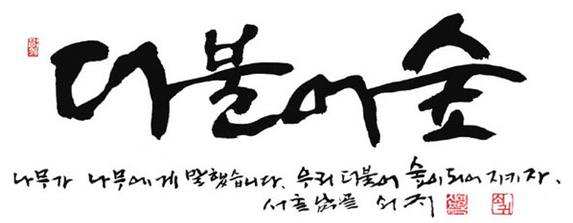
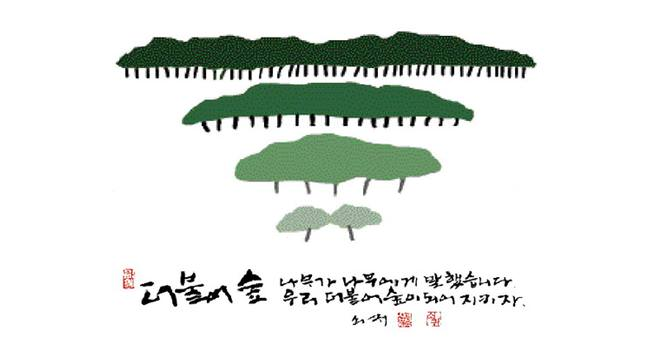

> 이번 글은 예전에 운영했던 [Pulse-Beat's Bits-Box 블로그](https://pulsebeat.tistory.com/)의 글을 옮겨 왔다.

# 공존과 평화를 위한 떠남과 만남, 더불어 숲 - 신영복

과거의 역사를 반성한다. 그리고 현재를 살아간다.

세월의 흐름 속에서 역사는 반복된다. 장구한 시간 속에서 사람들은 보편적인 행동을 통해 스스로에 대한 역사와 더불어, 한 집단, 한 나라에 대한 역사를 만들어 나간다. 그렇기 때문에 과거에 있었던 일들에 대한 통찰과 반성을 통해 현재의 행동을 결정할 수 있는 여지가 있다. 이와 같이 역사 재조명의 중요성은 신영복 작가가 「더불어숲」책을 집필하면서 가지는 기본 전제라 생각된다. 해박한 역사적 지식을 바탕으로, 신영복 작가의 깊이 있는 사색이 놀라움으로 다가오는 것은 나의 식견을 가뿐히 뛰어넘는 그의 넓은 견문 때문이다. 그는 여행을 통해 각 나라의 장구하고 육중한 역사를 맞이한다. 그 완고한 현실은 과거로부터 자연스럽게, 혹은 강제적으로 쌓여져 온 커다란 성이 되어 역사가 되었기 때문에, 갖가지의 복잡한 흐름이 복합적으로 합쳐지면서 넓은 줄기를 만들며 흘러가는 강과 같다. 하지만 대부분의 사람들은, 그 속에서, 즉, 가까이에서 항상 그것과 함께 지내왔기 때문에, 자연스런 흐름에 대한 어떠한 반성과 인식의 노력도 없이, 당연시하는 태도로 아무렇지도 않게 그 물줄기를 자신의 이념으로 받아들인다. 이는 산 속에서 산을 바라보는 것과 같이 전체적인 모습을 보지 못하고, 눈앞에 있는 것만 보게 되는 편협한 사고로부터 나온다. 작가는 그 때문에 현실을 직시하기 위해 떠남을 결정한다. 그는 여행을 통해 세계 곳곳에서 그 땅, 그 사람들을 서슴없이 관여하고, 장악하면서 사람들의 심성을 획일화시키고 있는 강자들을 발견한다. 이 '갑'들에 맞서 공존과 평화의 원리를 지키고, 인간의 논리를 지켜야 한다고 주장한다. 강자의 지배논리의 만연과 그 속에 숨겨진 진정한 의미에 대해 알아보고, 공존·평화와 같은 인간의 보편적 이념을 통해 역사를 재해석해보면서, 현재의 우리들이 앞으로 어떻게 살아 가야할 지에 대한 몇 가지 방법을 작가와 함께 생각해보도록 하겠다.

우리의 인식 자체는 현재 살고 있는 체제의 사상, 이념과 밀접하게 관계될 수밖에 없다. 생각 자체가 우리의 인식 범위에 한정적일 수밖에 없기 때문에, 사회에서 통용되는 사상과 이념은 우리의 사고를 결정하는데 큰 영향을 미친다고 볼 수 있다. 그러한 사상은 자연스레 우리가 모르는 사이에, 스며들어 오기 때문이다. 그렇게 생각해보자면, 신대륙을 발견한 위대한 모험가인 콜럼버스의 도전 정신과 개척 정신은, 그 정신을 우리들에게 심어주기 위한 누군가로부터 나오는 의도라 볼 수 있다. 도전 정신의 위대함도 높이 살만한 업적이지만, 그 당시 살았던 인디언들의 관점에서 보자면, 콜럼버스는 살인과 유괴를 저지른 잔혹한 침략자이다. 발상의 전환이라는 의미로 해석되고 있는, '콜럼버스의 달걀' 또한 생명 그 자체를 서슴없이 깨트릴 수 있는 비정한 폭력성으로 해석할 수 있다. 또 다른 예로는, 이슬람교를 나타내는 문장인 '한 손에는 코란, 한 손에는 칼' 이라는 것을 들 수 있다. 아프가니스탄이나 파키스탄에서의 전쟁과 이슬람교의 엄격한 교리에 대해 뉴스를 통해 알게 된 우리로서는, 종교가 가지는 긍정적 이점에 대해서 회의를 가지게 할 만큼, 우리가 상식적으로 이해할 수 없는 교리들이 많다는 것을 알고 있다. 우리가 대부분 생각하고 있는 이슬람교에 대한 서구적 사관은 이교도에 대한 관대함과 관용 정신을 엿볼 수 있는 있는 소피아 성당과 블루 모스크의 공존을 이해할 수 없는 것으로 만든다. 그보다 앞서, 이슬람교를 믿고 있는 아랍권 영역에 대한 관심을 가지는 것 자체를 보이지 않는 장벽으로 막는다. 중국의 만리장성 또한 뛰어난 문화유산이라는 화려함, 위대함과 웅장함을 생각하게 되지만, 장성 축성을 위한 백성들의 부당한 노역에 의한 희생은 선뜻 생각해내기가 어렵다. 그리고 백인, 흑인, 황인종으로 구별하여, 태생적으로 결정되어지는 피부의 색깔마저도 계급으로 나누어 인간 자체를 미리 판단해버리는 경우도 누군가로부터 전이된 이념이다. 이러한 예들은 사회 전체에서 통용되는 이념에 의해 결정되어 지는 것이 대부분이다. 이러한 이념의 지배는 대부분 강자의 암묵적인 조정에 의해서 이루어지기 마련이다. 그렇기 때문에 아무런 의문 없이 이러한 이념들을 받아들일 경우, 그것의 옳고 그름을 따지겠다는 의사도 없이, 지배적인 논리에 의해 자연스레 우리의 행동을 결정하게 되어버리는 결과를 초래한다.

우리는 사회 현상에 대한 반성과 재해석이 필요하다. 강한 자들의 지배 논리를 인간의 기본적인 이념인 평화와 자유, 박애 등의 모든 사람들이 수긍할 수 있는 진리로 해석할 필요가 있다. 인간의 논리로써 지나온 과거를 반성하고 통찰해야 한다. 작가는 비극의 현장인 아우슈비츠 수용소를 찾아간다. 과거의 처참한 살인 행위가 거행되는 아우슈비츠는 나치 독일의 만행이다. 살인 공장을 만들어 수백만 인명을 살해했다는 것은 어떠한 이유로도 합리화할 수 없는 죄악임에 틀림없다. '단죄 없는 용서와 책임 없는 사죄는 은폐의 합의' 라는 작가의 말처럼 철저히 책임짐으로써 다시는 반복되지 않게 하는 것이 진정한 청산일 것이다. 살인을 저지르는 것을 허용하는 나치 사상을 아무렇지도 않게 받아들이는 가치가 이전되면, 얼마나 끔찍한 희생을 가져오는지를 확인할 수 있는 표본이 되어 더 이상은 되풀이 되서는 안 된다. 작가는 영국으로 옮겨 자본주의의 상품화 현상에 대해 비판한다. 자본주의는 인간의 노동력은 물론이고, 신체의 일부마저 상품화시킨다. 주변에서 볼 수 있는 물건들부터, 사랑, 행복, 명예, 영국 언어 등의 눈에 보이지 않는 개념들 까지도 모든 것이 상품화가 되어있다. 다른 것을 얻기 위한 수단에 불과한 상품이, 그 자체가 목적이 되어 미다스 왕의 정원처럼 상품들로만 둘러싸여 버렸다. 우리는 목적이 아니라 수단으로써 상품을 대해야 한다. 이처럼 역사의 재조명과 현재에 대한 비판적 시각을 갖는 자세는 작가가 끊임없이 우리에게 바라는 것들이다. 이념 자체를 스스로 판단할 수 있는 지적 능력을 갖춰 옳고 그름을 생각해보는 자세는 무절제한 수렴을 막는 방법이 될 것이다. 거기까지 생각하지 않더라도, 인간에게 존중 되어야할 기본권을 생각해본다면 적절치 않은 이념에 대한 판단 근거가 될 것이다.

작가는 다양한 나라에서 맞이하는 많은 역사적 현장 속에서 우리가 가져야할 자세를 가르쳐준다. 앞서 이야기 한 것처럼 잘못된 인식에 대한 각성이 무엇보다도 중요하다. '각성은 그 자체로도 이미 빛나는 달성' 이라는 작가의 말처럼 자신이 무엇을 잘못 생각하고 있는지 알게 되는 순간부터가 이미 나아가야할 목표점에 거의 가까이에 와있는 것이 된다. 프랑스 혁명이 그랬던 것처럼, 시대적인 모순을 찾아내고, 많은 사람들이 그 정신을 공유하게 되면서 현실에 대한 인식이 바뀌게 되었다. 이를 출발점으로 새로운 세계를 만들어내려는 혁명이 시작되었다는 것은 자명한 이야기다. 그에 반해 현재의 브라질에서는 집단적 무의식과 무한한 낙천성과 더불어 우민화 정책의 답습으로 인해, 현 시대적 상황에 대한 깨달음의 기회를 막고 있는 상황이다. 상파울루, 브라질리아만의 개발은, 낮은 땅을 살아가고 있는 수많은 사람들을 동력으로 이끌어내지 않는 한, 눈부신 발전을 위한 원동력을 얻을 수 없을 것이라고 작가는 말한다. 잘못을 깨닫고 우직하고 꾸준한 노력으로 나라의 동력을 끌어 올리는 것이 필요할 것이다. 이와 더불어 문화 예술의 도시인 상트 페테르부르크의 시민들이 가지는 삶과 예술에 대한, 또한 이 도시에 대한 애정을 배워야 한다고 말한다. 이러한 애정이야말로 모든 것의 원동력이기 때문이다. 애정을 바칠 수 있는 사람을 길러내는 일, 사람들과의 관계를 아름답게 만들어내는 일에서부터 시작하면 된다고 작가는 말한다. 이처럼, 각성을 시작으로, 애정을 가지고 사람·도시·나라와의 관계를 회복시켜 나가면서, 같은 목표를 향해 '함께 걸어가는 것'이 사랑의 방법이고 진보의 방법일 것이다.

'여행에는 두 가지 의미가 있습니다. 떠남과 만남입니다.'

'떠난다는 것은 자기의 성 밖으로 걸어 나오는 것이며 만난다는 것은 새로운 대상을 대면하는 것입니다.'

우리는 작가와 함께 우리가 가졌던 평소의 생각에서 잠시 벗어나, 각 나라의 역사와 현재를 맞이했다. 장구한 역사를 거쳐서 현재의 모습을 이루고 있는 나라에 대해서, 지금 살고 있는 우리가 우리들의 잣대를 가지고 판단하는 것은 분명 잘못된 것이다. 우리 또한 과거를 통해 이루어진 모습이듯이, 그들 또한 과거를 짐 지고 있기 마련이기 때문이다. 작가는 깊고 해박한 역사적 지식을 바탕으로 우리가 미처 생각지 못했던 것들을 한 번 더 뒤집어 생각한다. 사물을 다르게 볼 줄 알고, 감정 이입을 통해 그들 속에 녹아있는 역사를 가슴깊이 느낀다. 아우슈비츠 수용소에서의 만행과 만리장성 축조에서의 백성들의 고통을 가슴으로 느낀다. 독일의 통일 모습에서 남북한의 꾸준한 교류와 협력을 통한 신뢰성 고취가 무엇보다 중요함을 역설하고, 인도의 간디와 네루를 비교하면서 애정도 중요하지만, 표현 방법 또한 중요하다고 말한다. 마라톤 평원에서 '우리는 이겼다'와 '나는 이겼다'의 차이를 말하고, '내'가 '우리'를 이겨야하는 현실에 대한 아쉬움을 토로한다. 일본 자본주의 고도성장의 저력을 근검과 인내라고 보고, 배워야할 것을 강조하고 있으며, 영혼 불멸의 상징인 피라미드를 보고 어리석은 생각을 가지는 것에 대해 일깨워준다. 이러한 작가가 우리에게 전하는 엽서들은 모두 작가의 인간에 대한 애정에서부터 나온다. 강자의 지배원리에 맞서서, 흑과 백의 공존과 평화의 원리를 '화음'으로부터 찾는다. 자본주의에 맞서 인간의 논리로 지키자고 한다.

숲은 나무로 이루어진다. 세계 어느 곳이나 나무는 존재하고, 오랜 기간의 역사의 흐름에 의해 현재의 우리가 만들어지듯, 한 곳에 자리를 잡고 뿌리에서부터 커간다. 그만큼 뿌리가 깊기 때문에 쉽게 자리를 옮길 수 없고, 쉽게 변하지 못한다. 하지만 우리는 다양성을 바탕으로 해서 평화와 공존으로 더불어 살 수가 있다. 강자로부터 오는 지배 이념을 넓은 잎과 가지로 막을 수 있고, 태풍과 같은 물리적, 정신적 폭력에도 서로 의지하며 맞설 수 있는 힘을 가질 수 있다.

나무는 사람이고, 도시이고, 국가이다.

무엇보다 중요한 것은 서로 간의 협력을 통하여 더불어 숲이 되어 '지키는 것'이다.

"나무가 나무에게 말했습니다. 우리 더불어 숲이 되어 지키자"

나무는 사람이고, 도시이고, 국가이다.

> 신영복 작가님의 글을 읽을 때마다 항상 뛰어난 글 솜씨와 더불어, 깊고, 넓은 생각들에 놀라움을 많이 느낍니다. 글귀 하나하나에 깊은 뜻이 담겨 있어 책을 넘기기가 쉽지 않습니다. 한참을 생각해보고, 마음으로 느끼면서 깊이 새겨야 하겠습니다.
