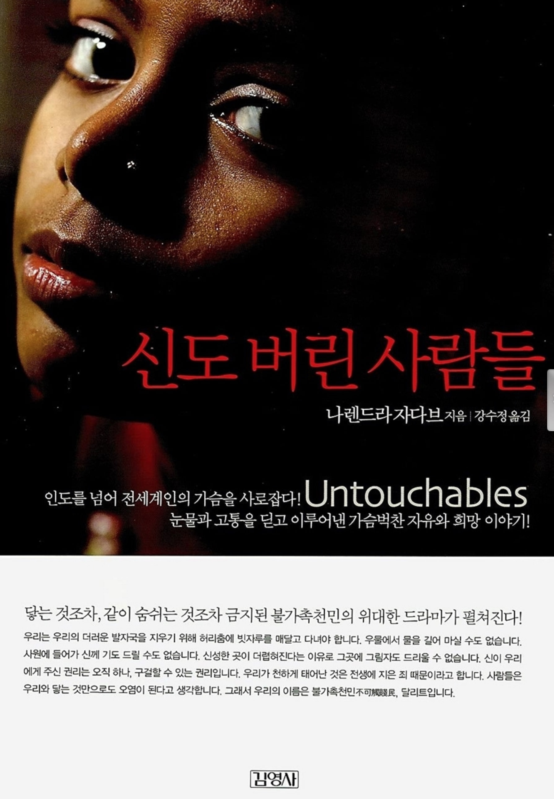

신도 버린 사람들. 인도에는 카스트 제도라는 게 있었다. 사람을 4가지 계급으로 분류하고, 그 계층에 따라 다른 업무와 일이 주어진다. 그 신분에 맞게 행동해야하며, 그것을 어겼을 시에는 많은 사람들로부터 멸시와 경멸을 받는다. 그 중에서도 불가촉 천민은 개와 돼지, 소만큼이나도 대우를 못받는다. 신발을 신을 수 없으며, 마을 구석에서 다른 계층과 분리되어 살아야 한다. 전보를 부치는 일이나 시체를 치우는 일들, 가창 천한 일들만 해야한다. 다른 계급과 접촉이 되면 결코 안되며, 심지어 그림자를 밝는 일까지도 저주받을 일이 된다. 이러한 일이 행해지는 배경에는 철저히 힌두교의 종교적 역사에 따른다. 불가촉 천민은 전생에 나쁜 짓을 저질렀고, 그들의 현재 삶은 그 죄를 뉘우치는 과정이라는 것이다. 마하르라 불리우는 불가촉천민들의 거주지는 마을과 동떨어져 있다. 마을의 저수지 또한 다른 계층이 마시는 신성한 물이라는 것 하에, 손도 댈 수 없다.

현재 2010년, 대한민국이라는 나라에 살고 있는 나로서는 상상조차 힘든 일이 불과 몇 십년전 인도에서는 행해지고 있었다. 그런 최악의 환경에서 자라난 주인공은 그 환경에 맞서 싸워나간다. 그러한 교육과 투쟁, 계몽은 각박한 현실에서도 조금씩 싹트고, 결국 주인공은 다른 어느 마하르보다, 다른 높은 계층보다 더 높게 성공할 수 있었다. 무엇이든 닥치는 대로 해내고, 후세에 이런 각박한 현실을 물려주지 않기 위해, 교육과 계몽에 힘쓴다.

멋지지 않은가? 그 험한 세상 속에서도 그것을 극복하겠다는 신념아래, 모든 것을 감수하고 끝끝내 이룬다. 밑바닥부터 안해본 일 없이 해나가면서 많은 실력을 쌓았고, 자신을 계발하기 위해, 각종 행사에 참여, 진행을 한다. 자신의 신념을 주위 사람들에 알리면서, 임베르디카의 믿음을 설파한다. 그의 노력은 이 후 세대에 까지 전해져 계급으로 결정되는 삶을 벗어나 자유롭고 공평함 속에서 살 수 있는 여건을 마련한다. 나렌드라 자다브는 그런 아버지 밑에서 자라, 불가촉 천민이라는 허물에서 벗어나 그 누구보다도 성공적인 삶을 이끌어나간다.

나도 현실의 구름을 걷어낼 강력하고도 뚜렷한 신념을 가지고, 무엇인가를 한다면 이 세상에서 못이루어낼 일이 없을 것이다. 난 그들보다도 좋은 환경에서 자랐으며, 자유롭게 행동할 수 있는 민주주의 국가에서 살고 있기 때문에 훨씬 더 쉽게 이겨낼 수 있을 것이다. '나는 무엇을 위해 사는가?'에 대해 끊임없이 생각해보며, 나의 삶의 의미를 찾아 확고한 신념 속에서 삶을 살아가야겠다.

 - 2010. 09. 19 -

