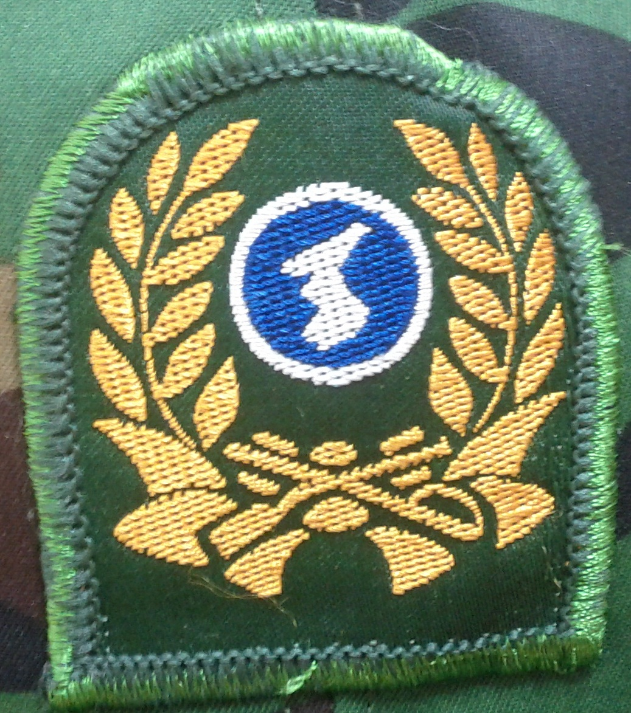

> 이번 글은 예전에 운영했던 [Pulse-Beat's Bits-Box 블로그](https://pulsebeat.tistory.com/)의 글을 옮겨 왔다.
>
> : 보내지 못한 편지

# To. 상민 : 예비군…? 걍 하고 말지 뭐.

꿉꿉한 날씨 탓에 비가 올 때면 짜증을 내는 사람이 더러 있는데, 어제는 주위 사람들의 대부분은 비가 오는 것을 매우 환영했다. 바로 예비군을 가는 날이었기 때문이다. 이렇게 비가 내리길 바랬던 적이 있었던가? 나는 비가 내리는 것을 좋아한다. 중학교 때의 옥계돈 선생님이 하신 말씀을 가슴 속에 간직하고 있기 때문이다. 비가 촉촉히 내리던 어느 날, 어떤 것인지는 정확히 기억이 안나지만, 물건 같은 것을 컨테이너에 넣으러 간적이 있었다. 비가 거의 개였기 때문에, 많이 젖지 않고 갔는데, 안에 선생님이 계셨다. 그러더니 하시던 말씀이, "비가 내리면 꿉꿉하고, 귀찮긴 하지만, 좋은 점이 많지. 더러운 먼지, 공기 등을 싹 가지고 가버리는 장점이 있지.", 그 때부터 비가 오는 것을 더 좋아하게 되었지. 비야, 제발 내려라.

아침 일찍 집을 나섰다. 간만에 입은 군복이 왠지 정겨웠지. 재밌었던 군대생활을 기억해보며, 지나온 기억들을 회상하며 미소지었다. 그 만큼 세월은 지나갔지만, 소중한 추억하나 있다는 것이 왠지 모르게 좋았다. 8시 59분에 간신히 부대 정문을 통과해 지각을 면했고, 그 때 부터 입대식과 정신 교육이 시작되었지. 학교 예비군에 편성되어 아는 사람이 많아서 오히려 재밌게 즐겼던 것 같다. 과제에 치여서 살고 있었는데, 간만에 휴가랄까? 뭐.. 하루라서 그런 말 할 수 있는지 모르겠지만. 맛난 식사를 먹는 도중, 한 방울 두 방울씩, 머리에 빗방울이 떨어졌다. 곳곳에서는 환호성과 여유로운 웃음이 들렸지. 나도 왠지 촉촉한 비가 사랑스러웠지. 작년에도 이런 시나리오대로 흘러갔는데, 올해도 똑같이 되다니 신기하기도 했지. 다행이도 오후에는 사격과 실내 교육이 배정되었다. 여덟명이서 사격 내기를 했는데, 다행이도 중위권에 속하게 되어서 아이스크림 한개는 벌었다. 이 후에는 각개전투에 대한 영상을 시청하게 되었지. 여기서 부터, 나의 의문이 시작된다. 교관은 비디오 시청 전에, 수업에 집중안하면 실제로 실습을 하로 나갈 것이라고 경고를 했고, 다들 동의하에 실내 정신 교육에 임하게 되었다. 그런데, 시간이 지나면서 사격을 하로 갔다와서인지, 우리 학급의 반 정도가 엎드려 자게 되었고, 교관은 실습을 하러 나가라고 지시했지. 어쩔 수 없이, 다들 일어나서 비가 조금씩 내리는 와 중에도 산에 올라 각개전투를 하게 되었다. 교관님이 약속하신 것과 그것을 동의한 우리들. 그리고 교관, 조교들도 매우 하기 싫은 상황일 태지만, 내뱉은 말로 인해 나갈 수 밖에 없는 현실. 예비군들 얼굴에서는 싫어하는 면색이 확실히 드러나고, 준비되어 있지 않은 상황에 교관, 조교 모두 약간씩 어설픈 느낌이 들었었지. 그런데, 난 왜 기분이 이렇게도 좋은거지? 처음엔 나도 싫었다가, 밖에 나가 개운한 비를 맡으며 산책하는 것이 좋았지. 그리고 실 부대에서는 거의 해보지 않았던, 각개 전투의 약진 앞으로를 한다는 것이 신기했어. 줄을 서서, 10명씩 조를 나누어, 두 명씩 팀을 이루면서 하게 되었는데, 나는 6조. 그런데 내가 할 차례가 되어서 나갔는데, 자리가 없는거야. 그래서 뒤로 쑥 빠져서 다시 돌아왔어. 그래서 뒤로 빠져계시던 형과 함께 안하게 되었던 거지. 후에 20명정도 빠졌다는 것을 알게 된 교관이 안한 사람 나오라고 지시를 내렸지. 그래서 10여명 정도 내려가서 다시 줄을 섰지. 나는 형들과 같이 뒤에 빠져 있었어. "대충 넘기면되. 했다고 하면 되는 거지. 예전에는 무조건 피해가는 것이 장땡이었는대. 요새 얘들 너무 착해." 라고 하시는데, 나는 어떻게 대답해야할지 몰랐어. 나는 아주 마음이 찝찝했거든. 시간이 다 된 관계로 넘어가버렸고, 다시 내려와서 수업을 듣고, 예비군을 마치게 되었지.

해야할 일과 그 것을 하는 것에 대한 태도에 대해서 생각하게 되었어. 내게 주어진 임무가 있을 때, 내빼고 안하게 될 수도 있고, 또한 그것이 나의 몸을 편하게 해주는 것이 될 지도 모른다. "군대에서 안 들키면, 모든 것을 다해도 된다." 라는 말로 표현이 가능할 지 모르겠네. 하지만 나의 마음은 매우 불편했다는 거지.내가 소심해서 그럴 것이라고 생각하지만, 난 영 마음이 불편해서 그냥 해버리고 마는 것이 내게 좋은 것 같다. 몸이야 한 번 힘들면 그만이지만, 마음의 껄끄러움은 나를 안절부절 못하게 만든다. 오늘 그런 일을 겪으면서 다음부터는 하고 말자라는 생각이 들었지만, 각개전투 장에서 내려오자마자, 아까 느꼈던 그런 찝찝함이 없어져버렸다는 것을 생각해보면, 사람은 쉽게 편해지고, 게을러질 수 밖에 없는 존재라고 생각된다. 순간의 힘듦을 벗어나기 위해, 자신의 양심과 자존감을 파는 것은 그리 좋은 행동이 아닌 것 같다. 그리고 쉽게 게을러 지는 것을 막기 위해, 항상 의식이 깨어있어야 한다는 것을 느꼈다. 쉽게 쉽게 넘어가버리는 것이 아니라, 반성을 하거나, 의미를 찾기위한 시간을 가짐으로써 자신의 행동에 대한 적절성을 따져보는 것이다. 게으름과 나태를 이겨내기 위해서, 항상 행동하고, 자신의 행동에 대한 의미를 생각해보면서, 올바른 일인지 아닌지 판단하는 자세를 가지기 위해서 노력 중이다.

 
- 2010년 6월 26일 -

