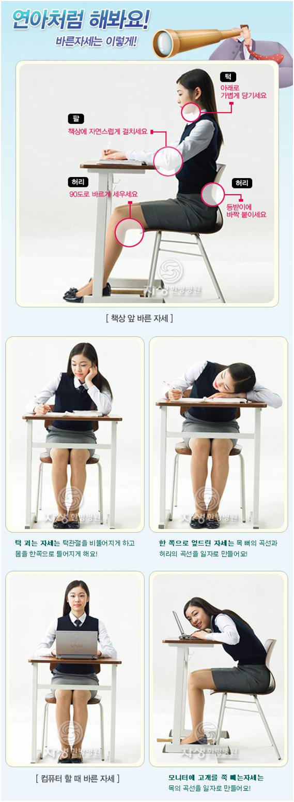

> 이번 글은 예전에 운영했던 [Pulse-Beat's Bits-Box 블로그](https://pulsebeat.tistory.com/)의 글을 옮겨 왔다.

요새 통 어깨와 목이 뻐근해서 공부에 집중하기가 힘듭니다. 가만히 앉아있어도 왠지 모르는 불편함에 안절부절 못한다고 해야할까요? 덕분에 눈까지 더욱 피로해져서 두통까지 생기고 있습니다. 눈이 빨리 피로해지는 것과 더불어, 하루 종일 컴퓨터에 매달려 있는 저로서는, 저녁쯤이면 눈이 따갑기까지 합니다. 버스 타고 집으로 돌아올 때 쯤이면, 멍한 두뇌와 뻑뻑한 눈 때문에 정신이 하나도 없습니다.

엊그제 부터 상태가 더욱 심각해져서 어깨와 뒷목 통증 때문에 가만히 있지를 못하고 있었습니다. 주기적으로 목이며, 어깨며, 등이며, 스트레칭을 해주고 있었지만, 나아질 기미가 안보였었죠. 그야말로 만성 피로에 쩔어있었다고 해야할 것 같습니다. 아무래도 안되겠다 싶어, 네이베, 구글신께 여쭈어 보았습니다. 많은 검색 결과가 끝없이 출력되었습니다. 세태를 반영하는 것인지, 자세, 어깨 통증, 목 디스크 등의 현대인의 고질병에 대한 자료가 날짜별로 줄줄이 달려 있는 것을 확인할 수 있었습니다. 그만큼 사람들이 많은 고통을 받고 있다는 반증이겠지요. 그래서 오늘은 바른 자세에 대해서 한번 알아보기로 했습니다. 의학적 지식이 전혀 없기 때문에 이렇고, 저렇기 때문에 이렇고, 저렇게 해야한다는 이론적인 내용 보다는 "이렇게 해라" 라는 방법만 제시하려고 합니다. 한번 알아볼까요?

역시 핵심은 **"바른 자세"** 입니다. 뭐 어쩔 수 없는 현실이죠. 평소 생활 태도가 가장 중요합니다. 꾸준한 스트레칭, 휴식 등도 물론 중요하지만 그것보다 더 중요한 것은 **평소의 "자세"**입니다. 약으로 겉으로 들어난 증세를 치료하는 것이 아니라, 근복적인 원인부터 먼저 제거하는 것이 순리겠지요.

1. 낮잠을 잘 때, 팔을 베고 엎드려 자는 자세는 척추에 무리가 있다.

   - 의자 등받이를 기대고, 수건을 목 뒤에 받친다음에 자는 것이 목, 척추 근육에 좋다.

2. 어깨에 전화를 끼고 받는 것도 주의! 어깨, 목 통증의 출발점!

3. 수면 자세는 천장을 보고 4지를 편히 놓고 자는 자세가 좋다.
   모로 누워 놓고 잔다면 어깨 높이의 베게를 배고, 다리 사이에는 베게를 껴서 잔다.
   높은 베게는 피하자. 엎드려 자는 것도 피하자.

4. 컴퓨터 작업 때나 걸어다닐 때, 고개를 숙이지 말아야 한다.

5. 운전시에는 등받이를 10도 정도 젖혀 허리와 목이 바로 세워지도록 하고,
   고개를 내미는 일이 없도록 한다.

6. 책을 읽을 때는 독서대를 이용하여 목을 숙이는 것을 방지!

> 허리를 곧게 펴고, 턱은 가슴 쪽으로 끌어당기듯 고개를 반듯하게 하는 의기양양한 자세가 좋다.
>
> 의도적으로 고개를 펴는 습관을 들이자.
>
> << 신체가 가장 무리가 안가도록 하는 것이 바른 자세 >>

역시 사람은 고통이 따른 뒤에 발전하는 것일까요? 한번 아프고 나니, 자세의 소중함을 깨달음과 동시에 실천하게 됩니다. 그 실천이 조금만 더 빨랐으면 하는 아쉬움이 있지만, 더 큰 병이 되기 전에 알게 된 것이 다행이라 생각합니다. 처음에는 "목 디스크" 증상과 거의 일치한다는 것에 놀라기도 했지만, 아직은 아니겠지라는 생각으로 바로 바른 자세를 생활화하기로 했습니다. 그래서 하루 실천을 해보았습니다. 가슴을 펴고, 턱을 가슴 쪽으로, 그리고 고개를 펴는 자세로...! 하지만, 역시나 익숙치 않았던 탓에 자세가 많이 불편했습니다. 그 여파인지 몸살 기운까지 돌았군요. (너무 과장인가.?) 그래도 지금은 좀 괜찮아졌습니다. 하루 종일 자세에 신경쓰다보니, 어느덧 자세가 조금씩 적응되는 것 같습니다. 병원 신세에, 입원, 약 처방, 주사 맞기, 물리 치료, 한방 치료들을 생각하면, 이렇게 몇 일 자세를 바로 잡는 과정은 아무것도 아니라는 생각이 듭니다.

바른 자세는 중요합니다. 더 아프기 전에 예방합시다!

아래는 "바른 자세" 검색하다 나온 연아양입니다. 자생 한방병원에서 협찬해주셨습니다. ㅎㅎ

음.. 적고 보니, 무슨 공익 캠패인 같네요? 오늘도 **곧은** 하루 되세요~!

---

### 참고자료

- [목 디스크](http://kale.kr/8664)
- [박진규 병원](http://www.spinepark.co.kr/)
