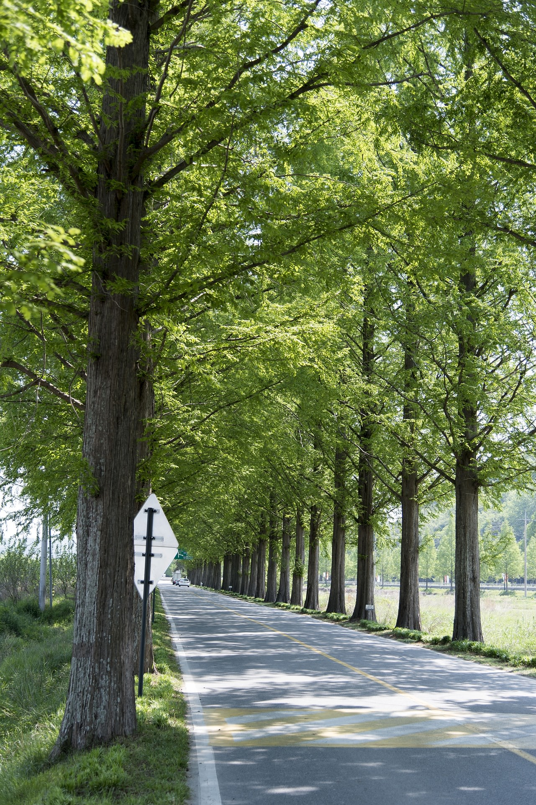

> 이번 글은 예전에 운영했던 [Pulse-Beat's Bits-Box 블로그](https://pulsebeat.tistory.com/)의 글을 옮겨 왔다.
>
> : 보내지 못한 편지

# To. 욱진 : 결단

시간이 참 빨리 흐른다. 너도 나도, 취업을 눈 앞에 두고, 미래에 대한 불안함으로 지내고 있는 상태라니. 이것저것 하고 싶은 것, 해야할 것들은 쌓여 있는 데, 무엇하나 제대로 시작하는 것도 없고, 답답할 뿐이다. 나 자신 스스로 한심스럽기도 하고. 이러한 생활이 반복되다보니, 자연스레 스트레스가 쌓이고 네거티브가 되어간다. 세상에 대한 불만, 부조리, 모순 등이 눈에 들어오기 시작하고, 나 자신 스스로를 깎아 내리는데 에너지를 소비하고 있지. 그래서 요즘 통 기운도 안나고, 얼굴에서 미소가 사라진지도 꽤 되었다. 무엇도 하기 싫고, 귀찮다는 느낌. 해야할 것에 대한 생각들 때문에 스트레스. 이런 악순환이 계속 반복되었다. 시간은 늘 부족하지만, 실제로 효율적으로 쓰는 것은 없었지.

뭐... 어찌되었든. 이러한 악순환의 고리를 깨부수기 위해 뭔가 새로운 것을 시도 해야했다. 늘 같은 방법으로 하는 것은 같은 결과를 나오게 하기 때문이지. 친구들에게 전화를 걸어 약속날짜를 잡고, 친구들에게 무엇인가를 같이 하자고 제안을 하고, 계속 웃으려 하고, 부지런해지려 노력하는 거지. 어제, 스타 안에서 얘기를 나누면서, 한가지 깨달은게 있지. 나는 스스로 무엇인가 해내기 위해서 남을 끌어들인다는 것. 하지만, 그런 남들은 그것을 원하지 않고, 하기 싫어한다는 것. 중요한 것은, 내가 그 사실을 이미 알고 있지만, 제안을 또 한다는 것. 그것 때문에 난 또 무엇인가를 시작하지 않는다는 것. 이런 순환은, 나에게 매우 좋지 않지. 왜냐면, 나 스스로의 의지력 부족을 딴 사람에게 떠넘기는 것이기 때문이지. 내가 결단이 부족해서 그런 것이 아니라, 친구들이 같이 하지 않아서라는 이유를 들어 스스로에게 합리화시키는 작업. 물론, 같이 하게 되면 그것만큼 좋은 것도 없겠지만, 서로의 상황과 환경이 다르기 때문에 힘들 것은 자명한 일. 서로 친한 만큼 서로를 이해해주고 서로의 발전을 위해 기꺼이 하게 된다면 더할 나위없이 좋겠지만, 스스로의 삶도 책임지지 못하는데, 서로를 격려해준다는 것도 조금 모순적인 일이지.

그래서 난 혼자서 스스로 해보기로 했다. 남들 핑계되는 것은 그만두고, 나 자신이 스스로 만족할 수 있도록 해보자는 것. 기타 자질구레한 핑계와 변명은 집어치우고 꼭 해내고 말 일 하나를 정해서 해보겠다고 다짐했다. 이일 해내면 나도 기꺼이 취업도 할 수 있다는 느낌이 드는 일말이야. 아침에 일어나 뒷 산을 찾았다. 산책길을 걸으며, 생각했지. 매일 이 아침 산책길을 걷거나 뛰면 좋지 않겠느냐는 생각. 산 능선을 따라 걸어가니, 주민들을 위한 체육 시설도 있더군. 이런 것이 있다는 것을 몰랐던 것은 아닌데, 왜 이런 좋은 곳을 놔두고, 너거 동네를 부러워했지는지 이해가 안될 정도이다. 모두다 핑계였던거지. 천천히 걸으며, 생각을 했다. 매일 아침 일찍일어나, 어떠한 일이 있더라고 산책길을 걷겠다는 결심. 그것은 왠지 해낼 수 있을 것 같은 느낌이 들었어. 한번 왔다갔다하니, 1시간 30분이 걸리더라고. 왠지 뛰어갔다오면 1시간안에 충분히 될 것이라는 것. 그 생각에 이어서, 가을에 열리는 마라톤에서 10km, 45분만에 완주하는 것. 삶에서 건강이 최선이니까, 우선 몸부터 챙기자는 생각. 하루의 시작을 나를 이기고 시작하면, 그 날 하는 모든 일은 다 해낼 수 있을 것 같다는 생각. 맑은 공기를 마시며, 산의 기운을 받자는 생각. 잡다한 생각들을 정리하고, 마음을 다 잡을 수 있는 시간을 가지는 곳. 여러 생각들이 하나를 가르키고 있었다. 하루 한번, 산으로 가자는 것이 결론. 100일 동안 꾸준히 하면, 난 취업이든 뭐든 다 잘 해낼 수 있을 것이라는 것이라는 생각이 들었지.

너와의 얘기 덕분에 많은 생각들을 하게 되었고, 잊고 있었던 의지력이 조금씩 살아나고 있다. 너도 열심히 무엇인가 준비하고 있듯이, 나도 시간 낭비하지말고 목표를 몇 가지 정해서 해내기로 했다. 이렇게 갑자기 너에게 편지를 보내는 이유도 고마움과 함께 나의 의지를 보여주는 것이다. 나도 최선을 다해 도전하겠다고 말해두는 것이지. 처음부터 많은 것을 하려고 하지 않겠다. 하루의 시작을 산과 함께 시작하는 것. 서로 각자의 위치에서 할 수 있는 만큼 잘해보자. 현재 자리에서 상대방을 위해 모범이 될 수 있도록 우뚝서자. 오늘 하루도 즐겁게 보내렴.

- 2010년 6월 24일 -

