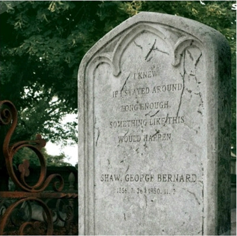

> 이번 글은 예전에 운영했던 [Pulse-Beat's Bits-Box 블로그](https://pulsebeat.tistory.com/)의 글을 옮겨 왔다.
>
> : 보내지 못한 편지

# To. 경민 : 장례식장에 다녀 와서

외할아버지께서 돌아가셨다. 1년 여간의 병치레로 고생하시다가, 병원에서 한달 반 정도 계시다가, 하직하셨다. 7월 8일, 별세 소식을 듣고, 다음날 오전에 올라가 장례를 치뤘다. 초등학교 때, 할머니의 장례식에 한번 갔었지만, 너무 어릴 때라 기억이 나지 않았다. 어떻게 해야할지 몰라 시키는 데로, 했는데, 그닥 어렵진 않았다. 손님이 오시면, 간단히 목례로 인사드리고, 상주와 맞절하는 것을 지켜보기만 하면 됬으니까. 그 일을 하루 종일했다. 덕분에 생각할 시간이 많아서 좋았다. 할아버지께서 돌아가셔서 슬픈 것보단 앞으로의 인생에 대한 걱정이 앞섰다. 할아버지께서 오늘, 내일 하신 것이 오래 되었으니까, 연세도 있으시니까, 슬픔보단 안타까움이 더 컸다.

인생이란 무엇일까? 한 번 살다가고, 죽으면 끝. 단지 그것뿐이라면, 인생이 너무 허무하지 않을까. 빈 손으로 왔다가, 빈 손으로 가고. 누군가 죽은 사람은 기억해주는 것. 또 그게 무슨 대수랴. 이 세상에 내가 존재하지 않는데, 의미가 있을까? 나는 느끼지도 못하고, 보지도 못하는데, 세상이 존재한들 의미가 없지 않나? 그렇게 계속 따지자면, 사는데 별 낙이 없을 것 같다. 그것보단 무엇인가 의미있게 사는 것이 삶 아닐까? 세상에 내가 존재해서 조금이라도 낳아졌다면 그걸로 괜찮은 것 아닐까? 그게 아니라면, 내가 살아가는 동안 즐기고, 행복하게 살면 그 것로 좋은 것 아닐까? 할아버지께선 나보고 삶을 즐기라고 말씀해주신다. 물론, 이 말은 내가 평소 보아오던 할아버지의 모습에서 내가 느꼈던 아쉬움이다. 삶 자체를 그저 흘려보내고, 하루하루를 그냥 사신 할아버지. 삶을 좀 더 재미있게 살아라. 현재에 살아라. 깨어 있어라. 나이 더 먹기 전에 할 수 있는 것을 다 해라. 죽기 전에.

영정 사진을 바라보며, 할아버지와 나눈 대화. 내가 가지고 있던 나에 대한 안타까움과 아쉬움이 나온 것이겠지. 조금 더, 재밌게, 조금 더 멋지게, 나를 위해서, 세상을 위해서, 삶을 행복하게 살아야겠다는 생각이 든다.

그리고 장례를 치르면서 느낀 것은, 사람은 관계 속에서 살아간다는 것.

식을 치르면서 수 많은 사람들이 찾아왔다. 만약, 현재 내가 죽으면, 몇 명의 사람이나 찾아올까? 순전히 나를 위해서 찾아오는 사람말이야. 기껏해야 20명 남짓? 거의 30년여년을 살아오면서 겨우 나를 위해서 찾아올 것 같은 사람이 20명이라니. 또 거기서, 나의 죽음을 아쉬워하고, 슬퍼해주고, 그리워 해주는 사람은 몇 명이나 될까? 내가 있어서 삶이 행복했다고.. 삶이 즐거웠다고.. 니가 없었으면 자신의 삶이 어떻했을까라고.. 이렇게 말해줄 사람이 몇명이나 될까. 난 이제껏 무엇을 하며 살아왔는가 싶다. 큰 삼촌, 작은 삼촌, 이모부께서 식을 치르셨는데, 특히 큰 삼촌은 K회사의 임원이시다 보니, 손님이 엄청 많으셨다. 회사 동료, 후배, 선배, 관련된 회사들의 직원들, 군대 동기부터, 대학 동료, 대학원 동료들까지. 생각지도 못한 곳에서 많은 사람들이 조문을 위해 찾아오셨다. 자리와 위치 때문에 찾아올 수 밖에 없는 경우도 있겠지만, 대부분의 경우에는 지인으로써 찾아오신 분들이었다. 내가 나이가 들었을 때, 저만큼 영향력 있는 사람이 되어 있을까? 난 지금 얼마나 좁고, 협소한 곳에서 생활하고 있는가? 나의 행동 범위가 고작 대학교에서 우리과 건물 밖이라니. 그리고 관계의 깊이가 얼마나 얕은지. 사람은 관계 속에서 지내고, 그 관계가 매우 중요하다. 삶의 일부이며, 나 자신의 범위의 너비이다. 조금씩 새로운 관계를 찾고, 현재의 관계를 깊게 하도록 해야겠다. 여담이지만, 한 가지 내가 느낀 것은 현재 친구들과의 관계의 깊이가 그리 깊지 않다는 것이다. 지금껏 나름대로의 친구를 사귀는 철학이, 적은 친구를 깊게 사귀자였는데, 그러지 못했던 것 같다. 그저 편한 대상으로써, 익숙해서 만나는 것이 아닐까. 익숙함으로 서로를 그냥 있는 그대로 두고, 어떠한 도전과 발전도 없는 그런 상태. 각 자 삶에서 일정한 선을 긋고, 넘어오는 것을 막는 상황. 진실된 얘기를 껄끄러워하고, 가십거리나 의미 없는 말들만 쏟아내다 끝나는 만남. 그 자체로도 의미 있고, 가치있는 일이지만, 일정 수준 이상의 친구의 한계를 벗어나지 못한 것 같다. 이런 말은 갑자기 왜 하느냐고? 그냥 약간 섭섭해서이다. 형의 친구들은 5명이나 찾아와서 인사를 치렀다. 같은 덕두 친구들이고, 같이 20년 넘게 사귀었지만 말이다. 안 올지는 알고 있었지만, 안온 것이 못내 아쉽다. 외할아버지가 돌아가셨다는 사실을 말해준 사람이 딱 두사람인데, 식이 끝나도 딱 두사람만 알고 있다. 나 같았으면, 몇 사람에게 조의금을 걷어 찾아갔을텐데. 그것까진 아니더라도, 친구들에게 알려서 문자라도 보내게 했을 텐데. 뭐, 너를 탓하려는 것은 절대 아니다. 그저 나의 관계에 깊이의 얕음에 아쉬움도 안타까움이 들어 투덜거리는 것 뿐.

마지막으로, 장례식장의 비용은 엄청 많이 들며, 돈으로 사람 마음이 크게 변한다는 사실을 알았다. 이런 행사를 직접 치르다보니, 이제 나도 애들과 지내는 것보다 어른들과 섞여 지내는 것이 편하다는 것을 알았다. 그러다 보니 행사의 진행 상황을 알고, 행사 치러지는 비용에 대해서 듣게 되었다. 내가 생각했던 것 이상으로 장례식장의 비용이 크게 들었다. 조의금 또한 많이 들어왔다. 돈 없으면 죽지도 못한다는 말이 맞는 것 같다. 다행이도 조의금이 더 많이 들어와서 맞춰졌지만, 장례식 비용에 엄청 놀랐다. 조의금은 주고 받기식이다. 주는 만큼 받으며, 받는 만큼 주게 되어있다. 기브 엔 테이크 형식인가? 여기서 조금 아이러니한 상황이 발생하는데, 그 사람에 대한 평가가 돈으로 이루어진다는 것이다. 물론 그 사람의 상황에 맞게. 자식의 수와 부모의 생존여부에 상관하여 부조금이 달라지며, 주는 만큼 받지 못하면, 그 사람에 대한 인식이 좋지 않게 변한다는 것. 이와 반대로 상황이 열악한대도 불구하고, 일정 수준이상의 조의금을 내게 되면, 그 사람에 대한 평가가 좋게 변한다는 것. 그 사람에 대한 관심과 관계의 척도가 돈의 금액으로 나타나기 마련이고, 그것 때문에 사람에 대한 평가가 달라지는 것을 보며, 사회 현상의 큰 흐름은 어쩔 수 없구나라는 생각이 든다. 이런 것들도 역시 나이가 먹으면서 자연스레 동화되어가는 것일까? 나도 어른이지만, 아직은 어린 마음이 많구나.

> 조지 버나드 쇼(아일랜드 극작가, 1856~1950)
>
> "I knew if I stayed around long enough, something like this would happen."
>
> "우물쭈물하다가 내 이럴 줄 알았다."

한 사람의 죽음. 그리고 직접 장례를 치르면서 많은 것을 느꼈다. 많은 생각이 들었지만, 크게 생각나는 세 가지를 너에게 전해준다. 죽음은 삶을 좀 더 열심히 살게 해준다. 내가 죽었을 때의 장례식을 생각해보니, 현재 이렇게 살아서는 안되겠다는 생가이 든다. 좀 더 즐겁게, 좀 더 재밌게, 좀 더 깊게, 좀 더 진실되게 살아야겠다. 멋진 인생을 살아야 죽어서도 후회하지 않겠지? 죽어서도 후회하면, 너무 슬플 것 같다.

 
- 2010년 7월 14일 -

