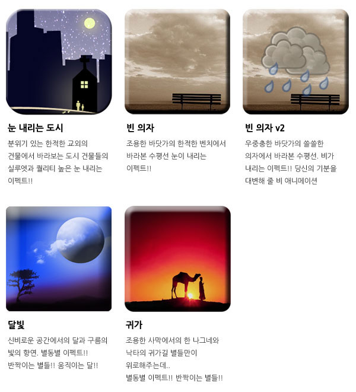
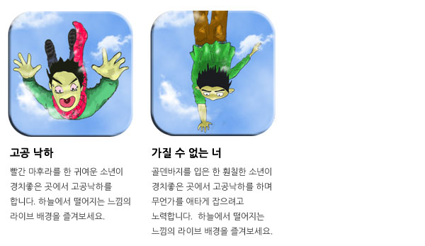
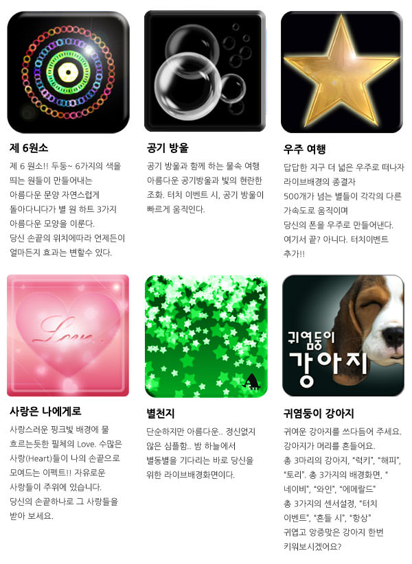
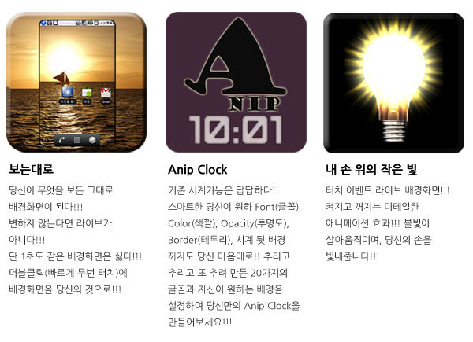

> 이번 글은 예전에 운영했던 [Pulse-Beat's Bits-Box 블로그](https://pulsebeat.tistory.com/)의 글을 옮겨 왔다.

---

# - 서막 - 안드로이드 프로젝트

지금으로부터 수년 전. 스마트폰이 나오기 시작할 무렵, 대학생이였던 나와 친구 두명이서 안입(Anip)이라는 이름의 회사를 세웠다. 새로운 웹 서비스를 개발할 목적으로 모였지만, 각자 생활비 부담으로 돈을 먼저 조금씩이라도 벌어보자는 생각으로 어플리케이션을 개발해보기로 했다. 이전에 동아리 내에서 안드로이드 관련 프로젝트를 몇 번 진행해보았기 때문에 스마트폰 앱 개발에 큰 부담은 없었다. 다만 스타트업이 너무 돈을 목적으로 진행하면 안될 것 같다는 생각에 앱 개발을 해보자는 제안에 대해 반대하고 있던 중이었다. 웹 서비스 개발 진행이 더디어지고 있었고, 뭔가 모르게 딱딱 맞아 떨어지며 진행이 되는 분위기가 아니었다. 이러한 분위기 전환을 위해 앱 개발을 해보자는 제안에 동의하고, 앱 개발에 착수했다.

## [ 추억의 프로젝트 ] 안드로이드 - 라이브 배경화면 편

안입(Anip) 팀의 두 번째 프로젝트를 시작해야만 했다. 거짓말 탐지기의 성공 후, 어떤 종류의 어플리케이션을 개발해야할지 팀원 세명이서 모여 머리를 맞대었다. 상훈이의 놀라운 안목으로 너무나도 쉽게 돈을 벌고 있는 라이브 배경화면 회사를 보았다. 스마트폰 배경화면은 안드로이드 폰의 초기 화면에서의 배경화면을 말한다. 여기서 '라이브'라는 것이 덧붙여져 살아서 동작하는 배경화면이다. 터치를 한다거나, 핸드폰이 움직인다거나, 날씨, 상태 변화에 따라 갖가지 애니메이션들이 동작하도록 하는 것이다. 예를 들면, 날씨에 따라 눈 또는 비가 내리거나, 햇빛이 떠있는 화면, 화면을 터치하면 물결이 퍼져나간다거나 하는 것이다. 라이브 배경화면의 선두주자인 한 회사는 만화 두컷으로 돈을 벌고 있었다. 화면이 가만히 있다가, 화면을 터치하면 다른 한 화면으로 바뀌는 것이다. 이 얼마나 심플한 앱인가. 그림 단 두장으로 돈을 쓸어모으고 있었던 것이다. 이에 질세라 라이브 배경화면 프로젝트를 시작하게 되었다. 우리는 그림 두장이 아니라 각종 에니메이션을 넣어서!

### 첫 번째 우린 속도와 에니메이션으로 승부한다.

빠른 개발 속도를 바탕으로 끊임없이 라이브 배경화면을 찍어내고, 갖가지 애니메이션을 추가하여 다양한 효과를 목표로 개발을 진행했다. 전문 디자이너가 없었기에 인터넷에 산재해있는 저작권이 자유로운 이미지들을 모으기 시작했다. 매일 아이디어 회의를 하면서 다양한 시도를 시작했다.

일차적으로 라이브 배경화면을 출시했다. 하루, 이틀 걸러 라이브 배경화면을 내놓았다. 지금도 그렇지만 그 당시에도 그리 퀄리티가 좋다고 생각하지 않았다. 다만 시범적으로 사람들의 반응을 살펴보기 위해 그냥 마켓에 올렸다. 위의 라이브 배경화면은 단지 이미지 한장에 이펙트가 들어가 있다. 배경은 그대로고, 눈이 내린다거나 비가 내리고, 구름과 달이 움직이며 별똥별이 떨어지는 애니메이션들이 각각 들어있다. 아이콘은 저래도, 폰에 넣어놓으면 볼만은 했다.

### 두 번째 우린 가속도 센서를 이용한다. 감정을 어필한다.

프로그래머라면 계속 진화해야한다. 스마트폰의 가속도 센서를 이용하여, 다양한 효과를 줄 수 있는 라이브 배경을 만들기 시작했다. 에니메이션도 향상되었다. 그림 그리기 좋아하는 친구가 직접 그리고, 포토샵으로 한땀한땀 수정하며 움직이는 사람을 만들어냈다.

하늘에서 낙하하고 있는 사람이 무서워하는 모습을 직접 그리며 구현했고, 무엇인가를 찾아서 향해가는 애타는 청년의 모습을 넣었다. 배경화면에 스토리가 들어가기 시작했다. 감정적인 부분을 어필했다. 하늘에서 끝없이 떨어지는 사람을 표현했다.

### 세 번째 심플함과 진화된 애니메이션을 구현한다.

가장 단순한 것이 가장 완벽한 것이다. '조금 더 많은 에니메이션, 조금 더 멋진 이펙트'를 향해가고 있었는데, 복잡한 것보다는 심플한 것이 더욱 좋을 수 있다. 멋지고 아름다운 디자인들을 구현하기 힘들었기 때문에 사람들과의 소통을 중요시 하도록 하였다. 사용자의 반응에 따라 다르게 동작하는 인터렉티브한 것을 중요시 하게 되었다.

사람들의 터치 방식에 따라 유동적으로 변하는 배경화면을 구현했다. 빠르게 터치한다거나, 더블 터치, 스마트폰 화면을 스와이프하여 창을 넘기는 동작에서의 다른 효과, 심플하지만 아름다운 구현을 목표로 잡고 구현하였다.

### 네 번째 라이브 배경화면에 새로운 기능을 추가한다.

라이브 배경화면은 새로움이 필요하다. 단순히 아름다운 이펙트와 멋진 사진만으로 쓰기에는 라이브 배경화면의 쓰임새는 너무 한정적이다. 라이브 배경화면은 더욱더 진화해야한다. 더욱더 다양한 용도로 쓰일 수 있다. 사람들은 새로운 것을 원한다.

라이브 배경화면을 통해 다양한 시도를 해보았다. 카메라를 이용하여, 투명한 라이브 배경화면을 구현했다. 자신이 보고 싶은데로, 즉 보는대로 변하는 배경화면이다. 더블 터치를 하면 바로 사진을 찍을 수 있다. 배경화면을 시계로 활용할 수도 있다. 다양한 폰트와 색깔, 투명도로 자신만의 시계를 구현해낼 수 있다. 여러 디자인을 통해 배경화면에 직접 시계를 넣음으로써 활용도를 높였다. 불빛 기능을 가진 손전등도 만들었다. 항상 불빛이 반짝인다. 아름답게 빛을 비추기 때문에 은은함을 느낄 수 있었다.

### 다섯 번째 적절한 조화가 필요하다. 디자인, 기능의 적절한 배합.

아무리 기능이 많더라도 사람들에게 다가가지 못하면 소용없다. 아무리 예쁘더라도 단순하다면 어필할 수가 없다. 디자인과 기능의 적절한 섞임이 필요하다.

사람의 감성을 자극할 수 있는 디자인이 필요하다. 이와 더불어 적절한 에니메이션은 이를 더욱 풍부하게 한다. 사람들에게 호기심을 자극하고, 신선함을 줄 수 있는 라이브 배경화면을 만들었다. 아름다운 여인을 등장시킨다거나, 봄날에 흩날리는 벚꽃을 그렸다. 자유롭게 날아다니는 예쁜 나비를 몽환적으로 나타내었으며, 사람들의 반응에 따라 탱탱볼들이 신나게 뛰어놀도록 하였고, 매일 지구 곳곳을 향해 여행을 떠나는 귀여운 강아지를 넣기도 하였다.

이렇듯 우리팀은 갈수록 다양한 시도를 하게 되었다. 아이디어를 구상하고, 새로운 디자인을 찾고, 넣고 싶은 에니메이션을 넣었다. 그 당시에는 이런 것을 시도하는 곳이 많이 없었기 때문에 노력한 것에 비해서는 많은 수익을 얻을 수 있었다. 공장에서 찍어내는 듯, 라이브 배경화면을 만들었었고, 수익이 나는 것에 즐거움을 느끼고 더욱이 개발에 박차를 가하게 되었다. 하지만 점점 경쟁 회사가 많아지고, 스마트폰 마켓 시장도 커짐에 따라 우리의 퀄리티가 사용자의 요구에 따라가지 못하게 되었고, 점점 우리도 지쳐갔다. 더군다나 수익 자체가 예전에 비해 훨씬 적어졌기 때문에 스트레스를 받기 시작했다. 라이브 배경화면 개발은 그렇게 끝이 났다.

사실 위의 내용에서 많은 부분은 희화화되었다고 볼 수 있다. 그 때 당시에는, 그냥 생각나는데로, 흘러가는데로 개발을 진행했다. 막연히 재밌을 것 같거라든가, 얻어 걸린 이미지을 조금 더 좋게 활용해본다던가, 지금 당장 개발해보고 싶은 것을 기획했다. 지금 이 순간에 과거를 보았을 때, 그 때 시절의 진행에 대해 나름의 의미를 붙여보았다고 해야할 것이다. 스타트업을 진행하기에 다들 실력도 많이 부족했고, 서로 간의 의사소통 스킬도 부족했다. 경영에 대해서도 전혀 몰랐고, 방법론적인 문제에 대해서도 알지 못했다. 그냥 무작정 학교 휴학을 하고 어떤 서비스라도 만들어보자는 목표와 어떤 것이든 해낼 수 있다는 단순한 열정만 가지고 셋이서 모여 했기 때문에 어떻게 진행하는 것이 올바른 것인지 몰랐고, 그에 따라 생기는 시행착오가 많아 힘들었다. 원래 같이 모여서 만들어보려고 했던 웹 서비스를 제쳐두고 어플리케이션을 개발하기 시작했었는데, 어플리케이션을 만들겠다는 것이 돈을 벌기위한 것이 궁극적인 목표였다. 그러나 그 돈이 안벌리기 시작하게 되니, 팀원들끼리 갈등이 점점 생겨나기 시작했다. 하루 종일 같은 방에서 생활하면서 밥을 먹고 씻고, 자고, 사무적인 일들을 같이 하면서, 서로에게 알게 모르게 상처를 주게 되었다. 몇 개월간의 생활 속에서 미래에 대한 불투명성과 서로간의 성격적인 문제로 더 이상 진행해나가기 힘들 것 같다는 생각에 팀을 해체하기로 했다. 이렇게 첫 회사는 문을 닫는다.

> 안입(Anip) ! 나의 첫 회사는 그렇게 끝이 났지만, 이 과정을 통해 많은 것을 배웠다. 회사를 이끌어나가는 힘과 의사 소통의 중요성, 목표와 가치의 중요성 등. 7개월간의 어플리케이션 개발 회사는 이제는 추억 속에 있다. 이 회사가 없었다면, 난 아마 지금 대기업에 취직해서 일하고 있지 않을까. 난 나 스스로 무엇인가를 만들 수 있고, 그것을 통해 사람들에게 새로운 가치를 줄 수 있을 것이라 믿는다. 그렇기 때문에 난 지금도 스타트업의 일원으로서 한 회사를 이끌어 나가고 있다. 실패할지도 모르지만, 뭐 어떤가. 그냥 지금 하고 있는 일이 재밌고, 성공할 수 있다는 믿음이 있기 때문에 끝까지 해볼 생각이다. 하다보면 좋은 결과가 있겠지 뭐.
